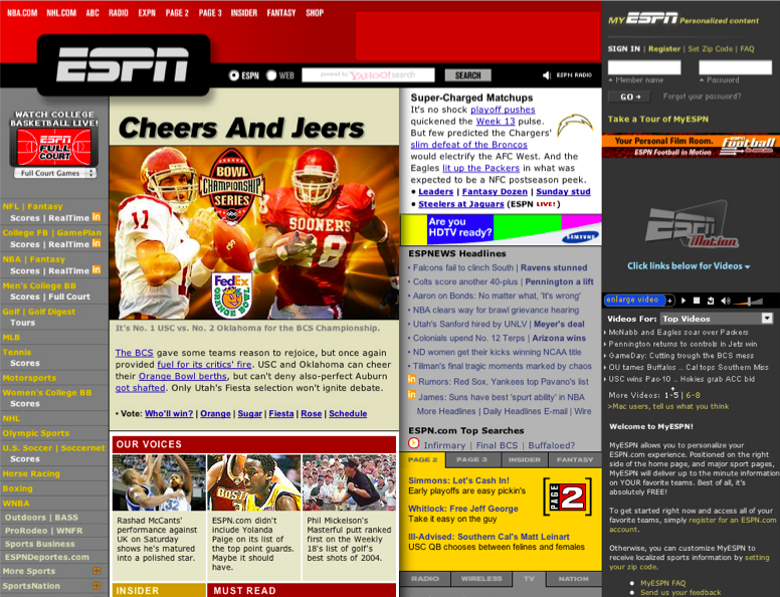
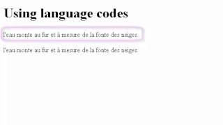

# 1. HTML

## 1.1 Texti &amp; upplýsingar

Frá örófi alda höfum við sagt hvort öðru sögur. Í fyrstu geymdar í minni einstaklinga, seinna skrifaðar á skinn eða pappír, síðan prentaðar með prentvél Gutenbergs og núna fjölfaldaðar í prentsmiðjum.

Prentaður texti er í eðli sínu fastur. Við höfum blaðsíður í ákveðinni stærð sem textinn er prentaður á og eftir það eru engar breytingar mögulegar. En hvað ef svo væri ekki?

Árið 1941 gaf Jorge Luis Borges út smásöguna [„The Garden of Forking Paths”](http://www.coldbacon.com/writing/borges-garden.html) sem segir frá höfundi sem ætlar að skrifa stóra og flókna bók ásamt því að búa til stórt og flókið völundarhús. Síðar kemur í ljós að bókin og völundarhúsið er sami hluturinn en sagan lýsir heim þar sem allar mögulegar niðurstöður atburða eiga sér stað samtímis. Þessi smásaga er talin kynna fyrst hugmyndina um _HyperText_.

Við lok seinna stríðs skrifaði Vennevar Bush greinina [„As We May Think“](http://www.theatlantic.com/magazine/archive/1945/07/as-we-may-think/303881/?single_page=true) í Atlantic Monthly þar sem hann lýsir _Memex_. _Memex_ er tæki sem leyfir einstakling að halda utan um sitt eigið safn af upplýsingum. Það leyfir flokkun, athugasemdir og tengingar við annað efni svo hægt sé að fletta upp og leita ásamt því að deila með öðrum á einfaldan hátt. Sannkallað töfratæki sem Bush gerði ráð fyrir að myndi gjörbreyta heiminum.

### 1.1.1 HyperText

Þessar hugmyndir, ásamt mörgum öðrum, höfðu mikil áhrif á þróun upplýsingatækninnar. Ted Nelson skilgreindi árið 1963 hugtakið _HyperText_: texti á stafrænu formi sem inniheldur vísanir þ.a. lesandi getur strax fengið aðgang að þeim. Textinn er ekki lengur fastur, heldur teygir hann anga sína út og leyfir lesandanum að stýra sinni eigin leið í gegnum hann. „Veldu þitt eigið ævintýri“ bækur útfæra svipað hugtak á hliðstæðan máta.


> Mynd 1: Ted Nelson.

Í [„Mother of all Demos“](https://www.youtube.com/watch?v=yJDv-zdhzMY) árið **1968** kynnti Douglas Engelbart til sögunnar NLS („oN Line System“) sem inniheldur m.a. mús, hypertext, útgáfustýringu (revision control), ritvinnsluforrit, fjarfundarbúnað og fleira sem í dag væri talið til nútímatækni.

[](https://www.youtube.com/watch?v=74c8LntW7fo)
> Mynd 2: Douglas Engelbart kynnir HyperText virkni í NLS, vídeó á YouTube.

> The future is already here — it's just not very evenly distributed.
- William Gibson

Til þess að geta útfært í reynd hugtakið um HyperText þurfum við einhverja leið til að ljá texta aukna dýpt og skilgreina tengingar, auk lýsingar á textanum sem er setningarfræðilega aðgreind frá textanum sjálfum. _Umbrotsmál_—_Markup language_—leyfir okkur að gera þetta.

## 1.2 Markup mál

Við höfum mál sem skilgreinir snið (_markup_) á textanum. Hægt er að skipta þessum málum í almenna flokka:

* _Létt_ (_Lightweight_) – einföld setningarfræði er notuð til að leyfa aðskilnað á ýmsum grunnhugmyndum texta án þess að draga úr læsileika textans, t.d. útbúa fyrirsagnir eða feitletra orð t.d. Markdown
* _Procedural_ – snið er innifalið í texta sem leiðbeiningar um sértækar aðgerðir á textanum, t.d. að gera orð feitletrað. Dæmi væru PostScript og LaTex
* _Presentational_ – [_WYSIWYG_](https://en.wikipedia.org/wiki/WYSIWYG) (What You See Is What You Get) ritlar, sniðið er falið fyrir notendum í formi skjals, t.d. Word
* _Descriptive_ – snið gefur texta merkingu sem er _óháð_ birtingu þess, notast er við _merkingarfræðilegt_ (semantic) snið. Leitast er eftir að lýsa eðli textans en ekki **útliti** hans

### 1.2.1 Markdown

[_Markdown_](https://daringfireball.net/projects/markdown/) er dæmi um létt umbrotsmál búið til að [John Gruber](https://daringfireball.net/) (í samstarfi við [Aaron Swartz](https://en.wikipedia.org/wiki/Aaron_Swartz)) árið 2004. Markmið þess er að leyfa fólki að skrifa texta með einföldum skipunum sem hægt er að þýða yfir í önnur form (t.d. HTML). Þessi bók er sem dæmi skrifuð í Markdown.

```markdown
# Markdown fyrirsögn

Texti sem inniheldur **feitletraðan** og _skáletraðan_ texta með [tengli](http://example.org).

* Listi
* af
* orðum
```

Helsti kostur Markdown er að auðvelt er fyrir manneskjur að vinna með textan _og_ vélar. Hægt er að smíða forrit sem _þýða_ úr Markdown yfir í eitthvað annað, t.d. HTML.

### 1.2.2 HTML

HTML stendur fyrir _HyperText Markup Language_, mál með sniði sem leyfir okkur að lýsa textanum okkar og nota HyperText hugtakið. Fyrstu útgáfur voru [byggðar á _SGML_](http://www.w3.org/TR/html4/intro/sgmltut.html), Standard Generalized Markup Language, sem er [ISO](https://en.wikipedia.org/wiki/International_Organization_for_Standardization) staðall sem skilgreinir _almennt_ markup mál fyrir skjöl. Það byggir á tveimur hugmyndum:

* Snið ætti að vera lýsandi
* Snið ætti að vera strangt svo auðvelt sé að vinna úr því

## 1.3 HTML &amp; sagan hingað til

Í kringum 1990 var [Sir Tim Berners-Lee](https://en.wikipedia.org/wiki/Tim_Berners-Lee) að vinna hjá [CERN](https://en.wikipedia.org/wiki/CERN) sem eðlisfræðingur.
Hann skrifaði minnisblað um kerfi sem hann sá fyrir sér að myndi auka möguleika á samvinnu með því að deila skjölum á einfaldan hátt. Í framhaldinu skilgreindi hann _HTML_, t.d. í skjalinu [„HTML Tags“](http://www.w3.org/History/19921103-hypertext/hypertext/WWW/MarkUp/Tags.html) og skrifaði fyrsta vafrann og vefþjóninn sem túlkuðu og birtu HTML (skrifaður í Objective-C á NeXT tölvu). [Fyrsta vefsíðan](http://info.cern.ch/hypertext/WWW/TheProject.html) var síðan aðgengileg 23. ágúst 1991, og er enn aðgengileg á sömu slóð í dag.


> Mynd 3: NeXT tölvan sem Tim Berners-Lee notaði til að skrifa fyrsta vefþjóninn og vafrann. Á tölvu er skrifað „This machine is a server DO NOT POWER DOWN!!

Uppbygging og þróun fór fram á póstlistum þar sem þeir einstaklingar sem höfðu áhuga gátu tekið þátt og haft áhrif, t.d. [stakk Marc Anderseen upp á ``](http://1997.webhistory.org/www.lists/www-talk.1993q1/0182.html) árið 1993 til að geta birt myndir á vefnum. Í kjölfarið komu fleiri vafrar fram á sjónarsviðið, t.d.:

* Line Mode Browser árið 1992, [CLI](https://en.wikipedia.org/wiki/Command-line_interface) vafri gefin út á mörgum stýrikerfum. Endurgerður árið 2013, keyrandi í vef: [Line Mode Browser 2013](http://line-mode.cern.ch/)
* Lynx árið 1992, vafri sem vinnur aðeins í texta, elsti vafrinn enn í almennri notkun
* Mosaic árið 1993, fyrsti _grafíski_ vafrinn og talinn vera sá vafri sem gerði vefinn vinsælan. Margt af því sem við þekkjum í vöfrum í dag kom fyrst fram í Mosaic. Þróaður hjá [NCSA](https://en.wikipedia.org/wiki/National_Center_for_Supercomputing_Applications) að hluta til með pening sem kom frá löggjöf sem [Al Gore kom í gegn árið 1991 til að búa til „information superhighway“](http://en.wikipedia.org/wiki/Al_Gore_and_information_technology)
* Netscape Navigator 1.0 árið 1994, þróaður m.a. af Marc Andreessen, ári seinna kemur útgáfa 1.1 sem kynnir _töflur_ til leiks
* Opera 1.0 og Internet Explorer 1.0 árið 1995

#/media/File:NCSA_Mosaic.PNG")
> Mynd 4: Skjáskot af Mosaic 3.0 á Windows XP.

## 1.4 Staðlar

Um leið og fleiri einn vafri voru komnir á sjónarsviðið þurfti að skilgreina _hvernig_ HTML virki í hörgul. Hver vafri um sig getur ekki útfært hlut á annan hátt en hinir eða bætt við sinni eigin, sérstöðluðu virkni.

Stöðlun á HTML 1.0 var fyrst reynd hjá [IETF](https://en.wikipedia.org/wiki/Internet_Engineering_Task_Force) (Internet Engineering Task Force) en komst ekki úr [því að vera drög](http://www.w3.org/MarkUp/draft-ietf-iiir-html-01.txt). Útgáfa 2.0 var síðar stöðluð af IETF í [RFC 1866](https://tools.ietf.org/html/rfc1866) árið 1995. Tim Berners-Lee stofnaði W3C (World Wide Web Consortium) hjá MIT árið 1994 með stuðning frá Evrópusambandinu og [DARPA](https://en.wikipedia.org/wiki/DARPA). CERN dró sig þá til hliðar, enda stofnun sem sérhæfir sig í rannsóknum á sviði eðlisfræði, ekki því að vera leiðandi í upplýsingatækni. Allur kóði vafrans og vefþjónsins sem Tim Berners-Lee vann að hjá CERN var [settur í almenningseign af CERN árið 1993](https://cds.cern.ch/record/1164399).

> The primary design principle underlying the Web’s usefulness and growth is universality. […] And it should be accessible from any kind of hardware that can connect to the Internet: stationary or mobile, small screen or large.
- Tim Berners-Lee: [Long Live the Web](http://www.scientificamerican.com/article.cfm?id=long-live-the-web) á 20 ára afmæli vefsins.

Frá byrjun hefur víðsýni og frelsi einkennt vefinn. Umferð á netinu hefur að mestu verið hlutlaus, þ.e.a.s. henni er ekki mismunað eftir því hvaðan hún kemur eða hvert hún fer. Ef netið væri ekki hlutlaust gætu þjónustuaðilar farið að gera greinarmun á umferð og skipt henni í hópa. Eftir því í hvaða hóp þú ert getur það haft í för með sér takmarkanir, aukinn kostnað o.s.fr.

  This is for everyone #london2012 #oneweb #openingceremony @webfoundation @w3c
  https://twitter.com/timberners_lee/status/228960085672599552

Frekar má lesa um sögu vefsins í [History of the Web](https://www.w3.org/2012/08/history-of-the-web/origins.htm) og vert er að endurtaka það sem kemur fram þar _„Understanding how an activity started and developed frequently gives a much greater insight into why things are as they are.“_

## 1.5 W3C

Hlutverk W3C var og er að vinna að framþróun vefsins. Það er gert í gegnum vinnuhópa (working groups) sem taka að sér ákveðna staðla fyrir tækni og vinna að því að staðla þær óstöðluðu hugmyndir eða óstaðlaða virkni sem er til staðar í dag.

Til að vinna þessa staðla eru útbúnir _specs_ sem segja til um hvernig hegðun á að vera. Þeir eru svo ítraðir í frekar löngu og ströngu ferli. Hver sem er getur komið sér í þessa vinnu þar sem W3C eru opin félagasamtök. Flest þau sem vinna að stöðlunum eru þó í vinnu hjá vafrafyrirtækjunum en geta unnið saman á (tiltölulega) óháðum vettvangi að framþróun vefsins.

W3C staðlar t.d. HTML, CSS, XML og SVG, en [margt annað er þó einnig í stöðlun og vinnslu þar](https://www.w3.org/standards/).

Ferli stöðlunar er langt og strangt hjá W3C en í grófum dráttum er það:

* Working draft – búið er að safna nægum upplýsingum til að gefa út fyrstu drög af staðli, sem þó er líklegt að munu breytast mikið. Hérumbil hver sem getur lesið og gert athugasemdir við working draft
* Candidate recommendation – þroskaðri útgáfa af staðlinum sem tilbúinn er til athugasemda varðandi útfærslu
* Proposed recommendation – búið er að taka við almennum athugasemdum og athugasemdum varðandi útfærslu og staðall er tilbúinn til loka samþykktar
* W3C recommendation – Þroskaðasta stig staðals, W3C hefur samþykkt hann og mælir með útfærslu hans

Oft þegar unnið er með staðlaða hluti getur verið gott að lesa yfir staðalinn til að fá _nákvæmari_ tilfinningu fyrir því hvernig hlutir eigi að virka. Þó ber að hafa í huga að staðlar eru skrifaðir fyrir þau sem útfæra _vafrana_ (eða tækin sem birta) en ekki höfunda efnis fyrir vafrana eða tækin.

Þetta verður sérstaklega áhugavert þegar unnið er með nýja tækni sem ennþá inniheldur villur, óskilgreinda hluti eða álíka.

## 1.6 Fyrsta vafrastríðið

Netscape Navigator 4.0 sem kom út árið 1997, með stuðning við CSS, JavaScript og DOM, var gífurlega vinsæll vafri. Þegar Microsoft fór að dreifa Internet Explorer ókeypis með Windows (sem síðar varð kveikja að stórri [_anti trust_ lögsókn á hendur Microsoft](https://en.wikipedia.org/wiki/United_States_v._Microsoft_Corp.)) fór markaðshlutdeild Netscape að dala. Á frekar stuttum tíma tók IE alveg yfir markaðinn á meðan Netscape fór þá leið að [endurskrifa Navigator 6.0 að öllu leiti, sem varð þeim kostnaðarsamt](http://www.joelonsoftware.com/articles/fog0000000069.html). Þetta tímabil er oft nefnt [_fyrsta_ vafrastríðið](http://en.wikipedia.org/wiki/Browser_wars#The_first_browser_war).

.svg")
> Mynd 5: Markaðshlutdeildir vafra í „Fyrsta vafrastríðinu“.

Eftir að Netscape tapaði stöðu sinni var fyrirtækið selt AOL en áður en það gerðist var Navigator gerður open source og [Mozilla stofnað sem umsjónaraðili þess verkefnis](https://en.wikipedia.org/wiki/Mozilla_Foundation). Mozilla nafnið er talið vera komið frá Jamie Zawinksi, [jwz](https://www.jwz.org/), og standa fyrir [_mosaic killer_](https://en.wikipedia.org/wiki/Mozilla_(mascot)). PBS gerði heimildarmyndina [_Coderush_](http://www.clickmovement.org/coderush) um þetta tímabil.

> Every program attempts to expand until it can read mail. Those programs which cannot so expand are replaced by ones which can.
- [Zawinski's law of software development](https://en.wikipedia.org/wiki/Jamie_Zawinski#Principles)

Í dag lifir Netscape Navigator að einhverju leyti í Firefox, en fyrsta útgáfan kom út árið 2002, þá undir nafninu Phoenix. Útgáfa 1.0 af Firefox kom síðan út 2004.

## 1.7 Vefstaðlar

Eftir fyrsta vafrastríðið var CSS orðið nógu vel skilgreint til að hægt væri að nota það í vefforritun en illa gekk að fá fólk til að skipta úr því að nota töflur til að setja upp vefi. Mikið var gert úr því að fólk myndi nýta sér _töflulausa vefhönnun_, þ.e.a.s., nota CSS til að setja upp vefi en ekki töflur.

Það varð þó breyting á með [A List Apart](http://en.wikipedia.org/wiki/A_List_Apart) sem varð til sem póstlisti 1997 en varð fljótlega að helsta veftímariti vefbransans og hefur verið það alla tíð síðan. [Web Standards Project (WaSP)](http://en.wikipedia.org/wiki/Web_Standards_Project) var stofnað 1998 með það að markmiði að þrýsta á vafra framleiðendur að auka stuðning við staðla og tókst það í Netscape 6 árið 2000 og IE6 árið 2001. Zeldman, áhrifamikill vefmógúll, skrifaði grein í A List Apart 2001, „[To Hell with Bad Browsers](http://alistapart.com/article/tohell)“, þar sem hann hvatti vefara til að byrja að nota staðla. Þó svo að margir væru enn að nota gamla vafra sem ekki styddu staðlana þá væri ekki endalaust hægt að halda í þá og nóg væri nóg.

Það var samt ekki fyrr en árið 2003 sem _töflulaus vefhönnun_ varð að alvöru með endurhönnun ESPN með XHTML og CSS, fyrsti stóri vefurinn til að vera gerður þannig. Wired hafði þó verið endurhannaður árinu áður en útgáfa hans hafði ekki jafn mikil áhrif. Árið 2003 var [CSS Zen Garden](http://www.csszengarden.com/) einnig stofnað, en það er vefur sem sýnir hvað var/er hægt að gera með CSS. HTML skjal var gefið og máttu þeir aðilar sem sendu inn hönnun _aðeins_ breyta CSS en ekki HTML. Þetta gekk vel og margar mjög framúrstefnulegar og nýtískulegar hannanir voru til sýnis. Dave Shea, stofnandi CSS Zen Garden, [gerði upp verkefnið á 10 ára afmæli þess, 2013](https://www.youtube.com/watch?v=gwdVU_ZJD0w). Árið 2013 var WaSP líka lagt niður með skilaboðunum, „[our work here is done](http://www.webstandards.org/2013/03/01/our-work-here-is-done/)“.


> Mynd 6: ESPN, fyrsti stóri vefurinn til að vera gerður töflulaust.

## 1.8 Annað vafrastríðið

Eftir að hætt var að gera vefi með töflum kom nokkur ládeyða yfir vafraframleiðendur og varð hún svo mikil að Microsoft tilkynnti árið 2003 að IE6SP1 yrði seinasti vafrinn þeirra. Það ásamt því að hugtakið [_Web 2.0_ var gert vinsælt af Tim O‘Reilly](https://en.wikipedia.org/wiki/Web_2.0) hleypti nýju lífi í markaðinn um 2004. [Apple gaf út Safari fyrir Mac OSX](http://donmelton.com/2013/01/10/safari-is-released-to-the-world/), byggðan á [KTHML](http://lists.kde.org/?m=104197092318639) árið 2003. WebKit, vélin sem keyrir áfram Safari, var árið 2005 gerð open source af Apple.

Fyrsta alvöru vefþróunartólið, [Firebug][1] fyrir Firefox, kom út árið 2006 og gjörbreytti því hvernig vefir voru unnir. Í fyrsta skipti var hægt að breyta á einfaldan hátt, beint í vafranum, hvernig vefir höguðu sér. IE 7.0 kom einnig út árið 2006, fimm árum eftir IE 6.0.

  [1]: http://en.wikipedia.org/wiki/Firebug_(software)

.svg")
> Mynd 7: Hlutdeild vafra 2009-2015.

Með tilkomu iPhone árið 2007 og útgáfu Safari 3.0 á Mac OSX, Windows og iOS, varð vefurinn í fyrsta skipti fyrir alvöru aðgengilegur í símum í almennilegum vafra. Tilraunir til að gera sérstakar vefsíður fyrir iPhone byrjuðu snemma, sérstaklega í ljósi þess að ekki var strax hægt að búa til öpp fyrir iOS.

Google gaf út Chrome vafrann árið 2008, byggðum á Chromium, open source vafra. Chromium var síðan aftur byggður á WebKit. [Árið 2013 var Webkit verkefnið _forkað_](https://blog.chromium.org/2013/04/blink-rendering-engine-for-chromium.html) og til varð ný vafravél, [_Blink_](https://www.chromium.org/blink) sem Chrome notar í dag.

Eitt af því sem hamlaði verulega útbreiðslu nýrrar virkni í vöfrum á fyrstu árum vefsins var það að stanslaust þurfti að sækja nýjar útgáfur af vöfrum. Það gat valdið því að fólk keyrði óuppfærðan vafra í mörg ár og notaði hann til að sinna öllu því sem það þurfti á vefnum, sem aftur gerði það að verkum að flestir stærri vefir urðu að styðja gamla vafra lengur en æskilegt hefði verið. Í dag er þetta minna vandamál þar sem allir vafrar dreifa uppfærslum mjög ört og (í flestum tilfellum) án þess að brjóta neitt á milli uppfærsla. [Chrome var fyrsti vafrinn til að gera þetta](https://blog.codinghorror.com/the-infinite-version/) og er í dag hægt að [sækja _Chrome Canary_](https://www.google.com/chrome/browser/canary.html) sem er útgáfan af Chrome með því allra nýjasta, uppfærð daglega með nýjasta buildi.

Ættartré þeirra vafra sem við notum í dag er orðið frekar flókið og margþætt, en hægt er að skoða það á [evolution of the web](http://www.evolutionoftheweb.com/).

## 1.9 DocType

Öll sniðmál sem byggja á SGML þurfa að tilgreina Document Type Definition (DTD) sem skilgreinir málfræðina sem farið er eftir. Í HTML er þetta sett fram í fyrstu línu skjalsins, í _DocType_.

```html
<!DOCTYPE HTML PUBLIC "-//W3C//DTD HTML 4.01//EN" "http://www.w3.org/TR/html4/strict.dtd">
```

Enn í dag þurfum við að skilgreina í hvaða DocType HTML skjölin okkar eru. Ástæðan fyrir því er að vafrar í dag geta ennþá túlkað og sýnt vefi frá því á árdögum vefsins. Þegar enn var verið að skilgreina hvernig HTML var birt í vöfrum var mikið um ósamræmi og á tímabili var ekki hægt að innleiða nýjungar án þess að brjóta þá vefi sem þegar voru til. Þegar nýir vefir voru smíðaðir sem notuðu nýja staðla þurftu þeir að _opta-inn_ á að nota þá með því að skilgreina DocType. Ef vefur skilgreindi ekkert DocType var hann birtur í [_quirks mode_,](https://developer.mozilla.org/en-US/docs/Quirks_Mode_and_Standards_Mode) þar sem gert var ráð fyrir að hinir ýmsu kvillar væru til staðar. Hinsvegar ef vefur benti á rétt, staðlað DTD, var hann birtur í [_standards mode_](https://developer.mozilla.org/en-US/docs/Quirks_Mode_and_Standards_Mode). Með þessari aðferð árið 1996 jókst notkun á CSS talsvert.

## 1.10 HTML 4

Þremur árum eftir að W3C var stofnað var HTML 3.2 staðlað og gefið út sem W3C Recommendation í janúar 1997. Í desember sama ár var HTML 4.0 staðlað og skilgreinir það „nútíma“ HTML.

Þegar við vinnum með HTML erum við ávallt að vinna með _element_, sem er einstakur hluti af vef. Hvert element getur innihaldið önnur element, text eða ekkert.

`<p>Halló heimur</p>` er _p element_ sem skilgreinir málsgrein (paragraph) með textann „Halló heimur“.

`<a href="https://example.org">Lærum <strong>HTML</strong></a>` er _a element_ (anchor) sem inniheldur bæði textann „Lærum “ og _strong element_ með textann „HTML“ og vísar á „https://example.org“ ef smellt er á það.

Með því að falda saman element búum við til tré sem myndar vefinn okkar. Þetta tré er oft kallað _DOM_ eða _DOM tré_, þar sem DOM stendur fyrir _Document Object Model_, við höfum möguleika á að vinna með þetta tré í gegnum JavaScript. En element mynda ekki eingöngu þetta tré, heldur býr hvert þeirra yfir merkingu — það hefur _merkingarfræðilegt gildi_ (_semantic value_).

Hvert element hefst á _byrjunartagi_, t.d. `<p>`. Að sama skapi ættu element í flestum tilfellum að enda á _lokatagi_, t.d. `</p>`. Í einhverjum tilfellum hefur element aðeins byrjunartag og er þá möguleiki á að _sjálfloka_ því (self closing) en með tilkomu HTML5 er það ekki krafa og ætti að sleppa.

Í HTML höfum við þrjú element sem mynda grunninn að vefjunum okkar:

* `<html>` rót HTML vefs er alltaf skilgreind með því og kemur það á eftir DocType
* `<head>` er yfirleitt fyrsta barn `<html>` og heldur utan um lýsigögn vefs, t.d. titil hans sem er texti skilgreindur innan `<title>`
* `<body>` skilgreinir meginmál vefs, element innan `<body>` mynda það tré sem birt er notanda

Oft þegar rætt er um HTML er element og tag blandað saman og talað um _p tag_ þegar það sem meint er _p element_. Þetta er viss smámunasemi en þegar við höfum möguleika á að hafa tæknilega rétt fyrir okkur, grípum við það af ákafa.

[Tag is not an Element. Or is it?](http://perfectionkills.com/tag-is-not-an-element-or-is-it/)

Til þess að ljá element frekari merkingu getum við bætt við heiti-gildis pari með því að nota _attribute_ sem eru sett á byrjunartagið, t.d. `href="https://example.org"` sem myndar vísunina sem _a element_ vísar á. Ekki er krafa um að umljúka gildið með gæsalöppum, en til að gildið sé skýrt er það æskilegt. Sum attribute eru aðeins notuð til að kveikja á gildi og er þá nóg að hafa aðeins heitið, t.d. `<option selected>`

Til eru nokkur attribute sem leyfilegt er að setja á öll element, svokölluð _global attributes_. Af þeim ber helst að nefna:

* `id`, skilgreinir auðkenni á element sem notað er í CSS eða til þess að vinna með í DOM gegnum JavaScript
* `class`, orð, skiptum á bilum, sem skilgreina flokka sem elementið tilheyrir. Mikið notað í CSS til að velja ákveðin element eða ákveðinn hóp af þeim
* `title`, texti með auka upplýsingum um element sem oftast birtist sem _tooltip_ þegar mús er haldið yfir elementinu

[W3C: Global attributes](https://w3c.github.io/html/dom.html#global-attributes)

Bil og línubil hafa ekki merkingu í HTML, þ.e.a.s. ef við notum fleiri en eitt bil eða línubil í orði þá eru þau felld saman í eitt bil. Ef við viljum setja athugasemdir innan HTML skjals getum við notað sérstakt athugasemda element sem mun aldrei birtast notanda: `<!-- no comment -->`.

## 1.11 XML

XML, eða _Extensible Markup Language_ er opið sniðmál sem staðlað er af W3C og hefur það að markmiði að kóða almennar upplýsingar á formi sem bæði er læsilegt af tölvum og fólki. XML er skilgreint með SGML og notast við element og attribute og eru því XML og HTML skjöl að mörgu leyti lík, nema að XML nota yfirleitt tög sem draga nöfn sín af verkefninu sem verið er að leysa.

```xml
<?xml version="1.0" encoding="UTF-8" ?>
<page>
  <section>
    <heading>Foo</heading>
    <content>Bar</content>
  </section>
</page>
```

XML skjöl _verða_ að uppfylla vissar kröfur um réttmæti til að tölvur geti lesið þau, þau verða að vera _valid_. Ef þau eru það ekki mun XML þáttari sem reynir að búa til DOM tré kasta villu og **engu** er skilað. XML skjöl verða einnig að byrja á _XML skilgreiningu_, t.d. `<?xml version="1.0" encoding="UTF-8" ?>` sem segir til um útgáfa af XML og stafasett sem notað er.

## 1.12 Stafasett &amp; HTML

Þar sem tölvur geta verið heldur vandlátar á það í hvaða _stafasetti_ við skrifum, þá skilgreinum við það sérstaklega í `<head>` með því að setja það á `charset` attribute á `<meta>`, element sem leyfir okkur að setja fram lýsigögn um skjalið okkar. Í langflestum tilfellum viljum við nota [UTF-8](https://en.wikipedia.org/wiki/UTF-8) sem getur kóðað alla stafi (code points) í [Unicode](http://unicode.org/).

```
<meta charset="utf-8">
```

Í XML og HTML eru sérstakir stafir, [_character entity_](http://en.wikipedia.org/wiki/List_of_XML_and_HTML_character_entity_references) skilgreindir með `&X;` þar sem X er:
  - Heiti tákns, t.d. `&lt;` fyrir minna-enn (`<`)
  - [Code point](https://en.wikipedia.org/wiki/Code_point), í decimal eða hexadecimal með `#` fyrir framan, t.d. `&#x00DE;` fyrir Þ

Nánari upplýsingar um það sem forritarar ættu (þurfa, verða!) að vita um stafasett, sjá greinina [The Absolute Minimum Every Software Developer Absolutely, Positively Must Know About Unicode and Character Sets (No Excuses!)](http://www.joelonsoftware.com/articles/Unicode.html)

## 1.13 XHTML

Við lok seinustu aldar var XML mjög vinsæl tækni sem var mikið notuð á internetinu. Þessar vinsældir ásamt því hversu erfitt það gat verið á stundum að þátta HTML (vafrar höfðu byggt inn virkni sem lagaði villur hjá notendum þar sem erfitt getur verið að skrifa HTML alveg kórrétt) urðu til þess að fólk fór að vinna að því að gera útgáfu af HTML sem fór eftir sömu reglum og XML. _XHTML_, Extensible HyperText Markup Language, var staðlað af W3C og kom útgáfa 1.0 út sem W3C recommendation árið 2000 og útgáfa 1.1 árið 2001.

XHTML er vel formað XML þannig að hægt er að þátta það með XML þátturum. Þetta þýðir að XHTML gerir kröfur á málfræði sem ekki eru til staðar í HTML:

* Vel formað
  - ```<p>Halló <strong>heimur</strong></p>```
  - __ekki__ ```<p>Halló <strong>heimur</p></strong>```
* Tög og attribute í lágstöfum
  - ```<p class="a">Hæ</p>```
  - __ekki__ ```<P CLASS="a">Hæ</P>```
* Endum alltaf og lokum alltaf elementum
  - ```<p class="a">Hæ</p><br/>```
  - __ekki__ ```<p class="a">Hæ<br>```
* Attribute á elementum alltaf innan gæsalappa og ekki stök
  - ```<p class="a" foo="foo">Hæ</p>```
  - __ekki__ ```<p class=a foo>Hæ```

Þessar kröfur eru _ekki_ til staðar í HTML5.

### 1.14 Gallar við XHTML

Þar sem XHTML á að vera vel formað XML er auðvelt að gera mistök sem valda því að vefur birtist ekki, t.d. ef það gleymist að loka elementi með endatagi, þá hreinlega _birtist vefurinn ekki_. Í IE6 (sem á þeim tíma sem XHTML var sem mest í umræðunni var vinsælasta vafrinn) var ekki hægt að setja XML skilgreiningu inn í skjalið, þar sem skilgreiningin lét vafrann túlka vefinn í _quirks mode_.

HTTP hefur leið til að skilgreina hvernig skjal kemur frá vefþjóni með _Content Type_ skilgreiningu. Fyrir HTML er `text\html` notað en fyrir XML og XHTML `application\xml`. Margir af þeim vefjum sem voru strangt tiltekið skrifaðar í XHTML/XML voru sendar með _vitlausu_ Content Type til vafra og þ.a.l. túlkaðar á _sama hátt_ og HTML, að hafa þær skrifaðar í XHTML hafði í raun og veru engin áhrif á hvernig þær voru túlkaðar.

Þó svo að þessi hugsun um að láta alla vefi vera skrifaða _rétt_ og láta vafra framfylgja því hafi verið falleg og góð, þá virkar það ekki í reynd og mun betra er að stefna að _robustness_:

> Be conservative in what you do, be liberal in what you accept from others
- Robustness principle / Postel's law: [RFC761: TCP](https://tools.ietf.org/html/rfc761#section-2.10)

XHTML skjal sem er í lagi:

```html
<?xml version="1.0" encoding="UTF-8" ?>
<!DOCTYPE html PUBLIC "-//W3C//DTD XHTML 1.0 Strict//EN" "http://www.w3.org/TR/xhtml1/DTD/xhtml1-strict.dtd">
<!-- ef við tilgreinum ekki xhtml xml namespace er vefur birtur sem xml -->
<html xmlns="http://www.w3.org/1999/xhtml">
  <head>
    <title>Í lagi?</title>
  </head>
  <body>
    <p>Halló?</p>
  </body>
</html>
```

XHTML skjal sem er ekki í lagi og mun ekki birtast:

```html
<?xml version="1.0" encoding="UTF-8" ?>
<!DOCTYPE html PUBLIC "-//W3C//DTD XHTML 1.0 Strict//EN" "http://www.w3.org/TR/xhtml1/DTD/xhtml1-strict.dtd">
<html xmlns="http://www.w3.org/1999/xhtml">
  <head>
    <title>Í lagi?</title>
  </head>
  <body>
    <p>Halló?
  </body>
</html>
```

Fyrir ekki stærri villu er refsað harkalega. Jafnvel í svona litlu dæmi er það ekki strax augljóst hvað vantar. Fyrir risa vefsíður með mikið af efni–sem jafnvel ótæknimenntað fólk vinnur við—er svona lagað afar óæskilegt.

## 1.15 HTML5


> Mynd 8: HTML 5 lógó

Eftir áhugaleysi W3C á því að þróa HTML áfam og mikinn fókus á XHTML og XML tengda tækni tóku nokkrir aðilar sig saman og stofnuðu [WHATWG](https://whatwg.org/) (Web Hypertext Application Technology Working Group) árið 2004, með það að markmiði að vinna áfram að HTML og eðlilegri framþróun vefsins. Þessi vinna fór fram undir nafninu HTML5 þar sem hver sem er gat lagt til breytingar á HTML í gegnum póstlista en takmarkaður hópur ritstjóra stýrði því hvað fór inn í staðal.

Tveimur árum seinna, árið 2006, sá W3C að sér og hélt áfram þróun HTML sem HTML 5. En þar sem hver heilvita maður sér að þróun á tveim aðskildum stöðlum (HTML5 og HTML 5) á sama tíma virkar ekki, þá voru þeir blessunarlega sameinaðir í einn HTML5 staðal árið 2007. W3C hætti þróun á XHTML 2.0 árið 2009 og farið var að öllu að þróa HTML5 sem framtíð HTML.

Árið 2012 tók W3C „snapshot“ af staðlinum eins og hann leit út hjá WHATWG og fór í þá vinnu að gera staðalinn að W3C staðli. WHATWG hætti hinsvegar að tala sérstaklega um HTML5 og [vinnur nú að framþróun HTML](http://blog.whatwg.org/html-is-the-new-html5) í lifandi staðli sem mun aldrei klárast og heldur áfram að þróast án þess að hlutir séu fjarlægðir.

HTML5 byggir hvorki á SGML né XML en er samhæft fyrri útgáfum (backwards compatible) af HTML. Stefnan er að auka samvirkni (interoperability) og aðgengi að vefnum. Til að vera að fullu samhæft fyrri útgáfum þarf HTML5 að skilgreina DocType:

```html
<!doctype html>
```

Þetta er eina DocType sem við notum, nema við höfum mjög góða ástæðu til annars.

Héðan í frá miðast öll umfjöllun við HTML5.

## 1.16 Að skrifa HTML og kóða almennt

Þó svo að HTML5 leyfi okkur að skrifa allskonar HTML þá viljum við halda vissu stigi af snyrtimennsku, því einsog sagt er, _kóði lýsir innri manneskju_. Þær leiðir sem við notum til að skrifa snyrtilegt HTML eru aðallega að:

* Fylgja (yfirleitt) þeim kröfum sem XHTML setur á málfræði
* Passa upp á inndrátt, þar sem bil eru ekki mikilvæg í HTML þá getum við leyft okkur að nýta þau til að mynda snyrtilegt HTML

```html
<!doctype html>
<html lang="is">
  <head>
    <meta charset="utf-8">
    <title>Halló heimur</title>
  </head>
  <body>
    <p>Hæ!</p>
  </body>
</html>
```

 ```html
<!doctype html><HTML lang=is>
<head><meta charset="utf-8">
<title>Halló heimur!</TITLE>
<BODY><p>Hæ!
```

Ef við skoðum _minnsta HTML5 skjalið_ sem hefur allt það sem við þurfum til að skilgreina grunnvef, þá er fyrra dæmið _snyrtilegt_ en seinna **ekki**. Dæmin eru þó merkingarfræðilega nákvæmlega eins. Hér er gott að rifja upp Postel´s law og vera _íhaldssöm_ og öguð.

Að skrifa snyrtilegt HTML getur einnig hjálpað okkur við að losna undan hvimleiðum villum. T.d. skiptir máli hvar element lokast m.v. önnur element.

```html
<title>Halló heimur!
<body><p>Hæ!
```
hér er `<title>` ekki lokað og því mun það efni sem kemur á eftir verða túlkað innan þess, og vefurinn okkar ekki líta út eins og við myndum vilja.

```html
<div class="foo">
  <div class="bar">
    <div class="baz">
    </div></div>
  </div>
</div>
```

Ef við lokum _of mörgum_ `<div>` getur það valdið því að eitthvað element að ofan er lokað of snemma og merking vefsins okkar breytist.

Að auki eru ákveðnar reglur um það hvaða element má vera innan annars elements, hver er t.d. merking þess að hafa málsgrein innan málsgreinar, `<p><p>foo</p></p>`?

### 1.16.1 _Linting_

Hugtakið _linting_ á við forrit sem nýta _static analysis_ á forritskóðanum okkur (hvort sem það er HTML, CSS eða eitthvað annað forritunarmál) og láta vita af mögulegum villum. Þessar villur geta verið tvennskonar:

* Mögulegar villur sem kæmu upp við keyrslu, t.d. `<div>` lokað of oft eða of snemma í HTML eða óskilgreindri breytu í JavaScript. Fyrir _túlkuð_ forritunarmál einsog JavaScript getur þetta gripið villur sem _þýðandi_ í þýddum forritunarmálum grípur fyrir okkur (t.d. einsog í Java)
* Brotum á kóðastíl verkefnis, þeim stíl sem við höfum sammælst um að nota

Þegar við vinnum í verkefnum með öðrum geta litlir hlutir í uppsetningu kóða hægt og rólega farið að skipta máli. Því getur verið mjög gott að skilgreina _hvernig_ við skrifum og nýta lintera og álíka tól til að framfylgja þeim ákvörðunum. Dæmi um hvað við stöðlum gæti verið:

* Hvernig við meðhöndlum inndrátt, notkun á _tabs_ eða _spaces_
* Hámarkslengd lína, ef línur verða mikið lengri en 100 stafir geta komið upp vandamál (t.d. að bera saman kóðabreytingar, lesa kóða á minni skjám/minni gluggum)
* Í hvaða röð CSS eigindi eru
* o.s.fr.

Til að aðstoða okkur við að skrifa snyrtilegt og rétt HTML eru til linting eða _validation_ þjónustur sem túlka HTML sem við gefum því og láta vita af villum sem eru til staðar. W3C rekur þá mest notuðu á https://validator.w3.org/ en þar getum við sent inn slóð á vef eða kóða til athugunar.

Ef við sendum inn

```html
<!doctype html><html>
<title>Halló heimur!
<body><p>Hæ!
```

fáum við til baka eitthvað í líkingu við

```
1. Error: End of file seen when expecting text or an end tag.
At line 3, column 12
BODY><p>Hæ!

2. Error: Unclosed element title.
From line 1, column 22; to line 2, column 7
tml><HTML>↩<title>Halló
```

Einnig bjóða flestir textaritlar upp á aukapakka (plugin) sem birta linting villur meðan við skrifum og flýta þannig fyrir því að við skrifum snyrtilegan og góðan kóða.

### 1.16.2 Tabs VS spaces

Ein af hinum _helgu stríðum_ forritunarheimsins er hvort nota eigi _tab_ eða _space_ til að draga inn kóða. Þá er ekki verið að meina _tab_ og _space_ lyklana á lyklaborðinu sjálfu heldur hvort eigi að nota bil, „ “ (kóði 32 í ASCII) staf eða _tab_ staf (kóði 9 í ASCII, eða `\t`). Þetta _stríð_ hefur verið ýkt í pop culture og oft notað til að gantast með forritara.

Rök fyrir notkun (og ekki notkun!) á tab er að hægt er að skilgreina nákvæmlega hversu langt bil eitt tab býr til á meðan að bil er alltaf nákvæmlega jafn langt. Sumir vilja að lína sé inndregin um ca. 2 bil, aðrir um 4 o.s.fr. Forritunarumhverfi sem unnið er í hefur yfirleitt einhverja ákveðna stefnu sem flestir fylgja, t.d. í JavaScript heiminum eru tvö space notuð en í C# eitt tab.

Hvort heldur sem notað er skiptir e.t.v. ekki mestu máli, en það sem skiptir máli er að hafa samræmi í inndrætti öllum kóða.

Blöndun á tab og space í HTML kóða, mismunandi inndráttur fyrir element á sama stigi getur valdið rugling og ætti að forðast í allra lengstu lög.

```html
<div>
	<p>Halló tab</p>
  <p>Halló spaces</p>
</div>
```

## 1.17 Element

HTML5 staðalinn skilgreinir element og skiptir þeim í hópa:

* Metadata – lýsigögn
* Flow – flæði
* Sectioning – kaflar og svæði
* Heading – fyrirsagnir
* Phrasing – orðalag
* Embedded – innfellt
* Interactive – gagnvirkt

<div>
  <object data="../img/content-venn.svg" type="image/svg+xml" height="288" width="1000">
    
  </object>
</div>

Þegar við skrifum HTML eru þetta elmentin sem við skoðum m.t.t. merkingarfræði áður en við grípum eitthvað almennt. Til að aðstoða við leit er gott að nota [skilgreiningar W3C](https://w3c.github.io/html/dom.html#kinds-of-content), [HTML5 Element Index hjá HTML5 Doctor](http://html5doctor.com/element-index/), [MDN: HTML element reference](https://developer.mozilla.org/en/docs/Web/HTML/Element) eða [W3C: The Elements of HTML](https://w3c.github.io/elements-of-html/).

### 1.17.1 Metadata – lýsigögn

Lýsigögn eru ekki efni sem notandi neytir beint, heldur lýsir vefnum á einhvern máta, tengir aðrar skrár, stillir vef o.fl. Dæmi um þetta eru:

* `<link>` lýsir tengingu við önnur gögn. Ef rel attribute er sett þá einskorðast `<link>` við `<head>`
  - `rel="stylesheet"` sækir CSS skrá til að birta
* `<meta>` skilgreinir margskonar lýsigögn, t.d. stafasett (charset) eða gögn sem vélar sjá um vefinn okkar
* `<script>` inniheldur kóða og gögn á vef

[W3C: Metadata content](https://w3c.github.io/html/dom.html#kinds-of-content-metadata-content)

Hægt er að setja inn skrá í rót vefsvæðis sem heitir `favicon.ico` eða sem `<link rel="shortcut icon" href="/icon.png">` til þess að fá fram þetta litla táknmynd sem situr yfirleitt vinsta megin í stikunni í vöfrum. Ástæðan fyrir þessu má rekja allt aftur til 1999 þegar þessari virkni var [hálfpartinn laumað inn í Internet Explorer 5](http://thehistoryoftheweb.com/how-we-got-the-favicon/).

### 1.17.2 Flow – flæði

Flest element í meginmáli, `<body>`, vefs eru _flæði_ element.

### 1.17.3 Sectioning – kaflar og svæði

Við uppbyggingu á vef er æskilegt að skipta honum upp í kafla og svæði eftir efnistökum. Sectioning element hjálpa okkur við það, t.d.

* `<main>` skilgreinir hvar megin efni vefs er, einu sinni per vefsíðu
* `<article>` er fyrir efni sem stendur sjálfstætt innan vef, t.d. grein, athugasemd
* `<aside>` er fyrir efni sem er tengt efni í kringum element, t.d. útdrátt sem gert er hærra undir höfði
* `<nav>` heldur utan um leiðarkerfi fyrir vef
* `<section>` skilgreinir kafla á vef, heldur utan um svipað efni, oftast með fyrirsögn

[W3C: Sectioning content](https://w3c.github.io/html/dom.html#kinds-of-content-sectioning-content)

Áður fyrr voru `<div>` mikið notuð til að útbúa þessi svæði, t.d.

```html
<body>
  <div id="header">
    <div id="nav"></div>
  </div>
  <div id="main">
    <div class="section"></div>
  </div>
  <div id="footer"></div>
</body>
```

en í dag getum við notað merkingarfræðilegri element:

```html
<body>
  <header>
    <nav></nav>
  </header>
  <main>
    <section></section>
  </main>
  <footer></footer>
</body>
```

### 1.17.4 Heading – fyrirsagnir

Fyrir þau svæði og kafla sem við skilgreinum er æskilegt að setja fyrirsagnir á hvert og eitt. Í HTML eru fyrirsagnir skilgreindar frá `<h1>` til `<h6>`, í minnkandi mikilvægisröð. Útfrá þessu er hægt að skilgreina _útlínu_ fyrir vefinn okkar sem hægt væri að horfa á eins og t.d. efnisyfirlit.

Merkingarfræðilega hefur `<h1>` mesta vægið og skilgreinir aðalumfjöllunarefni vefs og ætti aðeins að nota einu sinni. Þetta getur skipt máli fyrir lesvafra og vélar sem lesa vefina okkar.

Þegar við byggum efni á vef ættum við að skilgreina fyrirsagnir í röð og passa að _göt_ myndist ekki þar sem hoppað er yfir fyrirsögn, t.d. frá `<h1>` í `<h3>`.

```html
<main>
  <h1>Aðalfyrirsögn, kemur fyrir einusinni</h1>
  <section>
    <h2>Kaflaheiti</h2>
    <h3>Millifyrirsögn</h3>
  </section>
  <section>
    <h3>Ónei, ég ætti að vera h2</h3>
  </section>
</main>
```

[W3C: Heading content](https://w3c.github.io/html/dom.html#kinds-of-content-heading-content)

### 1.17.5 Phrasing – orðalag

Við skrif á texta höfum við nokkur element sem ljá hann merkingu, t.d.:

* `<p>`, málsgrein, skilgreinir í flestum tilfellum texta
* `<b>`, þýddi áður fyrr bold en hefur verið endurskilgreint til að draga athygli að texta án þess að gefa honum aukið vægi
* `<strong>`, gefur texta mikið auka vægi
* `<code>`, merkir forritunarkóða
* `<pre>`, _preformatted_, texti innan `<pre>` er óstílaður af vafra og viðheldur bilum og línubilum

[W3C: Pharsing content](https://w3c.github.io/html/dom.html#kinds-of-content-phrasing-content)

### 1.17.6 Embedded – innfellt

Þegar við viljum bæta við öðru efni en texta leyfa _innfelld_ element okkur að gera það, t.d.:

* `` bætir mynd við, vísað í með `src` attribute
* `<audio>` bætir hljóðskrá við
* `<video>` bætir myndbandi við
* `<object>` bætir við utanaðkomandi auðlind, sem gæti verið meðhöndluð af vafra ef þekkt eða sem plugin (t.d. Flash)

[W3C: Embedded content](https://w3c.github.io/html/dom.html#kinds-of-content-embedded-content)

### 1.17.7 Interactive – gagnvirkt

Sum element eru, eða geta verið, gagnvirk fyrir notanda, t.d.:

* `<a>` (anchor) tengir vefi saman, er hyperlink og grunnurinn að útfærslu _HyperText_. `href` attribute þarf að vera til staðar til að element sé virkur tengill. Hægt er að nota `target="_blank"` global attribute til þess að láta tengil opnast í nýjum glugga
* `<audio>` og `<video>` geta skilgreint stýri attribute og eru þá gagnvirk (spila, stoppa o.s.fr.)
* `<input>` taka við gögnum frá notenda, sérstaklega í formum

Þau attribute sem við getum sett á `<audio>` og `<video>` eru t.d.

* `autoplay` ef við viljum byrja að spila efni strax og búið er að hlaða því inn
* `loop` ef byrja á samstundis aftur að spila efni eftir að það klárast
* `muted` ef notandi þarf að kveikja á hljóði, á vel við ef við ætlum að nýta `autoplay`
* `controls` ef við viljum sýna sjálfgefnu stýringar sem vafri býður upp. Þessar stýringar eru mismunandi eftir vöfrum

[W3C: Interactive content](https://w3c.github.io/html/dom.html#kinds-of-content-interactive-content)

### 1.17.8 Listar

* `<ol>` lýsir röðuðum lista (ordered list)
* `<ul>` lýsir óröðuðum lista (unordered list)
* `<li>` skilgreinir hlut í `<ol>` eða `<ul>` (list item)
* `<dl>` lýsir lista af nöfnum og gildum (description list), t.d. skilgreiningar, spurningar & svör, notað með `<dt>` og `<dd>`

```html
<ol>
  <li>Læra vefforritun</li>
  <li>???</li>
  <li>Gróði!</li>
</ol>
```

```html
<dl>
  <dt>HTML</dt>
  <dd>HyperText Markup Language</dd>
  <dd>Búið til af Tim Berners-Lee</dd>
</dl>
```

Oftast er `<nav>`, `<ul>` og `<a>` notað saman til að útbúa valmynd:

```html
<nav>
  <ul>
    <li><a href="/">Forsíða</a></li>
    <li><a href="/about">Um</a></li>
  </ul>
</nav>
```

### 1.17.9 Töflur

Að vinna með töfluleg gögn krefst aðeins flóknari uppsetningar en á öðrum gögnum í HTML. Skilgreina þarf töflu, fyrirsagnir (í langflestum tilfellum, að sleppa þeim gerir það erfiðara að lesa úr gögnunum), gagnareiti og hugsanlega fót eða samantekt.

* `<table>` skilgreinir töflu
* `<caption>` lýsir gögnum í töflu
* `<thead>` fyrirsagnir í haus töflu, t.d. listi af dálkum
* `<tbody>` meginmál töflu
* `<tfoot>` fótur töflu, samantekt, t.d. samtölur
* `<tr>` er röð af reitum í töflu
* `<th>` er reitur með fyrirsögn í töflu, getur komið fyrir innan `<tr>` bæði í haus og í byrjun raða
* `<td>` er reitur með gögnum

Element innan töflu geta að auki skilgreint nokkur attribute:

* `border` á `<table>` — t.d. `"1"` til að setja border á töflu
* `colspan` á `<th>` og `<td>` — tala, stærri en 0 sem skilgreinir hversu marga dálka reitur nær
* `rowspan` á `<th>` og `<td>` — tala, stærri en 0 sem skilgreinir hversu margar raðir reitur nær
* `scope` á `<th>` — skilgreinir hvort `<th>` eigi við röð (row) eða dálk (col)

```html
<table border="1">
  <caption>
  <thead>
    <tr>
      <th scope="col">Vara</th>
      <th scope="col">Lýsing</th>
      <th scope="col">Verð</th>
    </tr>
  </thead>
  <tbody>
    <tr>
      <th scope="row">Sími</th>
      <td>Frábær sími!</td>
      <td>150.000 kr.-</td>
    </tr>
    <tr>
      <th scope="row">Tölva</th>
      <td>Geggjuð</td>
      <td>100.000 kr.-</td>
    </tr>
  </tbody>
  <tfoot>
    <tr>
      <td colspan="2">Tveir hlutir</td>
      <td><strong>250.000 kr.-</strong></td>
    </tr>
  </tfoot>
</table>
```

Nánar má lesa um að vinna með töflur í [W3C: Kafli 4.9 Tabular Data](https://w3c.github.io/html/tabular-data.html#tabular-data)

### 1.17.10 Form

Þegar við viljum fá upplýsingar frá notanda notum við yfirleitt form. Þau leyfa okkur að skilgreina mismunandi tegundir af leiðum til að skrá gögn ásamt aðferðum til að sannreyna þau að einhverju leyti áður en þau eru send.

`<form>` safnar saman elementum sem safna gögnum sem hægt er að vinna með og senda á bakenda til úrvinnslu. Attribute sem við viljum skilgreina á því eru `method` sem er annað hvort `GET` eða `POST` eftir því hvaða HTTP sögn við viljum nota (sjá HTTP) og `action` sem er URL sem við sendum gögnin á. Þumalputtareglur um hvort skuli nota `GET` eða `POST` eru:

* `GET` ef niðurstaða þess að senda form ætti að vera aðgengileg sérstaklega, t.d. Ef við framkvæmum leit með `GET`, þá verður leitarstrengur aðgengilegur (`/search?query=foo`)
* `POST` ef gögnin ættu ekki að vera aðgengileg eftir að þau eru send, t.d. skráningar

Önnur element sem við skilgreinum innan forma eru helst:

`<input>` er gagna reitur sem leyfir notanda að slá inn eða eiga við gögn, hefur nokkur `attribute`

* `name` sem segir til um hvað þessi reitur heitir, mætti hugsa sem breytunafn
* `required` — innsláttar krafist
* `placeholder` — texti sem er til staðar þar til eitthvað er slegið inn
* `autofocus` — setja fókus á þetta input strax
* `novalidate` — ekki keyra villutjékk
* `pattern` — regluleg segð (regular expression)
* `type` sem skilgreinir hvernig reitur þetta er
  - `text` fyrir einfaldan texta
  - `password` fyrir reit sem sýnir ekki textann sem hefur verið sleginn inn
  - `radio` reitur, aðeins hægt að velja eitt gildi úr tæmandi lista, þar sem hvert gildi hefur sama `name`, sjá dæmi
  - `checkbox` reitur, af eða á reitur
  - `file` fyrir reit sem býður upp á að velja skrá sem skal senda á vefþjón
  - `submit` til að senda formið á skilgreint `action` með `method`, einnig hægt að nota `<button>`
  - aðrar týpur eru t.d. `search`, `email`, `url`, `tel`, `range`, `date` o.fl. sem vafri mun nýta til að bjóða upp á viðeigandi UI fyrir innslátt, eða ef það er ekki stutt, birta eins og um `text` væri að ræða

`<textarea>` er reitur fyrir margar línur af texta sem tekur við nýjum línum, efni innan `<textarea>` elements er birt innan þess.

`<label>` merkir `<input>`, `<select>`, `<textarea>` eða aðra reiti með heiti og tengir saman. Ef `<label>` element inniheldur `<input>` eða `<textarea>` er nóg að velja/smella heitið til að færa _fókus_ í gagnainnsetningu. Ef element eru aðskilin notum við `for` attribute á `<label>` þar sem gildið er `id` á `<input>` eða `<textarea>` elementi. Við ættum **alltaf** að skilgreina `<label>` þegar við vinnum með form.

`<select>` leyfir val á hlutum úr fyrirfram völdum lista, eða fellilista. Hver hlutur er sett undir `<select>` í `<option>` elementi.

`<fieldset>` hópar hluta af formi saman, t.d. fyrir persónuupplýsingar. `<legend>` er heiti á `<fieldset>`.

```html
<form action="/skraning" method="post">
  <fieldset>
    <legend>Persónuupplýsingar</legend>
    <div>
      <label for="name">Nafn:</label>
      <input type="text" id="name" placeholder="Jón Jónsson">
    </div>
    <div>
      <label for="comment">Athugasemdir:</label>
      <textarea name="comment" id="comment"></textarea>
    </div>
  </fieldset>
  <fieldset>
    <legend>Uppáhalds litur</legend>
    <label><input name="color" type="radio" value="red"> Rauður</label>
    <label><input name="color" type="radio" value="green"> Grænn</label>
  </fieldset>

  <button>Senda</button>
</form>
```

Að vinna með form getur verið erfitt þegar styðja á marga mismunandi vafra og mörg mismunandi stýrikerfi og jafnvel stíla þau sérstaklega til, eins og lesa má um í
[&lt;input&gt; I ♡ you, but you're bringing me down](http://meowni.ca/posts/a-story-about-input/).

[W3C: Kafli 4.10 Forms](https://w3c.github.io/html/sec-forms.html#sec-forms)

* [Mozilla Developer Network — HTML forms guide](https://developer.mozilla.org/en-US/docs/Web/Guide/HTML/Forms)
* [HTML5 forms input types](http://html5doctor.com/html5-forms-input-types/)
* [HTML5 forms introduction and new attributes](http://html5doctor.com/html5-forms-introduction-and-new-attributes)

## 1.17.11 Vísað í efni

Þegar við vísum í efni þurfum við að gefa upp slóð. Þessar slóðir geta verið _afstæðar_ (relative) eða _nákvæmar_ (absolute). Oftast erum við að nota innfelld element þegar við vísum í slóðir en það á þó líka við t.d. `<a href="...">` og `<link>` þegar við vísum í CSS skrár.

Afstæðar slóðir eða relative paths eru slóðir sem líta út frá því skjali sem vísað er frá. Ef við erum stödd í `index.html` skjali og vísað er á `img/foo.jpg` er gert ráð fyrir að `img/` mappa sé til í sömu möppu og `index.html` er í.

Ef slóðin byrjar á `/` er byrjað á að fara „á rótina“ á viðkomandi vef og út frá því leitað að möppum og skjölum. T.d. ef við erum á `https://hi.is/nam/tolvunarfraedi/` og vísum af þeirri síðu á `/logo.png` er leitað að myndinni á `https://hi.is/logo.png` en ef `/` er sleppt er leitað á `https://hi.is/nam/tolvunarfraedi/logo.png`.

Nákvæmar slóðir eru þær slóðir sem ekki eru afstæðar, þ.e.a.s. þær vísa nákvæmlega í það sem átt er við. Í stað þess að vísa í `logo.png` vísum við í `https://hi.is/nam/tolvunarfraedi/logo.png`. Kostur við þetta er að vita nákvæmlega við hvað er átt. Á móti kemur sá stóri ókostur að ef slóð breytist þarf að breyta _öllum_ vísunum. Við það að breyta `nam` í `nam-og-kennsla` verða allar slóðir brotnar á meðan að hlutfallslegum slóðum er sama svo lengi sem möppur og skrár haldast þær sömu innbyrðis.

Tvö gildi er hægt að nota þegar verið er að fara á milli mappa en það eru `.` og `..`. Stakur punktur `.` vísar í þá möppu sem við erum í en `..` vísar í foreldri.

Ef við gefum okkur eftirfarandi strúktúr keyrandi á léninu `example.org`:

```bash
verkefni/
├── img/
│   └── foo.jpg
└── index.html
```

á eftirfarandi við ef við erum stödd á `https://example.org/verkefni/index.html`

* `.` vísar í möppuna `verkefni/`
* `..` vísar í „rót“ `example.org`, þ.e.a.s. möppuna sem inniheldur `verkefni/`
* `./img/foo.jpg`, `img/foo.jpg`, `/verkefni/img/foo.jpg` og `../verkefni/img/foo.jpg` vísa öll á sama stað

Margar af þessum reglum eiga bæði við um vefslóðir (URL) og skráakerfi stýrikerfa. Þó er munur þar á, t.d. nota vefslóðir, macOS og linux `/` til að skipta á milli mappa en í Windows er `\` notað.

## 1.18 Merkingarfræði

Merkingarfræðilegt HTML er þegar við nýtum skilgreinda merkingu þeirra elementa sem til eru í stað þess að nota element sem láta efnið okkar líta „rétt“ út. T.d. væri ekki æskilegt að nota `<strong>` til að láta texta _líta út fyrir_ að vera fyrirsögn, við notum `<h3>` eða álíka.

Það er sterklega mælst til þess að markup í HTML skjali sé aðeins notað til að tjá merkingu en ekki framsetningu. Framsetningu á gögnum er stýrt með CSS og fáum við því hreina skiptingu á milli efnis og útlits. Mörg element eru til sem skilgreina merkingu en annars er hægt að nota attributes til að ljá þeim frekari merkingu.

Með því aðskilja á milli merkingar og útlits er auðveldara að breyta öðru án þess að hafa áhrif á hitt. Þetta getur einfaldað okkur viðhald og gert breytingar ódýrari en þær annars gætu verið. Merkingarfræði getur líka aukið aðgengi að vefnum okkar, bæði fyrir einstaklinga sem nota lesvafra eða álíka og einnig fyrir _vélar_ sem heimsækja vefinn okkar. Þessar vélar skoða vefinn okkar og draga ályktanir um efnið út frá því hvaða element eru notuð. T.d. Googlebot, Pocket eða Instapaper. Vafrinn sem túlkar efnið gæti líka nýtt merkingarfræði okkar til að birta efnið á nytsamlegan hátt sem höfundi hefði ekki dottið í hug. Að lokum notum við merkingarfræðilegt HTML því það er _snyrtilegra_ og _faglegra_.

„Áður fyrr“ þegar við höfðum ekki HTML og CSS var merkingu og framsetningu blandað óhikað saman. Töflur ásamt ósýnilegum myndum (_spacer gifs_) voru notaðar til að stýra útliti, `<FONT>` elementið var eina leiðin til að stýra stærð og lit á letri, t.d. með `<FONT size="12" color="red" face="Comic Sans MS">Halló heimur!</FONT>` sem gerði það að verkum að við fastsettum birtingu _í merkingu skjals_ þegar hún ætti að vera óháð.

Í dag er búið að fjarlægja öll þau element sem breyttu útliti vefs, eins og `<center>` og `<font>`. Einnig er búið að fjarlægja attribute af sama meiði, t.d. `align`, `background` og `bgcolor`.

Þegar við skrifum HTML, þá skrifum við þannig að það beri merkingu. Við stýrum framsetningu með CSS og reynum eins og við getum að viðhalda hreinni skiptingu milli efnis og útlits.

### 1.18.1 Merkingarfræðileg siðvendni

`<div>` og `<span>` eru element sem bera í eðli sínu ekki neina merkingu, þau hópa efni saman og draga merkingu sína frá börnum sínum. `<div>` – division, skiptir vef. Block level, fyllir út í lárétt pláss foreldris. `<span>` – merkir texta. Inline, fellur inn í nærliggjandi texta.

Þó svo að þessi element beri enga merkingu notum við þau samt. Við höfum í huga að merkingarfræði skiptir máli og reynum að finna element sem passar við efnið okkar, en eyðum ekki of löngum tíma í að finna hið eina rétta element, notum `<div>` ef svo ber við.

* [Kafli 3.2.1 í HTML5 spec](https://w3c.github.io/html/dom.html#semantics-0)
* [HTML5 Doctor, Let’s Talk about Semantics](http://html5doctor.com/lets-talk-about-semantics/)
* [Google um merkingarfræði](https://support.google.com/webmasters/answer/176035?hl=en)
* [Our Pointless Pursuit Of Semantic Value](http://www.smashingmagazine.com/2011/11/11/our-pointless-pursuit-of-semantic-value/)
* [Pursuing Semantic Value](http://www.smashingmagazine.com/2011/11/pursuing-semantic-value/)

## 1.19 Framtíðin fyrir HTML

Vefurinn er rétt að byrja en hefur samt nú þegar breytt svo miklu. Við sem vinnum við hann munum halda áfram að sjá breytingar, bæði í því hvernig hann breytir þjóðfélaginu okkur og hvernig tæknin smám saman breytist. Vafrar munu halda áfram að batna, möguleikar til að birta flóknari og flóknari hluti mun aukast, þrívíð grafík með [WebGL](https://developer.mozilla.org/en-US/docs/Web/API/WebGL_API), sýndarveruleiki með [WebVR](https://webvr.info/) og eitthvað sem okkur hefur ekki ennþá dreymt um.

Til að fylgjast með vefnum þroskast er hægt að hlusta á [the Web ahead](http://thewebahead.net/), sem fjallar um nýja tækni, breytingar á eldri tækni og framtíð vefsins. [A List Apart](http://alistapart.com/) gefur reglulega út greinar um vefmál sem margar hverjar hafa haft mikil áhrif.

> The web we have right now is beautiful. It shatters the tyranny of distance. It opens the libraries of the world to you. It gives you a way to bear witness to people half a world away, in your own words. It is full of cats. We built it by accident, yet already we're taking it for granted. We should fight to keep it!
- Maciej Cegłowski: [Web Design: The First 100 Years](http://idlewords.com/talks/web_design_first_100_years.htm)

## 1.20 Aðgengi

Aðgengi og aðgengismál (accessibility eða a11y, 11 stafir milli fyrsta og seinasta) eru oft tengd við að fatlað fólk geti notað vefina okkar en það er frekar takmörkuð sýn á aðgengi. Aðgengi snýst um að _fólk_ geti notað vefina okkar. Við getum öll orðið „fötluð“ tímabundið, hvort sem það er vegna slyss sem setur okkur í gips á annarri hönd eða þreytu sem veldur því að erfitt er að rýna í texta.

Sem fagaðilar ættum við auk þess ekki að mismuna fólki og það mun aðeins aukast að [lög verði sett sem banna mismun, hvort sem hún er viljandi eða ekki](http://jimthatcher.com/book2/chapter17.html) eða [að þessum lögum verði framfylgt með sektum](https://www.levelaccess.com/winn-dixie-decision-florida-sets-landmark-precedent-digital-accessibility/). Því er það að segja „_en fólk með fötlun mun ekki nota vefinn okkar_“ lítið annað en afsökun fyrir því að huga ekki að virkni sem bætir vefinn fyrir **alla**.

> **P** has [Multiple Sclerosis](http://www.healthline.com/health/multiple-sclerosis/effects-on-the-body), which affects both her vision and her ability to control a mouse. She often gets tingling in her hands that makes using a standard computer mouse for a long period of time painful and difficult
- [An Alphabet of Accessibility Issues](https://the-pastry-box-project.net/anne-gibson/2014-July-31)

Sjá nánar í [Why Bother with Accessibility?](https://24ways.org/2013/why-bother-with-accessibility/) og [Web accessibility is not an option](https://vimeo.com/133535000)

### 1.20.1 WCAG 2.0

Að útfæra vef með grunn aðgengi í huga er ekki erfitt en getur verið dýrt að gera eftir á. W3C heldur úti staðli, [Web Content Accessibility Guidelines 2.0](http://www.w3.org/TR/WCAG20/), sem setur fram tilmæli og prinsipp sem hjálpa til við að gera vefi aðgengilegri. Atriðunum er skipt í þrjá flokka:

* A, minnsta stig
* AA, það stig sem við ættum að stefna að
* AAA, öll skilyrði uppfyllt

WCAG byggir á fjórum prinsippum um það hvernig eigi að útfæra hluti á vef:

1. _Perceivable_ - Upplýsingar og notendaviðmót verða að vera sett upp þannig að notendur geti _skynjað_ þau
2. _Operable_ - Notendaviðmót og leiðsögukerfi (navigation) verða að vera _nothæf_
3. _Understandable_ - Upplýsingar og notkun á notendaviðmóti verða að vera _skiljanleg_
4. _Robust_ - Efni verður að vera nógu _traust_ þ.a. það geti verið túlkað áreiðanlega af breiðum hóp tækja, þar með talið hjálpartækjum

Til að aðstoða okkur við að útfæra vefi sem standast tilmæli WCAG er annar staðall frá W3C, [Techniques and Failures for Web Content Accessibility Guidelines 2.0](http://www.w3.org/TR/WCAG-TECHS/) eða WCAG-TECHS 2.0, sem listar upp aðferðir til að uppfylla WCAG með lýsingu og prófanalýsingum, t.d. [Using alt attributes on img elements](http://www.w3.org/TR/WCAG-TECHS/H37.html).

Árið 2018 voru [gefnar út nýjar leiðbeiningar fyrir WCAG í útgáfu 2.1](https://www.w3.org/TR/WCAG21/#new-features-in-wcag-2-1) en þær eru hreinar viðbætur við WCAG og koma til eftir enn frekari skoðun á aðgengi á vefnum. Dæmi um hluti sem hafa bæst við eru:

* _Orientation_ (AA), ekki ætti að krefja fólk um að halda tæki á sérstakan hátt til að njóta efnis
* _Reflow_ (AA), fólk verður að geta notað vef í að lágmarki `320px` breiðum skjá, þ.e.a.s., vefur verður að vera skalanlegur
* _Kvikun út frá virkni_ (AAA), ef einhver kvikun á sér stað við notkun verður að vera hægt að slökkva á henni nema hún sé nauðsynleg

### 1.20.2 Aðgengi á Íslandi

Engin lög eru til staðar um aðgengi að vefjum á Íslandi, en stjórnvöld hafa beint þeim tilmælum til opinberra aðila að ná WCAG2.0 AA:

> Íslensk stjórnvöld hafa beint þeim tilmælum til opinberra aðila að leiðbeiningum alþjóðlegu staðlasamtakanna Worldwide Web Consortium (W3C) sé fylgt hér á land. WCAG 2.0 AA leiðbeinir um hvernig ganga skuli frá vefefni þannig að það sé aðgengilegt öllum.
[Aðgengi og nytsemi í Vefhandbók Innanríkisráðuneytisins frá árinu 2012](https://www.stjornarradid.is/verkefni/upplysingasamfelagid/opinberir-vefir/vefhandbokin/3.-adgengi-og-nytsemi/)

Birkir Rúnar sérfræðingur í aðgengismálum á vef, birti árið 2013 nokkrar greinar á vef Advania þar sem hann fór yfir stöðu aðgengismála á Íslandi:
* [Gott aðgengi gerir kraftaverk – þess vegna er ég rafviti](../appendix/a11y/birkir1.md)
* [Gott aðgengi er góður bissness](../appendix/a11y/birkir2.md)
* [Ísland er eftirbátur í aðgengi að upplýsingatækni](../appendix/a11y/birkir3.md)
* [Öflugt og einfalt regluverk tryggir aðgengi að upplýsingatækni](../appendix/a11y/birkir4.md)

> Ástæðurnar fyrir því að gera aðgengisumbætur á vefjum eru margvíslegar en mikilvægasta grunnástæðan fyrir góðu aðgengi er ætíð sú sama. Hún er einfaldlega sú að með góðu aðgengi er verið að gera kraftaverk í lífi einhvers hvort sem það er einhver sem þið hafið aldrei hitt, einhver sem er ykkur kær, eða jafnvel framtíðarútgáfa af sjálfum ykkur.
- Birkir Rúnar Gunnarsson: [Gott aðgengi gerir kraftaverk – þess vegna er ég rafviti](https://vefverslun.advania.is/um-advania/fjolmidlar/advania-bloggid/blogg/2013/03/20/Gott-adgengi-gerir-kraftaverk-thess-vegna-er-eg-rafviti/)

### 1.20.3 Að smíða vef með aðgengi í huga

Þegar við smíðum vef eru nokkur atriði sem við getum sérstaklega haft í huga og eru þau sett hér fram í engri sérstakri röð. Þetta er ekki tæmandi listi, heldur einföld ráð til að útbúa aðgengilegri vefi.

Skilgreina `lang` attribute á `<html>` til að skilgreina á hvaða máli vefurinn er og er það notað t.d. af lesvöfrum til að velja tungumál.

[](https://www.youtube.com/watch?v=ox5QVbZSPBk)
> Mynd 9: Munur á lang skilgreiningu fyrir franska setningu

Ef við höfum vef með fleiri en einu tungumáli getum við sett `lang` á þau element sem innihalda texta á öðru máli en rest af vefnum:

```html
<html lang="is">
  <body>
    <p>Halló, heimur!</p>
    <p lang="en">Hello, world!</p>
  </body>
</html>
```

Oftast eru þetta einföld gildi, t.d. `is` fyrir íslensku eða `en` fyrir ensku. Þar sem tungumál eru flókin, [getur þetta gildi verið flókið](https://codepen.io/tigt/post/notes-on-lang). Eftirfarandi er löglegt:

```html
<html lang="en-GB-Cyrl-u-kn-true-x-unproof-t-jp-032-Zxxx-x-matsu">
```

Titill vefs, `<title>` er það fyrsta sem skjálesarar lesa og skal því vera lýsandi. Ekki ætti að nota sama titil á allar síður og ekki nota óljós eða of almenn orð. `<title>Lærum vefforritun – forsíða</title>` frekar en `<title>Forsíða</title>`.

Takmarka skal notkun á efni sem birtist aðeins þegar mús er haldið yfir (_hover_, _sveimað_) elementi, þar sem það felur almennt efni fyrir notendum, getur valdið rugling þegar smellt er og er ekki nothæft á snjalltækjum. Að láta hluti birtast þegar sveimað er yfir getur oft verið ódýr og fljótleg lausn þegar birta þarf mikið af upplýsingum, t.d. í valmynd, en það getur líka verið _löt_ lausn.

Fyrir vídeó með töluðu máli getur verið mjög dýrmætt að bæta við texta. Fólk með slaka heyrn, fólk sem talar ekki málið eða þau sem ekki geta einhverra hluta vegna kveikt á hljóði græða öll. Hægt er að nýta `<video>` element með `<track>` elementi sem barni til að bæta við `vtt` skjali með texta. Þó að það sé ekki tæknilega flókið getur það verið afskaplega tímafrekt.

```html
<video controls>
  <source src="video.mp4" type="video/mp4">
  <track label="English" kind="subtitles" srclang="en" src="subs.vtt" default>
</video>
```

Skrifa ekki of flókinn texta, í of löngum línum eða með of smáu letri, þarsem texti er í eðli sínu það sem við notum til að miðla upplýsingum okkar. Því er mikilvægt að vanda frágang og birtingu hans.

Passa að nota ekki liti og litasamsetningar sem geta reynst erfiðar, þá bæði að litamótstaða (contrast) sé góð (hægt að nota tól einsog [Color Contrast Checker](http://webaim.org/resources/contrastchecker/)) og að nota ekki litasamsetningar sem geta reynst litblindum erfiðar ([Color Oracle](http://colororacle.org/) er tól sem hermir eftir litblindu)

Skilgreina _alt texta_ á myndir með `` og ef mynd er aðeins til skrauts, skilja eftir tómt. Alt textinn er birtur ef mynd nær ekki að hlaðast, eða lesinn af lesvöfrum í samhengi við efni. Forðast í lengstu lög að hafa myndir af texta. Skjálesarar taka fram þegar alt texti er lesinn svo það er óþarfi að byrja textan á „mynd af…“ eða álíka.

`title` atttibute er stundum ruglað saman við `alt`, og þá sérstaklega þegar óskað er eftir að fá _tooltip_, eða texta sem birtist þegar mús stoppar yfir elementi.

Nota fyrirsagnir rétt og í röð, frá `<h1>` til `<h6>` einsog farið var í að ofan.

Skrifa lýsandi texta þegar við búum til tengla, ekki _smella hér_. Oft á tíðum er texti tengils lesin sérstaklega í lesvöfrum og ætti því að innihalda eins mikið samræmi og hægt er. `<p>Hægt er að eyða öllu með því að <a href="…">smella hér.</a>`.

Breyta sem minnst af grunnhegðun vafra, t.d.

* Ekki banna að _zooma_ vefi því okkur finnst það ekki koma vel út
* Banna að _pastea_ í lykilorða reiti
* Útfæra nýja virkni fyrir virkni sem innbyggð er, t.d. búa til sérstaka valmynd í staðinn fyrir að nota `<select>`

Nota sjálfvirk tól til að hjálpa til en ekki treysta í blindni, t.d.

* [WAVE - Web Accessibility Evaluation Tool](http://wave.webaim.org/)
* [axe: the Accessibility Engine](https://www.deque.com/axe/)
  - [aXe Chrome Extension](https://chrome.google.com/webstore/detail/axe/lhdoppojpmngadmnindnejefpokejbdd)
* [Accessibility Developer Tools](https://chrome.google.com/webstore/detail/accessibility-developer-t/fpkknkljclfencbdbgkenhalefipecmb?hl=en)
* [tota11y - an accessibility visualization toolkit](http://khan.github.io/tota11y/)

Góð leið til að prófa aðgengi vefs er að sleppa því að nota mús og sjá hvort við getum gert allt sem hægt er á vefnum. Margir nota ekki mús eða álíka og reiða sig að miklu leyti á lyklaborðið. Í þessu samhengi viljum við ekki fjarlægja sjónræn merki um hvar fókus er, sjá nánar í [„a { outline: none; } Don't do it!“](http://outlinenone.com/)

Fleiri ráðleggingar og aðferðir má finna t.d. á
[10 guidelines to improve your web accessibility](https://aerolab.co/blog/web-accessibility/) eða
[How I Audit a Website for Accessibility](http://marcysutton.com/how-i-audit-a-website-for-accessibility/).

### 1.20.4 ARIA

Annar staðall frá W3C sem kemur að aðgengi er [Accessible Rich Internet Applications](http://www.w3.org/TR/wai-aria/). Þessi staðall skilgreinir auknar merkingar á element sem skjálesarar geta nýtt til að bæta upplifun. Hann gefur til kynna til hvers ákveðin svæði eru og hvert hlutverk þeirra er með `role` attribute. T.d. að innan einhvers elements sé leiðarkerfi með `role="navigation"` eða að það innihaldi leit með `role="search"`.

Með ARIA getum við einnig skilgreint auka upplýsingar um element, t.d.
* `aria-expanded="true"` — element er opið eða lokað, t.d. trjávalmynd
* `aria-describedby="foo"` — element er útskýrt af því sem er í element með `id="foo"`, þetta gæti t.d. átt við villuskilaboð í `<input>`
* `aria-hidden="true"` — element er falið fyrir notanda og ætti ekki að vera sýnt notanda, getur verið notað til að fela „skraut“ á síðum sem lesvefrar ættu að sleppa

Yfirleitt er þó betra að nýta rétt element (t.d. `<nav>`) og attribute (t.d. `required`) í staðinn fyrir að setja ARIA merkingar á allt. Sjá nánar í [On HTML belts and ARIA braces](http://html5doctor.com/on-html-belts-and-aria-braces/).

Í öllum eftirfarandi dæmum eru ARIA merkingar óþarfar:

```
<button role="button">press me</button>
<h1 role="heading" aria-level="1">heading text</h1>
<input type="text" required aria-required="true">
```

Noktun á ARIA merkingum á mest við þegar verið er að skrifa flóknari vefforrit sem nýta JavaScript virkni til hins ítrasta. Í W3C skjalinu [Using ARIA](https://www.w3.org/TR/using-aria/) er farið yfir hvernig nýta megi ARIA en þá eru líka tilteknar fimm reglur fyrir notkun:

1. Ef þú getur notað staðlað HTML element eða attribute með hegðun og merkingu sem þú þarftnast skal leitast við að nota það
2. Í lengstu lög skal forðast að breyta merkingu staðlaðra HTML elementa, t.d. með `<h1 role="button">`
3. Allar stýringar verða að vera nothæfar með lyklaborði
4. Fyrir sýnilega hluti sem er hægt að fókusa, skal ekki láta sem þeir séu það ekki með `role="presentation"` eða `aria-hidden="true"`
5. Öll gagnvirk element þurfa aðgengileg nöfn, sem eru annað hvort texti innan þeirra eða `<label>` sem vísar á element

### 1.20.5 Form &amp; töflur

Til að gera form aðgengileg þurfum við helst að merkja reiti á aðgengilegan hátt með því að nota `<label>`. Ef fleiri upplýsingar eru tengdar við reitinn, t.d. frekari upplýsingar um hvernig fylla skuli út, er hægt að nota `aria-describedby="id-a-reit"` til að tengja þá saman, sjá dæmi. Ef form er langt getur verið nytsamlegt að skipta því upp með `<fieldset>`.

```html
<label for="password">Lykilorð</label>
<input type="password" id="password" aria-describedby="password-help">
<span id="password-help">Lykilorð verður að innihalda 8 stafi.</span>
```

Fyrir flóknari töflur þarf að skilgreina fyrir hvaða reiti fyrirsagnir eiga við með því að nota `scope`. Ef ekki, þá _heyrir_ sá sem _skoðar_ töfluna ekki samhengið, nánar um að smíða aðgengilegar töflur má lesa á [WebAIM: Creating Accessible Tables](http://webaim.org/techniques/tables/)

### 1.20.6 Skjálesarar

Helsta tólið, fyrir utan vafra, sem notað er til að _lesa_ vefi eru skjálesarar. Tól sem sækja vefsíður, vinna úr þeim og _lesa_ innihaldið upp. Hvernig virkar þinn uppáhaldsvefur ef þú þarft að hlusta á hann?

Hægt er að fá skjálesara fyrir flest stýrikerfi, t.d.:

* [JAWS](http://www.freedomscientific.com/Products/Blindness/JAWS), vinsæll skjálesari fyrir Windows
* [NVDA Screen Reader](http://www.nvaccess.org/), ókeypis, open source skjálesari fyrir Windows
* [VoiceOver](https://help.apple.com/voiceover/info/guide/10.12/), skjálesari frá Apple byggður inn í OS X, iOS og Apple TV, dæmi um notkun má sjá á [Using VoiceOver to Evaluate Web Accessibility](http://webaim.org/articles/voiceover/)
* [TalkBack](https://support.google.com/accessibility/android/answer/6283677?hl=en), skjálesari innbyggður í Android

Að prófa vef í skjálesara er í dag tiltölulega auðvelt, þá sérstaklega með VoiceOver og TalkBack. Með því að læra nokkrar skipanir er hægt að finna mörg aðgengisvandamál og fá betri sýn á hvernig vefurinn okkar er „lesinn“.

## 1.21 Leitarvélabestun / SEO

Þegar búið er að smíða vef verður það oft krafa að hann komi fram í leitarniðurstöðum þegar leitað er að ákveðnum lykilorðum. _Leitarvélarbestun_ er það þegar efni er meðhöndlað þannig að það komi frekar fram í leitarniðurstöðum. Leitarvélar horfa til mörg hundruð breytna þegar ákveðið er hvaða vefir komi upp við leit, en þó við vitum ekki nákvæmlega hverjar þessar breytur eru, þá getum við haft áhrif á þær að einhverju leyti. Almennt er reglan sú að það eru engir galdrar, engin örugg leið til að vera #1 og að ef það hljómar of gott til að vera satt… þá er það það.

Merkingarfræðilegt HTML er grunnurinn sem góð leitarvélarbestun byggir á. Á eftir því kemur gott efni sem er _skipulagt_, _læsilegt_ og _einstakt_. Skipulagt að því leiti að lýsandi titlar brjóta það upp í einingar, læsilegt með því að vera ekki of langt eða flókið og einstakt þar sem það kemur ekki oft fyrir á sama vefnum og fjallar um þau lykilorð sem við einblínum á og ekki of mörg í einu.

Titill á vef (`<title>`) sem inniheldur efnið okkar ætti að vera lýsandi (lykilorð að koma fram í honum) og allar fyrirsagnir einstakar og hnitmiðaðar. Nota skal rétt _heading element_, `<h1>` til `<h6>` og allir tenglar á vef ættu að falla inn í textann eins og hægt er (ekki útbúa `<a href="">smelltu hér!</a>` tengla) og vera lýsandi fyrir það efni sem tengt er í. Myndir ættu að vera skilgreindar á aðgengilegan máta.

Lýsigögn fyrir vef ættu að vera sett upp fyrir helstu þjónustur, t.d. [Facebook](https://developers.facebook.com/docs/sharing/webmasters) og [Twitter](https://dev.twitter.com/cards/markup), sem oft á tíðum nota eitthvert staðlað form eins og [OpenGraph](http://ogp.me/) (sem er þó viðhaldið af Facebook). Einnig er hægt að setja lýsingu á vef í `<meta name="description">` og mun t.d. Google nýta þann texta til að birta með leitarniðurstöðum.

Minnstu upplýsingar sem ætti að skilgreina fyrir vefi svo helstu þjónustur birti viðeigandi upplýsingar eru titill, lýsing og mynd. Þar sem engin óháður staðall er til fyrir þetta þarf að bæta við öllu þrennu fyrir báðar þjónustur:

```html
<meta property="og:title" content="Titill fyrir Facebook">
<meta property="og:description" content="Lýsing fyrir Facebook">
<meta property="og:image" content="http://example.com/img.jpg">
<meta name="twitter:title" content="Titill fyrir Twitter">
<meta name="twitter:description" content="Lýsing fyrir Twitter">
<meta name="twitter:image" content="http://example.com/img.jpg">
```

Þegar verið er að bæta við þessum upplýsingum er oft nauðsynlegt að gera ítrekað breytingar meðan verið að ná hlutunum réttum. Þá

Flestar aðrar þjónustur nýta það sem kemur frá Facebook eða Twitter. Það að „fletja út“ þessar upplýsingar til birtingar fyrir notandur er [stundum kallað _unfurling_](https://medium.com/slack-developer-blog/everything-you-ever-wanted-to-know-about-unfurling-but-were-afraid-to-ask-or-how-to-make-your-e64b4bb9254).

Slóðir (URL) á vefi ættu að vera einfaldar og forðast það að dreifa efni , þ.e.a.s. það ætti aðeins að vera aðgengilegt á einni, viðurkenndri (canonical) slóð. T.d. ætti efni ekki að vera aðgengilegt á vef og líka sér „m“, eða mobile vef. Ef ekki verður komist hjá því að hafa efnið aðgengilegt á fleiri en einni slóð er hægt að nota áframsendingar og það að merkja með `<link rel="canonical" href="...">`. Sjá nánar á [Google: Building Smartphone-Optimized Websites](https://developers.google.com/webmasters/smartphone-sites/details). Eftir að við höfum á einum tímapunkti gert efni aðgengilegt á slóð, ættum við að reyna eins og við getum að koma í veg fyrir að það hætti að vera aðgengilegt á þeirri slóð, t.d. með því að nota áframsendingar, því einsog Tim Berners-Lee sagði, [_Cool URIs don't change_](https://www.w3.org/Provider/Style/URI.html).

Til að hjálpa ennfremur til getum við skilgreint veftré fyrir leitarvélar í [`sitemap.xml`](http://www.sitemaps.org/protocol.html), sem er þá tæmandi listi yfir þær síður sem vefurinn okkar inniheldur. Leitarvélar fá þá betri mynd af því hvaða efni er til staðar og hvenær það breytist. Að sama skapi getum við skilgreint [`robots.txt`](http://www.robotstxt.org/) skrá sem takmarkar eða stýrir að einhverju leyti hvernig leitarvélar og aðrir róbótar sem heimsækja vefi láta, t.d. hversu oft þeir ættu að sækja efni og hversu mikið í einu. Einnig ætti að búa til villusíður, t.d. fyrir 404 villur, ef síða finnst ekki.

Eftir að vefur fer í loftið getum við sett upp og nýtt okkur hin ýmsu tól til að fylgjast með, t.d. fjölda heimsókna, hvaðan komið er og villum sem koma upp. Með því að nota þau gögn getum við brugðist við, aðlagað efni og mætt betur raunþörfum fólks sem heimsækir vefinn. Þá er einnig hægt að gera tilraunir til að bæta vefina okkar, t.d. [A/B testing](https://en.wikipedia.org/wiki/A/B_testing).

Frekari upplýsingar má lesa í [Search Engine Optimization Starter Guide frá Google](http://www.google.com/webmasters/docs/search-engine-optimization-starter-guide.pdf), [Beginners Guide to SEO](http://moz.com/beginners-guide-to-seo) eða með því að finna efni sem hefur verið vandlega bestað fyrir leitarvélar á vefnum.

---

> Útgáfa 0.2, ágúst 2017.
