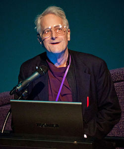

## Texti & upplýsingar

Frá örófi alda höfum við sagt hvort öðru sögur. Í fyrstu geymdar í minni einstaklinga, seinna skrifaðar á skinn eða pappír, síðan prentaðar með prentvél Gutenbergs og núna fjölfaldaðar í prentsmiðjum.

Prentaður texti er í eðli sínu fastur. Við höfum blaðsíður í ákveðinni stærð sem textinn er prentaður á og eftir það eru engar breytingar mögulegar. En hvað ef svo væri ekki?

Árið 1941 gaf Jorge Luis Borges út smásöguna [„The Garden of Forking Paths”](http://www.coldbacon.com/writing/borges-garden.html) sem segir frá höfundi sem ætlar að skrifa stóra og flókna bók ásamt því að búa til stórt og flókið völundarhús. Síðar kemur í ljós að bókin og völundarhúsið er sami hluturinn en sagan lýsir heim þar sem allar mögulegar niðurstöður atburða eiga sér stað samtímis. Þessi smásaga er talin kynna fyrst hugmyndina um _HyperText_.

> I had questioned myself about the ways in which a book can be infinite. I could think of nothing other than a cyclical volume, a circular one. A book whose last page was identical with the first, a book which had the possibility of continuing indefinitely.
> —Jorge Luis Borges, The Garden of Forking Paths, 1941

Við lok seinna stríðs skrifaði Vennevar Bush greinina [„As We May Think“](http://www.theatlantic.com/magazine/archive/1945/07/as-we-may-think/303881/?single_page=true) í Atlantic Monthly þar sem hann lýsir _Memex_. Þetta _Memex_ tæki leyfir einstakling að halda utan um sitt eigið safn af upplýsingum. Það leyfir flokkun, athugasemdir og tengingar við annað efni svo hægt sé að fletta upp og leita ásamt því að deila með öðrum á einfaldan hátt. Sannkallað töfratæki sem Bush gerði ráð fyrir að myndi gjörbreyta heiminum.

> Consider a future device … in which an individual stores all his books, records, and communications, and which is mechanized so that it may be consulted with exceeding speed and flexibility. It is an enlarged intimate supplement to his memory.
> —Vannevar Bush, How We May Think, 1945

### HyperText & HyperMedia

Þessar hugmyndir, ásamt mörgum öðrum, höfðu mikil áhrif á þróun upplýsingatækninnar. Ted Nelson skilgreindi árið 1963 hugtakið _HyperText_: texti á stafrænu formi sem inniheldur vísanir þ.a. lesandi getur strax fengið aðgang að þeim. Textinn er ekki lengur fastur, heldur teygir hann anga sína út og leyfir lesandanum að stýra sinni eigin leið í gegnum hann. Í raunheimum mætti líkja þessu við „Veldu þitt eigið ævintýri“ bækur.



Í [„Mother of all Demos“](https://www.youtube.com/watch?v=yJDv-zdhzMY) árið **1968** kynnti Douglas Engelbart til sögunnar NLS („oN Line System“) sem inniheldur m.a. mús, hypertext, útgáfustýringu (revision control), ritvinnsluforrit, fjarfundarbúnað og fleira sem í dag væri talið til nútímatækni.

[](https://www.youtube.com/watch?v=74c8LntW7fo)

> The future is already here — it's just not very evenly distributed.
> —William Gibson

Til þess að geta útfært í reynd hugtakið um HyperText þurfum við einhverja leið til að ljá texta aukna dýpt og skilgreina tengingar, auk lýsingar á textanum sem er setningarfræðilega aðgreind frá textanum sjálfum. _Umbrotsmál_ (e. markup language) leyfir okkur að gera það.

HyperMedia er það hugtak þegar við takmörum efnið okkar ekki aðeins við texta, heldur við fleiri miðla. Með fyrstu vinsælu stafrænu kerfunum til að útfæra HyperMedia var [HyperCard](https://en.wikipedia.org/wiki/HyperCard) sem kom út fyrir Machintosh tölvur árið 1987.

## Markup mál

Við höfum mál sem skilgreinir snið (_markup_) á textanum. Hægt er að skipta þessum málum í almenna flokka:

* _Létt_ (e. lightweight) – einföld setningarfræði er notuð til að leyfa aðskilnað á ýmsum grunnhugmyndum texta án þess að draga úr læsileika textans, t.d. útbúa fyrirsagnir eða feitletra orð. Dæmi um létt umbortsmál er Markdown.
* _Stefjað_ (e. procedural) – snið er innifalið í texta sem leiðbeiningar um sértækar aðgerðir á textanum, t.d. að gera orð feitletrað. Dæmi um stefjuð umbrotsmál eru [PostScript](https://en.wikipedia.org/wiki/PostScript) og [LaTex](https://en.wikipedia.org/wiki/LaTeX).
* _Framsetningar_ (e. presentational) – [_WYSIWYG_](https://en.wikipedia.org/wiki/WYSIWYG) (What You See Is What You Get) ritlar, sniðið er falið fyrir notendum í formi skjals, t.d. Microsoft Word.
* _Lýsandi_ (e. descriptive) – snið gefur texta merkingu sem er _óháð_ birtingu þess, notast er við _merkingarfræðilegt_ (semantic) snið. Leitast er eftir að lýsa eðli textans en ekki **útliti** hans.

### Markdown

[_Markdown_](https://daringfireball.net/projects/markdown/) er dæmi um létt umbrotsmál, búið til að [John Gruber](https://daringfireball.net/) (í samstarfi við [Aaron Swartz](https://en.wikipedia.org/wiki/Aaron_Swartz)) árið 2004. Markmið þess er að leyfa fólki að skrifa texta með einföldum skipunum sem hægt er að þýða yfir í önnur form (t.d. HTML). Þessi bók er sem dæmi skrifuð í Markdown.

```markdown
# Markdown fyrirsögn

Texti sem inniheldur **feitletraðan** og _skáletraðan_ texta
með [tengli](http://example.org).

* Listi
* af
* orðum
```

Helsti kostur Markdown er að auðvelt er fyrir manneskjur _og_ vélar að vinna með textann. Hægt er að smíða forrit sem _þýða_ úr Markdown yfir í eitthvað annað, t.d. HTML.

### HTML

HTML stendur fyrir _HyperText Markup Language_, lýsandi umbrotsmál (e. descriptive markup language) með sniði sem leyfir okkur að lýsa textanum okkar og nota HyperText hugtakið. Fyrstu útgáfur voru [byggðar á _SGML_](http://www.w3.org/TR/html4/intro/sgmltut.html), Standard Generalized Markup Language, sem er [ISO](https://en.wikipedia.org/wiki/International_Organization_for_Standardization) staðall sem skilgreinir _almennt_ markup mál fyrir skjöl. Það byggir á tveimur hugmyndum:

* Snið ætti að vera lýsandi
* Snið ætti að vera strangt svo auðvelt sé að vinna úr því

## HTML & sagan hingað til

Í kringum 1990 var [Sir Tim Berners-Lee](https://en.wikipedia.org/wiki/Tim_Berners-Lee) að vinna hjá [CERN](https://en.wikipedia.org/wiki/CERN) sem eðlisfræðingur.
Hann skrifaði minnisblað um kerfi sem hann sá fyrir sér að myndi auka möguleika á samvinnu með því að deila skjölum á einfaldan hátt. Í framhaldinu skilgreindi hann _HTML_. Sem grunn nýtti hann SGML en bætti við það (sjá t.d. í skjalinu [„HTML Tags“](http://www.w3.org/History/19921103-hypertext/hypertext/WWW/MarkUp/Tags.html)) og skrifaði fyrsta vafrann og vefþjóninn sem túlkuðu og birtu HTML (skrifað í Objective-C á NeXT tölvu). [Fyrsta vefsíðan](http://info.cern.ch/hypertext/WWW/TheProject.html) varð síðan aðgengileg 23. ágúst 1991, og er enn aðgengileg á sömu slóð í dag.


Uppbygging og þróun fór fram á póstlistum þar sem þeir einstaklingar sem höfðu áhuga gátu tekið þátt og haft áhrif, t.d. [stakk Marc Andreessen upp á](http://1997.webhistory.org/www.lists/www-talk.1993q1/0182.html) `` árið 1993 til að geta birt myndir á vefnum og er það ennþá notað í dag. Í kjölfarið komu fleiri vafrar fram á sjónarsviðið, t.d.:

* [Line Mode Browser](https://en.wikipedia.org/wiki/Line_Mode_Browser) árið 1992, [CLI (Command-line Interface)](https://en.wikipedia.org/wiki/Command-line_interface) vafri gefin út á mörgum stýrikerfum. Endurgerður árið 2013, keyrandi í vef: [Line Mode Browser 2013](http://line-mode.cern.ch/).
* [Lynx](https://en.wikipedia.org/wiki/Lynx_(web_browser)) árið 1992, vafri sem vinnur aðeins í texta, elsti vafrinn enn í almennri notkun.
* [Mosaic](https://en.wikipedia.org/wiki/Mosaic_(web_browser)) árið 1993, fyrsti _grafíski_ vafrinn og talinn vera sá vafri sem gerði vefinn vinsælan. Margt af því sem við þekkjum í vöfrum í dag kom fyrst fram í Mosaic. Þróaður hjá [NCSA](https://en.wikipedia.org/wiki/National_Center_for_Supercomputing_Applications) að hluta til með pening sem kom frá löggjöf sem [Al Gore kom í gegn árið 1991 til að búa til „information superhighway“](http://en.wikipedia.org/wiki/Al_Gore_and_information_technology).
* Netscape Navigator 1.0 árið 1994, þróaður m.a. af Marc Andreessen, ári seinna kemur útgáfa 1.1 sem kynnir _töflur_ til leiks.
* Opera 1.0 og Internet Explorer 1.0 árið 1995.

#/media/File:NCSA_Mosaic.PNG")

## Staðlar

Um leið og fleiri einn vafri voru komnir á sjónarsviðið þurfti að skilgreina _hvernig_ HTML virki í hörgul. Hver vafri um sig getur ekki útfært hlut á annan hátt en hinir eða bætt við sinni eigin, sérstöðluðu virkni.

Stöðlun á HTML 1.0 var fyrst reynd hjá [IETF](https://en.wikipedia.org/wiki/Internet_Engineering_Task_Force) (Internet Engineering Task Force) en komst ekki úr [því að vera drög](http://www.w3.org/MarkUp/draft-ietf-iiir-html-01.txt). Útgáfa 2.0 var síðar stöðluð af IETF í [RFC 1866](https://tools.ietf.org/html/rfc1866) árið 1995. Tim Berners-Lee stofnaði W3C (World Wide Web Consortium) hjá MIT árið 1994 með stuðning frá Evrópusambandinu og [DARPA](https://en.wikipedia.org/wiki/DARPA). CERN dró sig þá til hliðar, enda stofnun sem sérhæfir sig í rannsóknum á sviði eðlisfræði, ekki því að vera leiðandi í upplýsingatækni. Allur kóði vafrans og vefþjónsins sem Tim Berners-Lee vann að hjá CERN var [settur í almenningseign af CERN árið 1993](https://cds.cern.ch/record/1164399).

> The primary design principle underlying the Web’s usefulness and growth is universality. […] And it should be accessible from any kind of hardware that can connect to the Internet: stationary or mobile, small screen or large.
> —Tim Berners-Lee: [Long Live the Web](http://www.scientificamerican.com/article.cfm?id=long-live-the-web) á 20 ára afmæli vefsins.

Frá byrjun hefur víðsýni og frelsi einkennt vefinn. Umferð á netinu hefur að mestu verið hlutlaus, þ.e.a.s. henni er ekki mismunað eftir því hvaðan hún kemur eða hvert hún fer. Ef netið væri ekki hlutlaust gætu þjónustuaðilar farið að gera greinarmun á umferð og skipt henni í hópa. Eftir því í hvaða hóp þú ert getur það haft í för með sér takmarkanir, aukinn kostnað o.s.fr.

[](https://www.youtube.com/watch?v=UMNFehJIi0E)

Frekar má lesa um sögu vefsins í [History of the Web](https://www.w3.org/2012/08/history-of-the-web/origins.htm) og vert er að endurtaka það sem kemur fram þar: _„Understanding how an activity started and developed frequently gives a much greater insight into why things are as they are.“_

## W3C

Hlutverk W3C var og er að vinna að framþróun vefsins. Það er gert í gegnum vinnuhópa (e. working groups) sem taka að sér ákveðna staðla fyrir tækni vinna að því að staðla þær óstöðluðu hugmyndir eða óstaðlaða virkni sem er til staðar í dag.

Til að vinna þessa staðla eru útbúnir _specs_ sem segja til um hvernig hegðun á að vera. Hver sem er getur komið sér í þessa vinnu þar sem W3C eru opin félagasamtök. Flest þau sem vinna að stöðlunum eru þó í vinnu hjá vafrafyrirtækjunum en geta unnið saman á (tiltölulega) óháðum vettvangi að framþróun vefsins. W3C staðlar t.d. HTML, CSS, XML og SVG, en [margt annað er þó einnig í stöðlun og vinnslu þar](https://www.w3.org/standards/). Ferli stöðlunar er langt (tekur ár eða áratugi!) og strangt hjá W3C en í grófum dráttum er það:

* _Working draft_ – búið er að safna nægum upplýsingum til að gefa út fyrstu drög af staðli, sem þó er líklegt að munu breytast mikið. Hér um bil hver sem getur lesið og gert athugasemdir við working draft.
* _Candidate recommendation_ – þroskaðri útgáfa af staðlinum sem tilbúinn er til athugasemda varðandi útfærslu.
* _Proposed recommendation_ – búið er að taka við almennum athugasemdum og athugasemdum varðandi útfærslu og staðall er tilbúinn til loka samþykktar.
* _W3C recommendation_ – Þroskaðasta stig staðals, W3C hefur samþykkt hann og mælir með útfærslu hans.

Oft þegar unnið er með staðlaða hluti getur verið gott að lesa yfir staðalinn til að fá _nákvæmari_ tilfinningu fyrir því hvernig hlutir eigi að virka. Þó ber að hafa í huga að staðlar eru skrifaðir fyrir þau sem útfæra _vafrana_ (eða tækin sem birta vefsíður) en ekki höfunda efnis fyrir vafrana eða tækin.

Þetta verður sérstaklega áhugavert þegar unnið er með nýja tækni sem ennþá inniheldur villur, óskilgreinda hluti eða álíka.

## Vafrastríðin

### Fyrra vafrastríðið

Netscape Navigator 4.0 sem kom út árið 1997 (með stuðning við CSS, JavaScript og DOM) varð gífurlega vinsæll vafri. Uppi voru plön um að næstu útgáfur yrðu _ekki_ ókeypis. Þegar Microsoft fór að dreifa Internet Explorer (IE) ókeypis með Windows í kringum 1997 (sem síðar varð kveikja að stórri [_anti trust_ lögsókn á hendur Microsoft](https://en.wikipedia.org/wiki/United_States_v._Microsoft_Corp.)) fór markaðshlutdeild Netscape að dala og hugmyndir um að græða pening á vafranum urðu að engu. Á frekar stuttum tíma tók IE alveg yfir markaðinn á meðan Netscape fór þá leið að [endurskrifa Navigator 6.0 að öllu leiti, sem varð þeim kostnaðarsamt](http://www.joelonsoftware.com/articles/fog0000000069.html). Þetta tímabil er oft nefnt [_fyrsta_ vafrastríðið](http://en.wikipedia.org/wiki/Browser_wars#The_first_browser_war).

.svg")

Eftir að Netscape tapaði stöðu sinni var fyrirtækið selt [AOL](https://en.wikipedia.org/wiki/AOL) en áður en það gerðist var Netscape Navigator gerður open source og [Mozilla stofnað sem umsjónaraðili þess verkefnis](https://en.wikipedia.org/wiki/Mozilla_Foundation). Mozilla nafnið er talið vera komið frá Jamie Zawinksi, [jwz](https://www.jwz.org/), og standa fyrir [_mosaic killer_](https://en.wikipedia.org/wiki/Mozilla_(mascot)). PBS gerði heimildarmyndina [_Coderush_](http://www.clickmovement.org/coderush) um þetta tímabil.

> Every program attempts to expand until it can read mail. Those programs which cannot so expand are replaced by ones which can.
> —[Zawinski's law of software development](https://en.wikipedia.org/wiki/Jamie_Zawinski#Principles)

Í dag lifir Netscape Navigator að einhverju leyti í Firefox, en fyrsta útgáfan kom út árið 2002, þá undir nafninu Phoenix. Útgáfa 1.0 af Firefox kom út 2004.

### Vefstaðlar

Eftir fyrsta vafrastríðið var CSS orðið nógu vel skilgreint til að hægt væri að nota það í vefforritun en illa gekk að fá fólk til að skipta úr því að nota töflur til að setja upp vefi. Mikið var gert úr því að fólk myndi nýta sér _töflulausa vefhönnun_, þ.e.a.s., nota CSS til að setja upp vefi en ekki töflur.

Það varð þó breyting á með [A List Apart](http://en.wikipedia.org/wiki/A_List_Apart) sem varð til sem póstlisti 1997 en varð fljótlega að helsta veftímariti vefbransans og hefur verið það alla tíð síðan. [Web Standards Project (WaSP)](http://en.wikipedia.org/wiki/Web_Standards_Project) var stofnað 1998 með það að markmiði að þrýsta á vafra framleiðendur að auka stuðning við staðla og tókst það með útgáfum Netscape Navigator 6 árið 2000 og IE6 árið 2001. Zeldman, áhrifamikill vefmógúll, skrifaði grein í A List Apart 2001, „[To Hell with Bad Browsers](https://alistapart.com/article/tohell)“, þar sem hann hvatti forritara og fólk sem vann á vefnum til að byrja að nota staðla. Þó svo að margir væru enn að nota gamla vafra sem ekki styddu staðlana þá væri ekki endalaust hægt að halda í þá og nóg væri nóg.

Það var samt ekki fyrr en árið 2003 sem _töflulaus vefhönnun_ varð að alvöru með endurhönnun ESPN með XHTML og CSS, fyrsti stóri vefurinn til að vera gerður þannig. Wired hafði þó verið endurhannaður árinu áður en útgáfa hans hafði ekki jafn mikil áhrif. Árið 2003 var [CSS Zen Garden](http://www.csszengarden.com/) einnig stofnað, en það er vefur sem sýnir hvað var/er hægt að gera með CSS. Gefið var HTML skjal og máttu þeir aðilar sem sendu inn hönnun _aðeins_ breyta CSS en ekki HTML. Þetta gekk vel og margar mjög framúrstefnulegar og nýtískulegar hannanir voru til sýnis. Árið 2013 var WaSP líka lagt niður með skilaboðunum, „[our work here is done](http://www.webstandards.org/2013/03/01/our-work-here-is-done/)“.


### Annað vafrastríðið

Eftir að hætt var að gera vefi með töflum kom nokkur ládeyða yfir vafraframleiðendur og varð hún svo mikil að Microsoft tilkynnti árið 2003 að IE6SP1 yrði seinasti vafrinn þeirra. Það ásamt því að hugtakið [_Web 2.0_ var gert vinsælt af Tim O‘Reilly](https://en.wikipedia.org/wiki/Web_2.0) hleypti nýju lífi í markaðinn um 2004. [Apple gaf út Safari fyrir Mac OSX](http://donmelton.com/2013/01/10/safari-is-released-to-the-world/), byggðan á [KTHML](http://lists.kde.org/?m=104197092318639) árið 2003. WebKit, vélin sem keyrir áfram Safari, var árið 2005 gerð open source af Apple.

Fyrsta alvöru vefþróunartólið, [Firebug][1] fyrir Firefox, kom út árið 2006 og gjörbreytti því hvernig vefir voru unnir. Í fyrsta skipti var hægt að breyta á einfaldan hátt, beint í vafranum, hvernig vefir höguðu sér. IE 7.0 kom einnig út árið 2006, fimm árum eftir IE 6.0.

  [1]: http://en.wikipedia.org/wiki/Firebug_(software)

.svg")

Með tilkomu iPhone árið 2007 og útgáfu Safari 3.0 á Mac OSX, Windows og iOS, varð vefurinn í fyrsta skipti fyrir alvöru aðgengilegur í símum í „almennilegum“ vafra. Tilraunir til að gera sérstakar vefsíður fyrir iPhone byrjuðu snemma, sérstaklega í ljósi þess að ekki var strax hægt að búa til öpp fyrir iOS.

Google gaf út Chrome vafrann árið 2008, byggðum á Chromium, open source vafra. Chromium var síðan aftur byggður á WebKit. [Árið 2013 var Webkit verkefnið _forkað_](https://blog.chromium.org/2013/04/blink-rendering-engine-for-chromium.html) og til varð ný vafravél, [_Blink_](https://www.chromium.org/blink) sem Chrome notar í dag.

Eitt af því sem hamlaði verulega útbreiðslu nýrrar virkni í vöfrum á fyrstu árum vefsins var það að stanslaust þurfti að sækja nýjar útgáfur af vöfrum. Það gat valdið því að fólk keyrði óuppfærðan vafra í mörg ár og notaði hann til að sinna öllu því sem það þurfti á vefnum, sem aftur gerði það að verkum að flestir stærri vefir urðu að styðja gamla vafra lengur en æskilegt hefði verið. Í dag er þetta minna vandamál þar sem allir vafrar dreifa uppfærslum mjög ört og (í flestum tilfellum) án þess að brjóta neitt á milli uppfærsla. [Chrome var fyrsti vafrinn til að gera þetta](https://blog.codinghorror.com/the-infinite-version/) og er í dag hægt að [sækja _Chrome Canary_](https://www.google.com/chrome/browser/canary.html) sem er útgáfan af Chrome með því allra nýjasta, uppfærð daglega með nýjasta buildi.

Ættartré þeirra vafra sem við notum í dag er orðið frekar flókið og margþætt, en hægt er að skoða það á „[evolution of the web](http://www.evolutionoftheweb.com/)“ fyrir vafra frá 1992–2013.

## HTML 4

Þremur árum eftir að W3C var stofnað var HTML 3.2 staðlað og gefið út sem W3C Recommendation í janúar 1997. Í desember sama ár var HTML 4.0 staðlað og skilgreinir það „nútíma“ HTML.

Þegar við vinnum með HTML erum við ávallt að vinna með _element_, sem er einstakur hluti af vef. Hvert element getur innihaldið önnur element, texta eða ekkert. T.d. er `<p>Halló heimur</p>` _p element_ sem skilgreinir málsgrein (e. paragraph) með textann „Halló heimur“.

Til að mynda tengil (e. hyperlink) notum við t.d. `<a href="https://example.org">Lærum <strong>HTML</strong></a>` er _a element_ (anchor) sem inniheldur bæði textann „Lærum “ og _strong element_ með textann „HTML“ og vísar á „https://example.org“.

Með því að falda saman element búum við til tré sem myndar vefinn okkar. Þetta tré er oft kallað _DOM_ eða _DOM tré_, þar sem DOM stendur fyrir _Document Object Model_. Við höfum möguleika á að vinna með þetta tré í gegnum JavaScript. Element mynda ekki eingöngu þetta tré, heldur býr hvert þeirra yfir merkingu — það hefur _merkingarfræðilegt gildi_ (e. semantic value).

Hvert element hefst á _byrjunartagi_, t.d. `<p>`. Að sama skapi ættu element í flestum tilfellum að enda á _lokatagi_, t.d. `</p>`. Í einhverjum tilfellum hefur element aðeins byrjunartag og er þá möguleiki á að _sjálfloka_ (e. self closing) því (t.d. `<hr />`) en með tilkomu HTML5 er það ekki krafa (í lagi að skrifa `<hr>`).

Í HTML höfum við þrjú element sem mynda grunninn að vefsíðunum okkar:

* `<html>` skilgreinir rót HTML vefs og er það fyrsta í hverri vefsíðu, fyrir utan DocType.
* `<head>` er yfirleitt fyrsta barn `<html>` og heldur utan um lýsigögn vefsíðu, t.d. titil, sem er texti skilgreindur innan `<title>`.
* `<body>` skilgreinir meginmál vefs, element innan `<body>` mynda það tré sem birt er notanda.

Oft þegar rætt er um HTML er _element_ og _tag_ blandað saman og t.d. talað um _p tag_ þegar það sem meint er _p element_. Þetta er viss smámunasemi en þarna er munur og því æskilegt að tala rétt um hlutina.

Til þess að ljá element frekari merkingu getum við bætt við nafn-gildis pari með því að nota _attribute_ sem eru sett á byrjunartagið, t.d. `href="https://example.org"` sem myndar vísunina sem a element vísar á. Ekki er krafa um að umljúka gildið með gæsalöppum, en til að gildið sé skýrt er það æskilegt. Sum attribute eru aðeins notuð til að kveikja á gildi og er þá nóg að hafa aðeins heitið, t.d. `<option selected>`.

Til eru nokkur attribute sem leyfilegt er að setja á öll element, svokölluð [_global attributes_]((https://w3c.github.io/html/dom.html#global-attributes). Af þeim ber helst að nefna:

* `id`, skilgreinir auðkenni á element sem notað er til að vísa á það innan síðu með _fragment identifier_ (`index.html#auðkenni`), í CSS, eða til þess að vinna með í DOM gegnum JavaScript.
* `class`, orð, skiptum á bilum, sem skilgreina flokka sem elementið tilheyrir. Mikið notað í CSS til að velja ákveðin element eða ákveðinn hóp af þeim.
* `title`, texti með auka upplýsingum um element sem oftast birtist sem _tooltip_ þegar mús er haldið yfir elementinu.

Bil og línubil hafa ekki merkingu í HTML, þ.e.a.s. ef við notum fleiri en eitt bil eða línubil í orði þá eru þau felld saman í eitt bil. Ef við viljum setja athugasemdir innan HTML skjals getum við notað sérstakt athugasemda element sem mun aldrei birtast notanda: `<!-- no comment -->`.

### DocType

Öll sniðmál sem byggja á SGML þurfa að tilgreina Document Type Definition (DTD) sem skilgreinir málfræðina sem farið er eftir. Í HTML er þetta sett fram í fyrstu línu skjalsins, í _DocType_. Fyrir HTML 4, _strict_ útgáfu skilgreinum við:

```html
<!DOCTYPE HTML PUBLIC "-//W3C//DTD HTML 4.01//EN" "http://www.w3.org/TR/html4/strict.dtd">
```

Enn í dag þurfum við að skilgreina í hvaða DocType HTML skjölin okkar eru. Ástæðan fyrir því er að vafrar í dag geta ennþá túlkað og sýnt vefi frá því á árdögum vefsins. Þegar enn var verið að skilgreina hvernig HTML var birt í vöfrum var mikið um ósamræmi og á tímabili var ekki hægt að innleiða nýjungar án þess að brjóta þá vefi sem þegar voru til. Þegar nýir vefir voru smíðaðir sem notuðu nýja staðla þurftu að velja sérstaklega að nota þá með því að skilgreina DocType. Ef vefur skilgreindi ekkert DocType var hann birtur í [_quirks mode_,](https://developer.mozilla.org/en-US/docs/Quirks_Mode_and_Standards_Mode) þar sem gert var ráð fyrir að hinir ýmsu kvillar væru til staðar. Hinsvegar ef vefur benti á rétt, staðlað DTD, var hann birtur í [_standards mode_](https://developer.mozilla.org/en-US/docs/Quirks_Mode_and_Standards_Mode). Með þessari aðferð árið 1996 jókst notkun á CSS talsvert.

## XML

XML, eða _Extensible Markup Language_ er opið sniðmál sem staðlað er af W3C og hefur það að markmiði að kóða almennar upplýsingar á formi sem bæði er læsilegt af tölvum og fólki. XML er skilgreint með SGML og notast við element og attribute og eru því XML og HTML skjöl að mörgu leyti lík, nema að XML nota yfirleitt tög sem draga nöfn sín af verkefninu sem verið er að leysa.

```xml
<?xml version="1.0" encoding="UTF-8" ?>
<page>
  <section>
    <heading>Fyrirsögn</heading>
    <content>Efni</content>
  </section>
</page>
```

XML skjöl _verða_ að uppfylla vissar kröfur um réttmæti til að tölvur geti lesið þau, þau verða að vera _valid_. Ef þau eru það ekki mun XML þáttari sem reynir að búa til DOM tré kasta villu og **engu** er skilað. XML skjöl verða einnig að byrja á _XML skilgreiningu_, t.d. `<?xml version="1.0" encoding="UTF-8" ?>` sem segir til um útgáfa af XML og stafasett sem notað er.

### XHTML

Við lok seinustu aldar var XML mjög vinsæl tækni sem var mikið notuð á internetinu. Þessar vinsældir ásamt því hversu erfitt það gat verið á stundum að þátta HTML (vafrar höfðu byggt inn virkni sem lagaði villur hjá notendum þar sem erfitt getur verið að skrifa HTML alveg kórrétt) urðu til þess að fólk fór að vinna að því að gera útgáfu af HTML sem fór eftir sömu reglum og XML. _XHTML_, Extensible HyperText Markup Language, var staðlað af W3C og kom útgáfa 1.0 út sem W3C recommendation árið 2000 og útgáfa 1.1 árið 2001.

## Stafasett & HTML

Þar sem tölvur geta verið heldur vandlátar á það í hvaða _stafasetti_ við skrifum, þá skilgreinum við það sérstaklega í `<head>` með því að setja það á `charset` attribute á `<meta>`, element sem leyfir okkur að setja fram lýsigögn um skjalið okkar. Í langflestum tilfellum viljum við nota [UTF-8](https://en.wikipedia.org/wiki/UTF-8) sem getur kóðað alla stafi (code points) í [Unicode](http://unicode.org/).

```html
<meta charset="utf-8">
```

Í XML og HTML eru sérstakir stafir, [_character entity_](http://en.wikipedia.org/wiki/List_of_XML_and_HTML_character_entity_references) skilgreindir með `&X;` þar sem `X` er:
  - Heiti tákns, t.d. `&lt;` fyrir minna-enn (`<`)
  - [Code point](https://en.wikipedia.org/wiki/Code_point), í decimal eða hexadecimal með `#` fyrir framan, t.d. `&#x00DE;` fyrir Þ

## HTML5

Eftir áhugaleysi W3C á því að þróa HTML áfam og mikinn fókus á XHTML og XML tengda tækni tóku nokkrir aðilar sig saman og stofnuðu [WHATWG](https://whatwg.org/) (Web Hypertext Application Technology Working Group) árið 2004, með það að markmiði að vinna áfram að HTML og eðlilegri framþróun vefsins. Þessi vinna fór fram undir nafninu HTML5 þar sem hver sem er gat lagt til breytingar á HTML í gegnum póstlista en takmarkaður hópur ritstjóra stýrði því hvað fór inn í staðal.

Tveimur árum seinna, árið 2006, sá W3C að sér og hélt áfram þróun HTML sem HTML 5. En þar sem hver heilvita maður sér að þróun á tveim aðskildum stöðlum (HTML5 og HTML 5) á sama tíma virkar ekki, þá voru þeir blessunarlega sameinaðir í einn HTML5 staðal árið 2007. W3C hætti þróun á XHTML 2.0 árið 2009 og farið var að öllu að þróa HTML5 sem framtíð HTML.


Árið 2012 tók W3C „snapshot“ af staðlinum eins og hann leit út hjá WHATWG og fór í þá vinnu að gera staðalinn að W3C staðli. WHATWG hætti hinsvegar að tala sérstaklega um HTML5 og [vinnur nú að framþróun HTML](http://blog.whatwg.org/html-is-the-new-html5) í lifandi staðli sem mun aldrei klárast og heldur áfram að þróast án þess að hlutir séu fjarlægðir.

HTML5 byggir hvorki á SGML né XML en er samhæft fyrri útgáfum (e. backwards compatible) af HTML. Stefnan er að auka samvirkni (interoperability) og aðgengi að vefnum. Til að vera að fullu samhæft fyrri útgáfum verður HTML5 að skilgreina DocType:

```html
<!doctype html>
```

Þetta er eina DocType sem við notum, nema við höfum mjög góða ástæðu til annars. Héðan í frá miðast öll umfjöllun við HTML5. Grunnurinn að vefsíðunum okkar verður þá:

```html
<!doctype html>
<html lang="is">
  <head>
    <meta charset="utf-8">
    <title>Halló heimur</title>
  </head>
  <body>
    <p>Halló heimur</p>
  </body>
</html>
```


