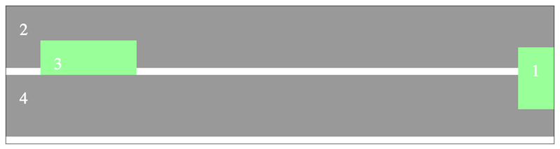
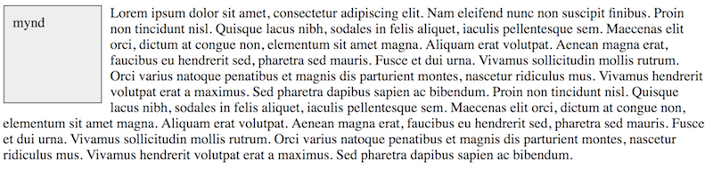
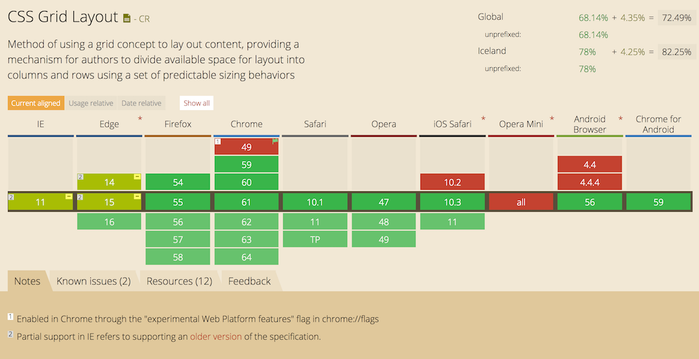

# CSS

## Hvað er CSS?

Þegar við höfum skrifað efnið okkar í afskaplega fínu HTML skjali, merkingarbæru og aðgengilegu, langar okkur að ljá það lífi með útliti. Þar sem HTML er _descriptive_ markup mál er því ekki ætlað að tjá útlit en þar kemur CSS inn í myndina.

CSS stendur fyrir [_Cascading Style Sheets_](http://en.wikipedia.org/wiki/Cascading_Style_Sheets) og er _style sheet language_ sem lýsir framsetningu á skjali skrifuðu í markup máli, t.d. HTML, XHTML, XML og SVG. CSS kom fyrst fram á sjónarsviðið árið 1994 þegar [Håkon Wium Lie lagði til _Cascading HTML style sheets_](https://www.w3.org/People/howcome/p/cascade.html). Í tillögunni er farið yfir hvernig vafrinn stjórni að mestu allri birtingu og „the author of HTML documents has no influence over the presentation“, sem var vissulega rétt, fyrir tíma CSS var engin leið til að breyta litum á tenglum!

Þó svo að það væri ekki hægt að breyta litum á tenglum lét fólk það ekki stoppa sig í að nýta það sem í boði var til að lífga upp á vefsíður. Töflur og gegnsæjar gif myndir tröllriðu öllu eftir að [_Creating Killer Websites_](https://www.killersites.com/killerSites/core.html) kom út og fólk gat loksins tjáð sig á vefnum með _hönnun_.


Árið 1996 var [CSS 1 staðlað hjá W3C](https://www.w3.org/TR/1999/REC-CSS1-19990111) en átti erfitt uppdráttar fyrstu árin eftir það. Stuðningur í vöfrum var ekki mikill og ósamhæfður. CSS 2 staðallinn kom út 1998 og kynnti til leiks `position` eigindið sem leyfði enn frekari stjórn yfir útliti. Stuðningur við CSS hélt þó áfram að vera lítill og ósamhæfður í vöfrum. Vefforritarar létu sér nægja að nota töflur og sáu sumir hverjir ekki ástæðu til að tileinka sér nýja tækni sem ekki var vel studd. [Web Standards Project (WaSP)](http://en.wikipedia.org/wiki/Web_Standards_Project) fór gagngert að þrýsta á vafraframleiðendur til að útfæra CSS rétt samkvæmt staðli og var stofnuð til þess [„CSS Action Committee“](https://archive.webstandards.org/css/) sem einnig gekk undir nafninu „The CSS Samurai“. Partur af því sem þessi hópur gerði var að útbúa viðmiðs útfærslu af CSS sem vafrar gátu hlaðið upp og borið saman við mynd. Þetta próf var kallað _acid test_ og varð til þess að stuðningur fór hægt og rólega að aukast.


Þegar þessir staðlar voru orðnir ágætlega studdir í nýlegri vöfrum um aldamótin, var þónokkuð af fólki ennþá að nota eldri, úrelta vafra einsog t.d. Netscape Navigator. Þar sem engin pressa var á notendur til að uppfæra og hlutirnir _virkuðu_ var ennþá stöðnun. Þetta breyttist síðan með _töflulausum_ eða _merkingarfræðilegum_ endurhönnum á Wired árið 2001 og ESPN árið 2003. CSS Zen Garden sem opnaði 2003 sýndi fólk líka hvers CSS var megnugt.

CSS 2.1 kom fyrst út árið 2004 og innihélt sá staðall  aðallega lagfæringar á villum í CSS 2. Brösuglega gekk þó að ná þeim öllum. W3C setti því staðalinn fram og aftur í _draft_ og hélt það áfram alla leið til ársins 2011. Af þessu lærði W3C og var CSS 3 sett upp á annan máta. Í staðinn fyrir að gefa út einn stóran staðal með allri virkni sem staðla ætti er virknin þróuð í einingum. [Hlaupa þessar einingar á tugum](https://www.w3.org/Style/CSS/current-work) og eru þær á hverjum tíma í mismunandi stöðu, hvort sem þær eru draft, candidate recommendation eða proposed recommendation


## Einfalt, ekki auðvelt

> “You don't need to be a programmer or a CS major to understand the CSS specifications. You don't need to be over 18 or have a Bachelor's degree. You just need to be very pedantic, very persistent, and very thorough.”
– [Understanding the CSS Specifications](http://www.w3.org/Style/CSS/read)

CSS er einfalt að læra en ekki auðvelt að nota. Í grunninn eru þetta nokkrar reglur með einfaldri málfræði sem leyfir okkur síðan að lýsa því hvernig element eigi að birtast. Þar sem það er einfalt að læra á CSS en ekki auðvelt að skrifa CSS til að lýsa því útliti sem óskað er eftir, lenda margir upp á kant við CSS. Vegna þessa eru margir sem sem líta CSS hornauga og kenna því um að ekki gangi vel. Þetta er vert að hafa í huga áður en byrjað er að læra CSS.


## CSS & HTML

Þar sem CSS er sú tækni sem við notum til að ljá HTML líf þurfum við að tengja saman HTML og CSS. Það eru nokkrar leiðir til þessa:

* Geyma CSS í eigin skrá (með skráarendingunni `css`) og vísa í þá skrá úr HTML með `<link rel="stylesheet" href="path/to/file.css">` í `<head>`. Þessi leið viðheldur algjörum aðskilnaði á milli HTML og CSS og er æskilegasta leiðin.
* `<style>` element í HTML skjali, helst í `<head>`. Elementið inniheldur CSS reglurnar sem texta. Þetta er ekki alveg jafn _hrein_ leið en aðskilur þó CSS frá sniðmálinu
* Öll element hafa `style` global attribute sem leyfir skilgreiningu á CSS beint á elementi. Þetta getur haft sína kosti en ætti **alls ekki** að vera almenna leiðin til að tengja CSS við HTML þar sem þetta bindur útlit við sniðmálið og er litlu betra en að nota `<FONT>`

## Málfræði

Málfræði CSS er einföld, flest það sem við gerum byggist á því að vinna með reglusett sem samanstendur af _selectors_ og _skilgreiningum_. Hægt er að setja inn athugasemdir í CSS innan `/*` og `*/`.

```css
/* þetta er athugasemd */
p {
  color: green;
  margin: 1em;
}
```

### Selectors

_Selector_ er strengur sem lýsir því hvaða element við viljum að taki við _skilgreiningum_. Sér í lagi getum við skrifað:

* _Type selector_, heiti á elementi, t.d. `p`
* _Universal selector_, öll element, skilgreindur með `*`
  - Getur valdið hægagangi þar sem vafri þarf að skoða flest öll element
* _Attribute selector_, velur element eftir því hvaða attribute eru á því og hvað þau innihalda
* _Class selector_, velur element eftir því hvað `class` attribute inniheldur, notar `.` (punkt)
* _ID selector_, velur element eftir því hvað `id` attribute inniheldur
  - Ekki æskilegt þar sem það lætur selector fá hátt sértækni (specificity) gildi
* _Gervi-klasar_ (pseudo-classes), velur hluti sem ekki er hægt að velja með hinum, einföldu selectorum, notum `:`. Þeir skiptast síðan áfram í nokkra flokka, helst ber að nefna:
  - dýnamískir gerviklasar. Fyrir tengla `:link` ef ekki er búið að heimsækja og `:visited` ef búið er að heimsækja. Fyrir aðgerðir notenda, `:hover` meðan sveimað er yfir element, `:active` ef búið er að velja það, smella á það, `:focus` ef það hefur fókus
  - Gerviklasar fyrir upbyggingu, t.d. `:nth-child()`, `:first-child` eða `:last-of-type`

Hægt er að tengja saman selectors með bili (white space), „>“, „+“ eða „~“:

* ` ` þýðir að seinni selector velur element sem er afkomandi fyrri
* `>` er fyrir _strangt barn_, seinni selector verður að vera barn fyrri
* `+` er fyrir _systkini_, seinni selector velur element sem er systkini sem kemur **beint á eftir** fyrri selector
* `~` er almennur systkina selector, seinni selector velur element sem er syskini fyrri

```css
*           /*  öll element */
div         /* öll div */
div p       /* öllu p, afkomendur p */
div > p     /* öll p sem eru börn div */
p + p       /* öll p með p sem fyrra systkyni */
div.foo       /* öll div með class foo */
a:hover       /* öll a sem verið að hovera á */
div#foo       /* öll div með id foo */
div[foo="bar"]  /* öll div með attribute foo=bar */
```

### `at` reglur

_At reglur_ leyfa skilgreiningar á aukaupplýsingum. Þær geta verið fyrir ákveðið gildi, t.d. `@import 'foo.css';` sem innifelur allt CSS úr `foo.css`. Þær geta einnig verið hreiðraðar, innihalda þá CSS reglur sem eru aðeins notaðar við ákveðin skilyrði, t.d.

* `@media` sem skilgreinir að ákveðnar reglur eigi við ákveðna virkni eftir _media query_
* `@supports` er nýleg regla sem leyfir okkur að nota reglur aðeins ef ákveðin CSS virkni er studd

### Gervi-element

Gervi-element leyfa okkur að velja parta af elementi sem við annars gætum ekki gert. Þau eru skilgreind í selector með `::`.

* `:before/:after` – element sem er fyrir framan/aftan það sem skilgreint er
* `:first-letter` – fyrsti stafur elements
* `:first-line` – fyrsta lína elements

### Villumeðhöndlun

CSS er hannað til að fyrirgefa minniháttar villur, t.d. fyrir yfirlýsingar:

* Ef tvípunkt eða semíkommu vantar í yfirlýsingu
* Ef heiti eigindis er óþekkt
* Ef gildi er óþekkt eða ekki er hægt að vinna úr því

Er yfirlýsingin öll hunsuð og haldið áfram að næstu.

Meiriháttar villur stoppa lestur á skjali frá þeim stað sem þær eiga sér stað. Þetta gerist yfirleitt þegar `{` og `}` eru ekki í jafnvægi.

```css
p {
  color: blue;

  /* næstu tvær reglur eru hunsaðar, vantar ; */
  color: yellow
  font-size: 10em;
}

/* a verður litað grænt þó } vanti */
a {
  color: green;

/* engar reglur héðan í frá verða nýttar því } vantar */
em {
  color: purple
}
```

### Skilgreiningar

Skilgreiningar á reglusetti eru innan `{` og `}` innihalda enga eða fleiri _yfirlýsingar_ aðgreindar með semikommu.

Yfirlýsing byrjar á nafni _eigindis_, tvípunkti, _gildi eigindis_ og loks endar semíkomma yfirlýsinguna. `eigindi: gildi;`

Nöfn eiginda eru margvísleg í CSS og bætast við fleiri eftir því sem ný virkni er skilgreind. Gildin eru hinsvegar töluvert færri.

Fyrir sum eigindi er hægt að skilgreina í einni yfirlýsingu mörg gildi fyrir svipaða virkni, þetta er kallað _shorthand_. Þessi virkni getur minnkað fjölda lína sem við þurfum að skrifa og kannski sparað tíma.

Shorthand leyfir líka að sleppa því að skilgreina ákveðin gildi og eru þá sjálfgefin gildi sett í staðinn. Þetta getur valdið vandræðum ef það skrifar yfir gildi sem við höfum áður skilgreint.

## Gildi í CSS

Strengir er skilgreindir með `'` eða `"`. Ef við þurfum að skrifa þess stafi notum við _escape_, með því að setja `\` fyrir framan.

* `"this is a 'string'"`
* `"this is a \"string\""`

Url skilgreinum við með `url(<slóð>)` þar sem slóð er bein slóð eða slóð í streng.

* `url(http://example.org)`
* `url('http://example.org')`

Liti má skilgreina með:

* Lykilorði, t.d. `black`, `white`, `green`
  - `transparent` er einnig lykilorð fyrir alveg gegnsæan lit
* RGB gildi með hexadecimal (eða hex) eða `rgb()`, t.d. `#00ff00` eða `rgb(0, 255, 0)` (bæði gildi eru grænn). Hex gildi má einnig skilgreina með þrem stöfum, en þá gildir hver stafur tvisvar, `#0f0` er `#00ff00`, `#9ac` er `#99aacc`
  - RGB gildi skilgreina styrkleika á rauðum (red), grænum (green) og bláum (blue) frá `0` og upp í `255` í decimal kerfi eða `0` uppí `ff` í hex
* [HSL](https://en.wikipedia.org/wiki/HSL_and_HSV) gildi með `hsl()`

Hægt er að skilgreina alpha rás fyrir lit ef `rgba` eða `hsla` er notað. Ef gildið er `1` er liturinn ekkert gegnsær, ef `0.5` er liturinn hálfgegnsær og ef `0` er liturinn að öllu gegnsær.

Tölur geta verið heiltölur og rauntölur. Rauntölur eru skilgreindar með punkt, t.d. `1.2`. Einingar á tölum geta verið ýmsar en einnig getum við skilgreint prósentur, t.d. `25.5%``. Tölur notum við yfirleitt þegar við vinnum með _lengdir_ í CSS.

## Lengdir

Þegar unnið er með útlit í CSS er mikið unnið með lengdir. Hvort sem það er til að stýra hversu breið, há eða hve mikið bil er á milli elementa. Eigindin geta tekið hinar ýmsu einingar. Í grunninn eru þær hlutfallslegar og nákvæmar.

Eitt sérstakt gildi er hægt að gefa fyrir lengd en það er `auto` sem leyfir vafra að reikna lengdina fyrir element.

### Nákvæmar einingar

Nákvæmar einingar eiga við þegar við vinnum með hluti sem við vitum nákvæmar mælingar á, t.d. fyrir prent þar sem við prentum á þekkta stærð í raunheimum, þar er hægt að nota einingar einsog `in`, `cm`, eða `mm`. Að skilgreina `1cm` í CSS þýðir samt ekki að útkoman verði nákvæmlega einn sentimeter útprentuð. Nákvæma gildið er alltaf _hlutfallslegt_ við upplausn prentunar, `dpi` eða _dots per inch_.

Í langflestum tilfellum reynum við að sleppa því að nota nákvæmar einingar þar sem vafrinn og umhverfið sem vefurinn okkar birtist í er ekki þekkt stærð. Þó eru aðstæður þar sem við þurfum að nota nákvæmar einingar og þá notum við `px` eða _pixel_. Það er þó töluvert flóknara en svo að `1px` sé `1px` á öllum tækjum.

### Hlutfallslegar einingar

Hlutfallslegar einingar skiptast í tvo hópa, letur-hlutfallslegar einingar (font-relative lengths) og skjá-prósentu einingar (viewport Percentage Lengths).

Letur-hlutfallslegar einingar horfa til `font-size` eigindsins þegar þær skilgreina stærð fyrir element. Yfirleitt notum við `em` eða `rem` einingar. `em` var upphaflega stærð skilgreind útfrá breidd `M` í leturgerð en hefur í dag verið skilgreind í CSS sem stærð `font-size`. Ef ekkert hefur verið átt við `font-size` er `1em == 16px` en ef `font-size: 18px;` hefur verið skilgreint verður `1em == 18px`.

Þegar reiknað er úr `em` gildum í elementum sem eiga sér foreldri með skilgreint `em` gildi eru þau _margfölduð_. Þetta getur oft valdið ruglingi þegar `em` er notað:

```css
html { font-size: 1.5em; }
/* texti innan html er núna 16px * 1.5 = 24px */

.foo { font-size: 12px; }
/* texti innan .foo er nákvæmlega 12px */

.foo p { font-size: 2em; }
/* texti í p undir .foo er 12px * 2 = 24px */

.foo p em { font-size: 10px; }
/* texti í em undir p undir .foo er nákvæmlega 10px */

.foo p strong { font-size: 1.5em; }
/*
  texti í strong undir p undir .foo er:
  12px * 2 * 1.5 = 36px
*/
```

Núna spyrja margir sig, afhverju í ósköpunum að hafa svona flækjustig í útreikningum á stærðum fyrir texta? Þetta er svona flókið þar sem við getum með þessu útbúið vefi þar sem _vertical rhythm_ eða _lóðréttur hrynjandi_ í texta er réttur. Öll bil og allar stærðir eru margfeldi af grunnstærð, förum nánar yfir það í hönnunarhluta.

`rem` einingin losar okkur við þessa margföldun í gegnum element og horfir alltaf á stærð rótar elements, `font-size` á `<html>`. Þar með getum við fengið kosti þess að skilgreina hlutfallslega án þess að þurfa að vera í sífellu að reikna hlutföll.


Ástæðan fyrir því að nota hlutfallslegar einingar er, einsog áður var nefnt, til að hjálpa okkur að láta vefinn okkar birtast rétt í þeim mýmörgu tækjum sem hann getur verið skoðaður í. Ef við fastsetjum allar stærðir útfrá stórum skjám með háa upplausn munu einstaklingar sem skoða hann áminni skjám með minni upplausn lenda í vandræðum, og öfugt.

Nánar má lesa um einingar í [MDN: CSS <length>](https://developer.mozilla.org/en/docs/Web/CSS/length), [CSS-Tricks: The Lengths of CSS](https://css-tricks.com/the-lengths-of-css/) og [W3C: Font-relative lengths](http://www.w3.org/TR/css3-values/#font-relative-lengths).

Skjá-prósentu einingar eru hlutfallslegar við stærð _viewports_ sem er yfirleitt stærð vafragluggans.

* `vw` er ein eining á breiddina (_viewport width_) svo `100vw` myndi fylla upp í skjá á breiddina
* `vh` er ein eining á hæðina (_viewport height_) svo `100vh` myndi fylla upp í skjá á hæðina
* `1vmin` er `1vw` eða `1vh`, hvort sem er minna
* `1vmax` er `1vw` eða `1vh`, hvort sem er stærra

Hægt er að nota þessar einingar bæði til að stýra stærðum á elementum eða öðru, t.d. leturstærð.

## Dæmi um selectors og einingar

Fyrir eftirfarandi HTML

```html
<div>
  <p>Halló <strong id="text">gangi</strong></p>
</div>

<div class="text">
  <em>Lorem</em> <span foo>ipsum <em foo>dolor</em> sit amet</span>, consectetur adipiscing elit.
</div>
```

skilgreinum við CSS

```css
html { font-size: 20px; }
/* grunn stærð fyrir em er 20px */

div { border: 1px solid #000; }
/* svartur 1px breiður border */

em { color: #f00; }
/* látum öll em vera með rauðan texta */

div > em { color: #00f; }
/* en ef þau eru beint undir div er það blátt */

div + div { margin-top: 1em; }
/* div sem er systkini div fær 20px margin fyrir ofan sig */

div.text:first-letter { font-size: 2em; }
/* fyrsti stafur undir div.text verður 10px*2=20px */

[foo]::after { content: ' foo!'; }
/* á eftir öllum elementum með attribute foo setjum við textan foo! */

span:hover { background-color: #0f0; }
/* ef við förum með mús yfir span breytir það um bakgrunnslit */
```

## Specificity – sértækni

Fyrir hvern selector er reiknað _sértækni_ (specifitcy) sem er á forminu `(a,b,c,d)` þar sem:

* `a`, 1 ef skilgreint í `style` attribute, annars 0
* `b`, fjöldi `id` selectora
* `c`, fjöldi attribute selectora og gervi-klasa
* `d`, fjöldi elementa og gervi-elementa

Við fáum síðan gildi með því að skeyta gildinu saman í tölu sem er sértækni gildið

```css
li.foo {}        /* a=0 b=0 c=1 d=1 → 11 */
#foo {}          /* a=0 b=1 c=0 d=0 → 100 */
.foo .bar:active /* a=0 b=0 c=3 d=0 → 30 */
style=""         /* a=1 b=0 c=0 d=0 → 1000 */
```

## Cascade – „flóðið“

Þegar útlit er sett saman af því sem ætlar að birta útlit þarf að komast að því _nákvæmlega_ hvaða skilgreiningar eigi við fyrir hvert element. Þá er „flóðið“ eða cascade notað. Skilgreiningar geta komið frá þremur stöðum:

* _User agent_, tæki sem birtir (yfirleitt af vafra, en fleiri tæki styðja CSS) en það verður að skilgreina sjálfgefna stíla
* _Notanda_, notandi tækis getur skilgreint með stillingum hvernig hlutir líta út, t.d. að allt sé stækkað
* _Höfundi_, skilgreiningar frá höfundi vefs, yfirleitt okkar sem vefforritara

Eftir að allt CSS hefur verið lesið frá öllum upprunum er skilgreiningum raðað eftir:

1. Skilgreiningum user agents
2. Skilgreiningum notanda
3. Skilgreiningum höfundar
4. Skilgreiningum höfundar merktar með `!important`
5. Skilgreiningum notanda merktar með `!important`
6. Sértækni
7. Skilgreiningar röð innan skjals þar sem seinna skilgreint fær hærra gildi

Þessi röðun er síðan notuð til að reikna hvaða gildi hver yfirlýsing fær.

### `!important`

Með því að skilgreina `!important` á yfirlýsingar höfum við áhrif á það hvar í röðinni yfirlýsingin lendir. Þetta gæti hljómað sem góð hugmynd en í raun er hún það ekki. Yfirlýsingar með `!important` hunsa sértækni gildi og skilgreiningar röð og vinna því gegn almennu reglunni um það hvernig reiknað er og getur valdið rugling.

```css
div {
  font-size: 100px !important;
  /* það er mjög mikilvægt að allur texti sé 100px! */
}
```

T.d. ef tveir aðilar vinna í sama CSS, annar lendir í einhverjum vandræðum með að fá rétt útlit með því að nota selectora og setur `!important` á yfirlýsingu. Hinn aðilinn hefur verið að nota rétta selectora til að fá fram útlit en allt í einu hætta þær skilgreiningar að vera réttar því `!important` gildi tekur yfir skilgreiningar.

### Gildi

Þegar útlit er birt þarf að reikna gildi fyrir allar yfirlýsingar sem tæki styður. Til þess er byrjað á að finna skilgreint gildi eftir reglu:

* Ef „flóðið“ gefur okkur gildi, notum það
* Annars, erft gildi
* Annars, upphafsgildi

Sum gildi eru erfð í börnum frá foreldri sínu, þetta sparar okkur heilmikla vinnu og lætur CSS virka einsog við myndum gera ráð fyrir.

```html
<h1>Halló <em>heimur</em></h1>
```

```css
h1 { color: blue; }
/*
  allur texti innan h1 er blár, líka sá
  sem er innan em, þar sem color erfist
*/
```

Fyrir aðrar yfirlýsingar eru skilgreind upphafsgildi. Þau eru yfirleitt rökrétt en stundum geta þau valdið okkur vandræðum, sérstaklega þegar við notum _shorthand_. T.d. er `background-color` með sjálfgefna gildið `transparent`, engin bakgrunnslitur.

Þegar komið er að því að fá raun gildi er það fengið með eftirfarandi reglu:

* Reiknað gildi – reiknað úr hlutfallslegum gildum eins langt og hægt er, t.d. hlutfallsleg breidd m.v. foreldri
* Notað gildi – fáum nákvæm gildi úr öllum, leyst úr háðum gildum
* Raun gildi – gildi notað við birtingu, t.d. þarf að námunda tölur að einhverjum aukastaf

```html
<section>
  <div>halló</div>
</section>
```

```css
html {
  font-size: 10px;
}

section {
  width: 10em;
  /* reiknað, notað og raun gildi: 10px * 10 = 100px */
}

div {
  font-size: 2em;
  /* reiknað, notað og raun gildi: 10px * 2 = 20px */

  border: 0.01em solid black;
  /*
  reiknað og notað gildi: 0.01 * 20px = 0.2px
  raun gildi: 1px, rúnað upp
  */

  width: auto;
  /*
  reiknað gildi: auto
  notað gildi: 100px, búið að reikna section
  raun gildi: 98px, útfrá box model og border
  */
}
```

### Reset

Hver user agent (í flestum tilfellum vafri) setur sín eigin sjálfgefnu gildi sem eru notuð ef við skilgreinum ekkert. Þetta getur verið mismunandi milli vafra og því varð hugtakið um _css reset_ til, en það eru reglusett sem setur öll element í „núllstöðu“. Fyrsta [`reset.css` skjalið](http://meyerweb.com/eric/tools/css/reset/) var búið til af Eric Meyer.

## Að skrifa CSS

Algengasta leiðin til að skrifa CSS er að hafa einn selector per línu með `{` á línu seinasta selectors. Allar yfirlýsingar eru síðan dregnar inn innan reglusetts.

```css
/* ekki svona */
.foo, .bar, div { font-size: 1em;
color: black; }

/* heldur svona */
.foo,
.bar,
div {
  font-size: 1em;
  color: black;
}
```

Almennt notum við ekki ID selectora þar sem þeir hafa hærra specifity en class selector og valda því vanda. Einnig er `id` aðeins einu sinni per síðu og því ekki hægt að endurnýta fyrir fleiri en eitt element.

Einnig er æskilegt að nýta sér „flóðið“ þar sem það á við, t.d. til að skilgreina leturgerð aðeins einu sinni, þarf ekki að skilgreina aftur og aftur fyrir mörg element.

Stundum eru yfirlýsingum raðað á einhvern sérstakan hátt og þeim hópað saman, t.d. allt sem á við texta saman, allt sem á við staðsetningu. Þetta á sérstaklega við í verkefnum sem margir vinna í.

Þegar við skrifum `class` á element til að velja með selector þá er venjan að skrifa þá með _kebab-case_ á ensku:

```css
/* ekki svona */
.MikilvaegurTexti
.ListOfItems

/* heldur svona */
.important-text
.list-of-items
```

W3C heldur úti [_validation_ þjónustu](https://jigsaw.w3.org/css-validator/) sem bæði bendir okkur á beinar villur en einnig hugsanlega vandræði sem CSS gæti skapað. Til þess að fá allar upplýsingar þurfum við að kveikja á öllum _warnings_ undir _more options_.

Fyrir eftirfarandi CSS:

```css
p {
  font-size: 1en;
  margim: 1em;
}

.foo {
  background-color: #999;
}
```

fáum við villur:

```
2 p Value Error : font-size Unknown dimension 1en
3 p Property margim doesn't exist : 1em
```

og viðvaranir:

```
7 You have no color set (or color is set to transparent) but you have set a background-color. Make sure that cascading of colors keeps the text reasonably legible.
```

## Box model

Box módelið lýsir því hvernig rétthyrnd box fyrir element eru mynduð.


### Margin

Margin er ysta lag boxsins og getum við skilgreint lengd í hverja átt með `margin-top`, `margin-right`, `margin-bottom` og `margin-left`. Lengd getur verið skilgreind sem neikvæð tala en þá er box _dregið_ í viðkomandi átt um töluna. Litur á boxi er ekki settur á margin svæði box.

Ef `auto` er skilgreint fyrir vinstri og hægri hliðar er box miðjað í foreldri sínu, vafri reiknað sjálfkrafa hve mikið margin á að vera báðum megin.

_Shorthand_ skilgreining á margin er:

```css
margin: 1em; /* margin: allar hliðar; */
margin: 1em 0; /* margin: top&bottom right&left; */
margin: 0 1em 2em; /* margin: top right&left bottom; */
margin: 0 1em 2em 3em; /* margin: top right bot left; */
```

Lóðrétt margin tveggja eða fleiri boxa í röð geta fallið saman og er það kallað _collapsing margin_. Einnig getur það gerst fyrir box innan í boxi. Getur oft komið á óvart en getur líka verið gagnlegt. Nokkuð [flóknar reglur](http://www.w3.org/TR/CSS2/box.html#collapsing-margins) segja til um hvenær og hvernig það gerist.

```html
<p>foo</p>
<p class="bar">bar</p>
<p>baz</p>
```

```css
p { margin: 50px; }
/*
á milli tveggja p er aðeins 50px margin
ekki 50px+50px þar sem þau collapse'a saman
*/

.bar { margin-bottom: 100px; }
/*
milli p.bar og næsta p er 100px margin ekki 100px + 50px, einnig collapse
*/
```

### Border

Border er næst ystalag boxins og teiknar jaðar utan um það. Hægt er að skilgreina:

* þykkt (width) sem jákvætt tölulegt gildi með `border-width`
* stíl (style) með lykilorðum, t.d. `solid` (lína), `dotted` (teiknaður jaðar er röð af punktum), `double` (tvær línur með bili á milli, summa alls er jafn þykkt) með `border-style`
* lit (color) sem litagildi með `border-color`

Fyrir hverja átt er hægt að skilgreina hvert gildi, t.d. `border-top-width`. Eða notað `border` shorthand sem skilgreinir allt fyrir allar hliðar eða per hlið með t.d. `border-top`.

```css
border: 1px solid #000; /* svört 1px lína allt um kring */
border-top: 0; /* nema engin lína efst */
border-bottom-width: 3px; /* og 3px þykk í botninum */
border-left-style: dotted; /* og punktar til vinstri */
```

### Padding

`padding` er næst innsta lag boxsins en það er skilgreint einsog `margin` en getur ekki fengið neikvætt gildi. Fær bakgrunnslit sem skilgreindur er á elementi. `padding` hefur eins shorthand og `margin`.

### Boxið

Við getum skilgreint breidd með `width` og hæð með `height` fyrir efnið. Heildarstærð sem boxið tekur er þá:

```
width = left margin + right margin + left border + right border +
        left padding + right padding + content width

height= top margin + bottom margin + top border + bottom border +
        top padding + bottom padding + content height
```

Það getur leitt til vandræða þar sem útlit notar hlutfallslegar stærðir og nákvæmar stærðir, t.d. ef við skilgreinum border með `px` en viljum að boxið í heild sinni fylli alveg upp í foreldri sitt með `100%`.

Að takmarka hæð á elementum er hættulegur leikur. Breidd á elementum miðast alltaf við breidd á vafra (eða því tæki sem við erum að skoða með) og því auðveldara að takmarka það og þá sérstaklega með hlutfallslegum lengdum. `width: 100%;` á element þýðir að það fyllir upp í lárétt pláss foreldris. Í flestum tilfellum viljum við því takmarka breidd en láta hæðina flæða eftir því sem efnið þarf.

```html
<p>Lorem ipsum dolor sit amet, consectetur adipiscing elit. Nam eleifend nunc non suscipit finibus. Proin non tincidunt nisl. Quisque lacus nibh, sodales in felis aliquet, iaculis pellentesque sem.</p>
```

```css
p {
  border: 1px solid #000;
  width: 10%;
  height: 100px;
}
```

Því minna pláss sem foreldri bíður upp á, því meiri líkur á að textinn „flæði útúr“ `p` elementinum.

### Box sizing

CSS3 skilgreinir [`box-sizing`](https://developer.mozilla.org/en-US/docs/Web/CSS/box-sizing) sem breytir því hvernig box modelið er reiknað

* `content-box;` - sjálfgefið gildi, allt tekið með í reikninginn
* `border-box;` - aðeins margin er tekið með í reikninginn

### Takmarkanir á hæð og breidd

Stundum viljum við að boxin okkar séu aldrei minni eða stærri en ákveðið á hæð eða breidd

* `min/max-height: X;` takmarkar box þ.a. það sé aldrei minna/stærra en X
* `min/max-width: X;` takmarkar box þ.a. það sé aldrei mjórra/breiðara en X

Þetta getur verið gott þegar við vinnum með hluti sem _skalast_ en við vitum að undir/yfir ákveðinni breidd verða þeir ljótir eða ónothæfir, þá getum við skilgreint breidd þeirra í hlutfallslegri stærð, t.d. `width: 100%;` en takmarkað þá með `min-width` og `max-width`.

```html
<div class="box">
  Lorem ipsum dolor sit amet, consectetur adipiscing elit. Nam eleifend nunc non suscipit finibus. Proin non tincidunt nisl. Quisque lacus nibh, sodales in felis aliquet, iaculis pellentesque sem. Maecenas elit orci, dictum at congue non, elementum sit amet magna. Aliquam erat volutpat. Aenean magna erat, faucibus eu hendrerit sed, pharetra sed mauris. Fusce et dui urna. Vivamus sollicitudin mollis rutrum. Orci varius natoque penatibus et magnis dis parturient montes, nascetur ridiculus mus. Vivamus hendrerit volutpat erat a maximus. Sed pharetra dapibus sapien ac bibendum.
</div>
``

```css
.box {
  box-sizing: border-box;

  width: 100%;     /* fyllir upp í foreldri */
  max-width: 40em; /* aldrei breiðari en um 40em, ca þ.a. við höfum 50-60 stafi í línu */
  min-width: 20em; /* og aldrei minni en um 20em */

  padding: 1em;
  border: 1px solid #000;
}
```

### Dæmi

```html
<div class="outer-box">
  <div class="inner-box">
    Efni í boxi
  </div>
</div>

<div class="border-box">
  <div class="outer-box">
    <div class="inner-box">
      Efni í boxi
    </div>
  </div>
</div>

<div class="fluid-box border-box">
  <div class="outer-box">
    <div class="inner-box">
      Efni í boxi
    </div>
  </div>
</div>
```

```css
/* box model */
.outer-box {
  background: #669;

  border: 1px solid blue;
  padding: 10px;

  width: 200px;
}

/* viljum box sem fyllir upp í foreldri sitt en hefur samt pláss */
.outer-box .inner-box {
  background: #fff;
  width: 100%; /* = 200px þar sem parent er 200px */
  height: 100px;
  padding: 20px 30px;
  border: 2px solid #000;

  /* heildarstærð á boxi er þá:
      width: 200px + 2*30px + 2*2px = 264px
      height: 100px + 2*20px + 2*2px = 144px
  */
}

.border-box {
  margin-top: 100px;
}

/*
ef við skilgreinum sem border-box er efnið aðlagað
þ.a. padding og border eru með í útreikingi á víddum
*/
.border-box * {
  box-sizing: border-box;
}

/*
Með border-box getum við auðveldlega búið til box sem geta
komist fyrir og fyllt upp í foreldri sitt
*/
.fluid-box > .outer-box {
  width: 100%;
  min-width: 200px;
  max-width: 500px;
}
```

Þegar við byrjum að vinna með útlit í CSS er mjög gott að muna það að **lang flest í CSS er rétthyrnt box!**

## Visual formatting model

CSS 2.1 skilgreinir [_visual formatting model_](http://www.w3.org/TR/CSS2/visuren.html) sem er grunnurinn í því hvernig við vinnum með útlit síðu. Þar til _flexbox_ náði nægilegra mikilli útbreiðslu voru þessar aðferðir þær einu sem notaðar voru til að stilla upp öllu útliti.

_Visual formatting model_ tekur til:

* Gerð boxa
  - `block` vs. `inline` og `display` eigindið
* Eðlilegs flæðis
* Staðsetningu með `position`
* Þriðju víddarinnar
* Float

### Normal flow – eðlilegt flæði

Ef við höfum ekki skilgreint hvernig element á að haga sér er það í _eðlilegu flæði_ og er sjálfgefið annað hvort _block_ eða _inline_

* _block_ element forma blokkir og fylla upp í breidd foreldris
* _inline_ element forma ekki blokkir heldur dreifir sér í línur, inline element fá ekki lárétt `margin`, `width` eða `height`

`display` eigindið leyfir okkur að stýra því hvernig element hagar sér m.t.t. eðlilegs flæðis. Einnig er hægt að skilgreina fleiri gildi, t.d.

* `inline-block`, element myndar blokk (og getur því fengið lárétt margin) en dreifir sér í línu
* `none`, element er fjarlægt með öllu úr flæði og hefur ekkert pláss

```html
<div class="box block">block</div>
<div class="box inline-block">inline block</div>
<div class="box inline">inline</div>
<div class="box none">none</div>
<div class="box block">block</div>
<div class="box inline-block">inline block</div>
```

```css
.box {
  width: 50px;
  height: 50px;

  margin: 20px;
  border: 2px solid #f00;
  padding: 20px;

  background-color: #000;
  color: #fff;
}

.block { display: block; } /* stendur alltaf sér í blokk */
.inline { display: inline; } /* raðast í línu með öðrum inline eða inline-block */
.inline-block { display: inline-block; } /* raðast í línu með inline */
.none { display: none; } /* hvergi sjáanlegt */
```

Ef við viljum ekki ganga svo langt að fjarlægja box með `display: none;` getum við falið allt efni innan þess með `visibility: hidden;`. Það felur boxið og allt efni í því en reiknar með því í útliti.

### Efni í boxi

Þegar við stýrum stærð á elementum með `height` eða `width` hættum við á að það verði of lítið fyrir efni sitt. Þá getur `overflow` hjálpað en það leyfir okkur að skilgreina hvað gerist við efnið sem flæðir út fyrir:

* `visible` (sjálfgefið) sýnir efni sem flæðir út fyrir
* `hidden` felur efni sem flæðir út fyrir
* `scroll` efnið flæðir og skrunstikur birtast
* `auto` birtir efni ef pláss, annars skrunstikur


## Staðsetning

Við getum stýrt staðsetningu á elementum með `position` eigindinu. Það tekur nokkur lykilorð en ásamt því notum við `top`, `right`, `bottom` og `left` eigindin til þess að staðsetja, en þau taka öll bæði jákvæð og neikvæð gildi sem lengd. `static` er sjálfgefna gildi `position` og staðsetur það í eðlilegu flæði. Að gefa element `position` gildi annað en `static` gerir það að _containing block_ sem notast er við í suma útreikninga. Fyrsta containing block er rótar elementið, yfirleitt `<html>`.

### Hlutfallsleg staðsetning

`position: relative;` staðsetur element _hlutfallslega_ í eðlilegu flæði. Staðsetning er reiknuð út frá eðlilegu flæði en síðan er það flutt hlutfallslega miðað við þá staðsetningu. Eftir flutning er „plássið“ í eðlilegu flæði eftir.

```html
<div class="box">1</div>
<div class="box">2</div>
<div class="box">3</div>
<div class="box">4</div>
```

```css
.box {
  margin-bottom: 10px;
  padding: 20px;
  height: 50px;
}

.box:nth-child(2) {
  position: relative;
  top: 150px;
  left: 50px;
}

.box:nth-child(4) {
  position: relative;
  top: -200px;
  left: -50px;
}
```


### Nákvæm staðsetning

`position: absolute;` staðsetur element _nákvæmlega_ útfrá containing block og hunsar eðlilegt flæði. Element sem eru staðsett nákvæmlega eru ekki reiknuð í eðlilegu flæði og skilja því ekki eftir sig pláss.

```html
<div class="absolute">
  <div class="box">1</div>
  <div class="box">2</div>
  <div class="box">3</div>
  <div class="box">4</div>
</div>
```

```css
.absolute {
  /* gerum foreldri að containing block */
  position: relative;
  border: 1px solid #000;
}

.box {
  margin-bottom: 10px;
  padding: 20px;
  height: 50px;
}

.box:nth-child(1) {
  position: absolute;
  top: 0;
  right: 0;
}

.box:nth-child(3) {
  position: absolute;
  bottom: 0;
  left: 50px;
  width: 100px;
}
```


Með því að nota `position: absolute;` getum við látið element _fylla út í_ foreldri sitt að öllu leiti með því að tilgreina öll staðsetningar eigindi í `0`. Foreldri **verður** að vera containing block, annars er barnið staðsett ofar í trénu.

```css
.fill {
  position: absolute;
  top: 0;
  right: 0;
  bottom: 0;
  left: 0;
}

.parent {
  position: relative;
}
```

```html
<div class="box">
  <div class="child">
    Box 1 – barn
  </div>
</div>
<div class="box parent">
  <div class="child fill">
    Box 2 – barn
  </div>
</div>
```


### Föst staðsetning

`position: fixed;` staðsetur element _fast_ útfrá viewport og hunsar eðlilegt flæði. Element sem eru fast staðsett eru ekki reiknuð í eðlilegu flæði og skilja því ekki eftir sig pláss. Element er fast að því leiti að þegar síða er _scrolluð_ helst element í stað.

```css
.fixed { // element er alltaf staðsett uppi í vinstra horni vafra
  position: fixed;
  top: 0;
  left: 0;
}
```

### Þriðja víddin

Element sem hafa annað gildi en `position: static;` eru ekki aðeins staðsett í tvívíðu rúmi, þau liggja líka á z-ás. Þetta kemur fram t.d. í því að ef tvö eða fleiri element eigi að birtast í efra vinstra horni, hvert þeirra sést? Þessi staðsetning ræðst af _stacking order_ og hvernig það er reiknað út sjálfgefið fylgir [ákveðnum reglum](https://www.w3.org/TR/CSS2/visuren.html#z-index). Við getum ákvarðað hvar í röðinni element liggur með því að gefa því sitt eigið gildi með `z-index: <tala>;`.

```html
<div class="zindex">
  <div class="box">1</div>
  <div class="box">2</div>
  <div class="box">3</div>
  <div class="box">4</div>
</div>
```

```css
.zindex {
  position: relative;
  border: 1px solid #000;
}

.zindex .box:nth-child(1) {
  position: absolute;
  top: 60px;
  right: 0;
  z-index: 4;
}

.zindex .box:nth-child(2) {
  position: relative;
  z-index: 1;
}

.zindex .box:nth-child(3) {
  position: absolute;
  bottom: 50px;
  left: 50px;
  z-index: 1;
  width: 100px;
}

.zindex .box:nth-child(4) {
  position: relative;
  z-index: 3;
}
```



## Floats

Önnur leið sem CSS 2.1 skilgreinir til að hafa áhrif á eðlilegt flæði er með _floats_ en það getum við skilgreint fyrir element með `float` eigindinu sem getur tekið gildin `left`, `right` eða sjálfgefna gildið `none`. Með því að skilgreina `float: left;` eða `float: right;` fjarlægjum við element úr eðlilegu flæði og „fleytum“ því til vinstri eða hægri m.v. þá línu sem það er í. Þessi lína er efri brún staðsetningar elements í eðlilegu flæði áður en því er fleytt. Fleiri en eitt element sem fleytt er í sömu átt munu sitja hlið við hlið lárétt svo lengi sem þau hafa pláss. Um leið og plássið er ekki til staðar mun elementi vera ýtt niður og „ný“ lína myndið.

```html
<div class="img">mynd</div>
<p>Lorem ipsum dolor sit amet…</p>
```

```css
.img {
  float: left;
  margin: 0 10px 10px 0;
}
```

Við getum stýrt flæðinu í kringum element sem er fleytt með `clear` eigindinu sem tekur við gildunum `left`, `right`, `both` eða sjálfgefna gildinu `none`. Ef við „hreinsum“ ekki innan foreldris, sem aðeins inniheldur element sem er fleytt, getum við lent í vandræðum þar sem það fær þá ekki hæð og fellur saman (collapses). Nokkrar leiðir eru til að koma í veg fyrir þetta en sú sem var vinsælust meðan `float` var meira notað var _clearfix_ sem er sett á foreldrið og útbýr gervi-element á eftir því sem sér um að hreinsa.

```css
.clearfix::after {
  content: '';
  display: table;
  clear: both;
}
```

Á einum tímapunkti var `float` töluvert notað til þess að stýra heildar útliti á síðum, t.d. til að fleyta dálki til vinstri o.þ.h. Í dag ættum við ekki að nota `float` til að stýra útliti heldur aðeins til að fleyta elementum innan annars efnis, t.d. myndum sem eiga við texta.



Þar með ljúkum við sérstakri yfirferð yfir CSS 2.1 og förum yfir virkni eftir hópum. Einhver virkni þar gæti verið úr CSS 1, CSS 2.1 eða einhverju af CSS 3 módúlum. En þá gæti spurningin um hvaða virkni getum við treyst á að sé studd af vöfrum? Getum við notað virkni _án þess_ að hún sé að fullu studd? Þurfa allir vefir að líta eins út?

## Progressive enhancement

Hugtakið um _progressive enhancement_ segir að við eigum að einbeita okkur að upplifun sem krefst minnstu mögulegrar tækni og bæta hana í lögum, _progressively_. Á hverju af þessum _lögum_ nær notandi að upplifa efnið okkar.

Þetta má hugsa í tilfelli vefforritunar svona:

1. Skrifum áhugavert, skýrt efni
2. Setjum það upp með aðgengilegu, merkingarfræðilegu HTML
3. Bætum við grunn útliti sem er vel stutt
4. Bætum við flóknara útliti sem er e.t.v. minna stutt
5. Bætum við aukinni virkni með JavaScript

Með hverju skrefi verður vefurinn _fallegri_, _skemmtilegri_ og meira _töff_ fyrir einhverjar skilgreiningar af þessum orðum.

### Nýleg virkni í CSS

Ný veftækni (einsog t.d. CSS 3) er ekki að fullu studd í öllum vöfrum sem notaðir eru dagsdaglega. Við viljum því ekki nota þá virkni blint ef það getur á einhvern hátt dregið úr upplifun notenda. Það eru nokkrar leiðir til að skrifa CSS með þetta allt saman í huga.

Auðveld leið er að skilgreina _fallback_ gildi, en það er gildi sem við eru viss um að allir vafrar styðji áður en við skilgreinum gildi sem nýtir nýrri tækni sem ekki er að fullu studd.

```css
width: 99%;
width: calc(100% - 30px);
```

Önnur leið sem vafraframleiður bjóða upp á er að nota _vafraforskeyti_ (vendor prefixes) á ákveðnum eigindum og gildum. Þá er boðið upp á virknina áður en vafrinn er með fullkominn stuðning eða á meðan staðallinn er ekki að fullu skilgreindur. Þetta hefur farið minnkandi seinustu ár þar sem vefforritarar uppfærðu ekki endilega vefi eftir að forskeyti urðu óþarfi og vafrai varð að halda áfram að styðja það.

```
display: -webkit-box;
display: -ms-flexbox;
display: flex;

-webkit-user-select: none;
-moz-user-select: none;
-ms-user-select: none;
user-select: none;
```

Ekki er æskilegt að handskrifa vafraforskeyti heldur nota sjálfvirk tól til að sjá um, t.d. [_Autoprefixer_](https://autoprefixer.github.io/).

Báðar þessar leiðir nýta sér villu meðhöndlun CSS, eigindi og gildi sem ekki eru þekkt af vafra er einfaldlega sleppt og næsta er skoðað.

[caniuse.com](http://caniuse.com/) hefur yfirgripsmikinn gagnagrunn yfir stuðning vafra á ákveðinni virkni. Við getum nýtt okkur þennan gagnagrun til að taka ákvörðun um það hvort það sé þess virði að leggja í að nota nýja virkni yfir höfuð fyrir verkefnið okkar.



### _Feature queries_

Nýlegri leið til að skrifa CSS sem ekki er tryggt að allir vafrir styðja er að nota _feature queries_ með `@supports` at-reglunni. `@supports` leyfir okkur að athuga hvort að eigindi **og** gildi séu studd, þá getum við innan reglunnar skilgreint CSS sem er notað. Það ber þó að fara sparlega með notkun á þessu og ætti aðeins að nota ef við þurfum að skrifa fleiri en eina línu af CSS, hugsanlega með nýrri virkni og eldri í bland. Ef við ætlum einfaldlega að bæta við virkni í einni línu þá notum við fallback.

```css
/* ef við getum breytt því í hvaða átt texti er skrifaður með writing mode
   gerum það *og* fleytum texta til vinstri */
@supports (writing-mode: vertical-lr) {
  h1 {
    float: left;
    writing-mode: vertical-lr;
  }
}
```

```css
/* ekki gera svona, bara bæta við border-radius sem progressive enhancement */
@supports (border-radius: 50%) {
  .box {
    border-radius: 50%;
  }
}
```

### Shim og polyfill

Almennt er talað um _shim_ sem virkni sem „stungið“ er inn í umhverfi til þess að veita nýja virkni í gömlu umhverfi (eða öfugt, gamalli virkni í nýrra umhverfi). Þegar umhverfið er síðan uppfært ætti _shim_ virknin að detta út og allur kóði virkar í nýja umhverfinu. Þessi virkni er e.t.v. ekki alveg kórrétt eða hröð, en hún veitir fyrr aðgang að nýrri virkni.

Fyrir vefinn er talað um _polyfill_ sem kóða sem veitir aðgang að nýrri virkni áður en allir vafrar bjóða upp á hana, þ.e.a.s. polyfill er shim fyrir vafra virkni. Polyfill eru ekki eingöngu fyrir CSS virkni heldur eru til polyfill fyrir mikið af virkni sem komið hefur til á seinustu árum og koma einhversskonar stuðningi í jafnvel elstu vafra, sjá t.d. [HTML5 Cross Browser Polyfills](https://github.com/Modernizr/Modernizr/wiki/HTML5-Cross-Browser-Polyfills).

### CSS og progressive enhancement

Við getum notað _í dag_ virkni sem verður ekki að fullu studd í öllum vöfrum fyrr en _í framtíðinni_ og við höfum plan um hvernig. Í því plani tökum við tillit til þess
* Ákveðum hvaða vafra og stýrikerfi við ætlum (eða ætlum ekki að styðja)
* Prófum í viðeigandi tækjum
* Nýtum okkur _progressive enhancement_

## Letur

Þegar við birtum texta er mikilvægt að huga að leturgerð og hvernig textinn er birtur, hvort sem það er sem meginmál, fyrirsagnir eða á einhvern annan hátt. CSS hefur mörg eigindi sem skilgreina hvernig það er gert.

### Leturgerð

Leturgerð segir til um hvaða hönnun á letri við notum til að birta texta. Í grunninn höfum við aðgang að almennum leturgerðum:

* serif
* sans-serif
* cursive
* fantasy
* monospace

og _vef öruggum_ (web safe) leturgerðum sem aðgengilegar eru á lang flestum tækjum:

* „Times New Roman“, serif týpa
* „Georgia“, serif týpa
* „Arial“ (sem ætti að skilgreina með Helvetica), sans-serif týpa
* „Verdana“, sans-serif týpa
* „Courier new“, monospace týpa

Við nýtum síðan `font-*` eigindi til að velja og breyta hvernig leturgerðin hagar sér:

* `font-family` skilgreinir hvaða leturgerðir við notum sem forgangsröðuðum lista af strengjum skiptum með `,` (kommu) sem ætti alltaf að enda á vef öruggri leturgerð
* `font-style`, sjálgefið `normal`, skásetur letur með gildinu `italic`
* `font-variant` setur ýmsar breytur á leturgerð, t.d. að setja texta í `small-caps`
* `font-weight` setur þyngd letur í tölum (t.d. `700`) eða heitum (t.d. `bold`)
* `font-size` setur stærð leturs
* `line-height` setur hæð línu (hlutfall af leturstærð), skilgreint án einingar

```css
p {
  font-family: helvetica, arial, sans-serif;
  font-style: italic;
  font-variant: small-caps;
  font-weight: bold;
  font-size: 1em;
  line-height: 1.5;
}
```

`font` er shorthand sem skilgreinir mörg af þessum gildum í einu:

```css
/* font: (style|variant|weight) size/line-height family; */
font: italic small-caps bold 1em/1.5 helvetica, arial, sans serif; /**/
```

### Aðrar leturgerðir

Með `@font-face` at reglunni getum við sótt aðrar leturgerðir og gert þær aðgengilegar í CSS. Við skilgreinum hvað leturgerðin heitir og hvernig hún hagar sér (er hún italic eða bold o.s.fr.) og, hvar hana er að finna og á hvaða formi.

```css
@font-face {
  font-family: 'Roboto';
  font-style: normal;
  font-weight: 400;
  src: url(path-to-font) format('woff2');
}
/* skilgreinum aðrar gerðir, t.d. italic, í öðrum @font-face blokkum */
```

Nokkrar þjónustur bjóða upp á ókeypis leturgerðir:

* [Google Fonts](https://fonts.google.com/) hefur mörg hundruð leturgerðir í boði og býður upp á hýsingu svo einfalt er að byrja að nota þær leturgerðir
* [Font Squirrel](https://www.fontsquirrel.com/) hefur einnig margar leturgerðir í boði en hægt er að sækja þær leturgerðir


## Texti

Við getum breytt útliti á texta:

* `text-transform` stýrir hvort texti sé aðeins í hástöfum (`uppercase`), lágstöfum (`lowercase`) eða hver stafur í hástöfum (`capitalize`)
* `text-decoration` stýrir strikun gegnum texta, `underline`, `overline` eða `line-through`
* `letter-spacing` stýrir hversu mikið bil er milli hvers stafs, yfirleitt sett í `em`, þ.a. `letter-spacing: 1em;` setur eitt leturbil milli hvers stafs. Neikvæð tala dregur texta saman
* `text-shadow` setur skugga á letur `text-shadow: offset-x | offset-y | blur-radius | color` þar sem `offset` gildi segja til um hversu mikið skuggi er dreginn eftir x eða y ás

Texta er hægt að skipta upp í dálka með _columns_. Við tilgreinum hámarksfjölda dálka sem við viljum skipta textanum í með `column-count` og hversu breiðir þeir mega í minnsta lagi vera með `column-width`. Vafrinn reiknar síðan út hvernig dálkar birtist best m.v. stærð foreldis, glugga o.s.fr. `column-gap` getur einnig tekið lengd og er þá pláss á milli dálka, `column-rule` getur skilgreint línu sem skiptir dálkum.

```css
section {
  columns: 3 14em;
  column-gap: 2em;
  column-rule: inset 1px #999;
}
```

`writing-mode` eigindið leyfir okkur að stilla það hvort texti sé teiknaður lóðrétt eða lárétt og hvar hann byrjar.

```css
writing-mode: horizontal-tb; /* sjálgefið, lárétt frá vinstri til hægri, lóðrétt frá toppi til botns */
writing-mode: vertical-rl; /* lárétt hægri til vinstri, lóðrétt frá toppi til botns */
writing-mode: vertical-lr; /* lárétt vinstri til hægri, lóðrétt frá toppi til botns */
```

### Prent CSS

Við getum haft áhrif á það hvernig vefirnir okkar prentast út með CSS. Það á helst við síðan sjálf hefur mikið af óþörfum elementum fyrir prentun, t.d. valmynd eða fótur eða stýra því hvar síða má skiptast, t.d. viljum við ekki að mynd prentist á tveim síðum. Bæði er hægt að vísa sérstaklega í prent css með `<link rel="stylesheet" media="print" href="print.css">` eða nota at-reglu:

```css
@media print {
  nav,
  footer {
    display: none; /* ekki birta valmynd eða fót */
  }

  img {
    page-break-inside: avoid; /* forðast að prenta myndir á tveim síðum */
  }
}
```

## Bakgrunnur og litir

Þegar við vinnum með myndir í CSS er það sem bakgrunnur á element. Við tilgreinum hvaða mynd á að birta og stillum síðan birtinguna á henni

* `background-color` setur lit á bakgrunn, sjálfgefið gildi er gegnsætt (transparent)
* `background-image` setur mynd á bakgrunn eftir slóð
* `background-repeat` segir til um hvernig bakgrunnurinn endurtekur sig
  - `repeat` og hann endurtekur sig á báðum ásum
  - `repeat-x` og `repeat-y` skilgreina endurtekningu á einum ás
* `background-attachment` skilgreinir hvernig bakgrunnur hagar sér í skrolli – með (scroll) eða fastur (fixed)
* `background-position` skilgreinir hvar myndin birtist
  - Lykilorð (`right`, `left`, `top`, `bottom`, `center`), nákvæmum einingum eða hlutföllum

`background` er shorthand sem skilgreinir mörg af þessum gildum í einu:

```css
/* background: [color] [image] [repeat] [attachment] [position] */
background: #fff url(bg.png) no-repeat left top; /**/
```

Við getum skilgreint _stigul_ (gradient) sem bakgrunn á element en það eru litir sem blandast saman eftir ákveðnum formerkjum. Vafrar hafa mismunandi útfærslur og þarf að skilgreina með vafraforskeytum og gott að nota tól, t.d. [Ultimate CSS Gradient Generator](http://colorzilla.com/gradient-editor/).

`color` breytir lit á texta elements.

### Gegnsæi

Með `rgba()` og `hsla()` getum við stýrt því hversu gegnsæir litir eru frá, `0` alveg gegnsætt upp í `1` ekki gegnsætt.

Við getum einnig stýrt því hversu gegnsætt allt efni í elementi er með `opacity` sem tekur tölu frá `0` og upp í `1`

### Bakgrunnur í stað texta

Stundum höfum við element sem inniheldur texta en útlitslega viljum við birta mynd og hafa stjórn með CSS, t.d. logo í staðinn fyrir heiti fyrirtækis. Það væri einfaldlega hægt að hafa tómt element og bæta síðan myndinni á með CSS en aðgengislega gengur það ekki. Við getum haldið textanum á sínum stað til að hann sé lesinn en [falið hann sjónrænt með CSS trikkum](http://www.zeldman.com/2012/03/01/replacing-the-9999px-hack-new-image-replacement/).

```css
.hide-text {
  text-indent: 100%;
  white-space: nowrap;
  overflow: hidden;
}
```

## Annað

### Border radius

Hægt er að rúnna horn á boxi með `border-radius`, það virkar hvort sem `border` hafi verið skilgreindur eða ekki. Líkt og með `border` er `border-radius` shorthand fyrir `border-top-left-radius` o.s.fr.

Ef við skilgreinum eina tölu er miðað við hringlaga horn en tvær tölur miða við sporöskjulaga horn.

Hægt er að nota [border-radius generator frá Mozilla](https://developer.mozilla.org/en-US/docs/Web/CSS/CSS_Background_and_Borders/Border-radius_generator) til að skilgreina hin fullkomnu rúnuðu horn.

### Box shadow

Líkt og með skugga á texta getum við skilgreint einn eða fleiri skugga á boxum.  Þessir skuggar geta bæði legið utan (`outset`, sjálfgefið gildi) eða innan boxsins (`inset`). Við skilgreinum hvernig skugginn liggur frá boxinu á x og y ás, hversu mikið hann er _bluraður_, hvernig hann dreifist og hvernig hann er á litinn. Fyrir flóknari skugga má nota [box-shadow generator frá Mozilla](https://developer.mozilla.org/en-US/docs/Web/CSS/CSS_Box_Model/Box-shadow_generator).

### CSS shapes

Þar sem lang flest í CSS er skilgreint sem rétthyrnt box getur verið skemmtilegt að brjóta upp þessi box og gera eitthvað öðruvísi. CSS shapes leyfa okkur skilgreina hvernig inline element leggjast upp að boxunum okkar, í staðinn fyrir að nota ytra byrði þeirra. Við getum skilgreint form (t.d. hring, polygon) eða _alpha channel_ á mynd, þau svæði myndar sem eru gegnsæ. Í dag er hægt að nota í einhverjum vöfrum `shape-outside` sem leyfir að gera þetta fyrir efni utan boxa, en unnið er að skilgreiningu á `shape-inside`.

```css
img {
  float: left;
  shape-outside: ellipse(50% 50%); /* efni leggst eftir sporöskjulaga ferli utan um myndina */
  margin: 1em;
}
```

### `object-fit`

Þegar við fellum inn annað efni á síðuna okkar, einsog mynd með `` þá gætum við þurft að skilgreina hvernig það meðhöndlað til að passa í foreldri sitt. Með `object-fit` getum við skilgreint nokkrar leiðir til að meðhöndla:

* `object-fit: fill;`, sjálfgefið, fyllir algjörlega út í foreldir. Ef stærðarhlutföll (aspect ratio) passar ekki, er hlutur teygður
* `object-fit: cover;`, hlutur fyllir út í box en stærðarhlutföllum er haldið, ef hlutur passar ekki er klippt af honum
* `object-fit: contain;`, hlutur fyllir út í box en stærðarhlutföllum er haldið, ef hlutur passar ekki er hann skalaður, getur myndast „letterbox“
* `object-fit: none;`, ekkert er átt við hlut

Einnig er hægt að stýra staðsetningu hlutar í tvívíðu rúmi með `object-position: <x-ás> <y-ás>;`. Sjálfgefið gildi er `object-position: 50% 50%;`, hlutur er miðjaður.

## Flexbox

Það kom snemma í ljós að noktun á visual formatting model með `position`, `float` og félögum var ekki nóg til að gera flókin útlit. Sérstaklega getur verið erfitt að nota það til að útbúa útlit þar sem hlutir voru jafn háir eða eru miðjaðir lóðrétt innan foreldris. Flexbox var búið til með það að leiðjarljósi að einfalda gerð flókinna útlita.

Í júli 2009 kom fyrsta útgáfa af staðlinum sem kynnti til leiks `display: box;` sem síðan í mars 2011 breyttist í `display: flexbox;` sem að lokum endaði í `display: flex;` árið 2012 þegar fyrsta candidate recommendation kom út. Stuðningur við flexbox (með vafraforskeytum) er í dag mjög mikill og er aðalleiðin til þess að útbúa útlit í dag.

Flexbox er skilgreint með því að setja `display` eigindið `display: flex;` en þá er element í eðlilegu flæði og börnum þess er raðað með flexbox. Einnig er hægt að setja `display: inline-flex;` en þá er element túlkað _inline_ í eðlilegu flæði en börnum þess raðað með flexbox. Þegar börnum elements er raðað með flexbox er `margin` á alla gleypt með `auto`, ekki bara lárétt.

Börn elements sem er raðað með flexbox eru kölluð _flex items_. Þau raðast sjálfgefið í þeirri röð sem þau eru skilgreind í HTML en við getum breytt þeirri röðun með `order` eigindinu. Hægt er að skilgreina `order` fyrir hvert flex item og er þeim síðan raðað þar sem hærri tala raðar flex item seinna. Sjálfgefið gildi er `order: 0;`.

### Ásar


Í flexbox eru skilgreindir tveir ásar, aðalás (main axis) og krossás (cross axis) sem eru hornréttir á hvorn annan. Með því að nota `flex-direction` getum við skilgreint hvernig elementum er raðað á þessum ásum:

* `flex-direction: row;`, sjálfgefið gildi, raðað frá vinstri til hægri (eða hægri til vinstri ef texti er lesinn þannig)
* `row-reverse`, raðað frá hægri til vinstri
* `column`, krossás (m.v. `row`) verður skilgreindur sem aðalás og öfugt. Raðað frá toppi til botns
* `column-reverse`, einsog `column` en raðað frá botni til tops

Sjálfgefið er öllum flex itemum troðið á aðalás og þau minnka í samræmi til að fá pláss. Hægt er að nota `flex-wrap` til að láta flex item flæða í nýja línu ef ekki er nóg pláss:

* `flex-wrap: nowrap;`, sjálfgefið, ekki flæða í nýja línu
* `flex-wrap: wrap;`, ef það er ekki pláss, flæða í nýja línu (vinstri hægri eða hægri vinstri ef texti lesinn þannig)
* `flex-wrap: wrap-reverse;`, einsog wrap en í öfugri röð


### Röðun á ás

`justify-content` skilgreinir hvernig flex item er raðað á aðalás:

* `justify-content: flext-start;`, sjálfgefið, raðar við byrjun á ás
* `justify-content: flex-end;`, raðar við enda á ás
* `justify-content: center;`, raðar fyrir miðju áss
* `justify-content: space-between;`, dreifir plássi _milli_ flex itema
* `justify-content: space-around;`, dreifir plássi milli _og utanum_ flex flex item


`align-items` skilgreinir staðsetningu _innan línu_ á krossás:

* `align-items: stretch;`, sjálfgefið, jafnar við stærstu línu
* `align-items: flext-start;`, byrjun línu
* `align-items: flext-end;`, enda línu
* `align-items: center;`, miðju línu
* `align-items: baseline;`, jöfnuð við _baseline_


Með `align-self` getur hvert og eitt flex item skilgreint hvernig það hagar sér m.t.t. `align-items`.

`align-content` breytir staðsetningu _lína_ á krossás og hefur því aðeins áhrif ef `flex-wrap` er ekki `no-wrap`.

* `align-items: stretch;`, sjálfgefið, línur teygðar til að taka allt pláss
* `align-content: flext-start;`, raðar við byrjun á ás
* `align-content: flex-end;`, raðar við enda á ás
* `align-content: center;`, raðar fyrir miðju áss
* `align-content: space-between;`, dreifir plássi _milli_ flex itema
* `align-content: space-around;`, dreifir plássi milli _og utanum_ flex flex item


### Stærðir flex item

Við getum stýrt því hvernig flex item taka pláss innan flexbox með `flex-grow`, `flex-shrink` og `flex-basis`.

`flex-grow` er skilgreint sem rauntala, stærri en 0 og skilgreinir hvernig flex item stækkar, sjálfgefið er `0`.

* Ef öll flex item hafa `flex-grow: 1;` taka þau öll jafnt pláss
* Ef öll hafa `1` en eitt þeirra hefur `2` mun það taka tvisvar sinnum meira pláss (einsog hægt er) en hin flex item fá jafn mikið af plássi sem eftir er
* Ef aðeins eitt flex item hefur `flex-grow` skilgreint mun það taka allt pláss sem önnur flex item þurfa ekki

`flex-shrink` er skilgreint einsog `flex-grow` en stýrir því hvern flex item minnkar, sjálfgefið er `1`.

`flex-basis` skilgreinir hvernig upprunastærð á flex item, áður en plássi er dreift til flex itema, sjálfgefið er `auto`.

Þessi þrjú eigindi ætti alltaf að skilgreina með `flex` eigindi en það stillir óskilgreind gildi rétt m.v. sett gildi. Í flestum tilfellum ætti að vera nóg að setja gildið sem:

* `initial`, sjálfgefið, flex item minnka ef ekki er nóg pláss en stækka ekki umfram `width` og `height` gildi sín
* `auto`, stærð skv. `width` og `height` en stækkar til að fá auka pláss í flexboxi
* `none`, flex item stækka hvorki né minnka
* `<tala>`, tilgreinir hlutfall sem flex item fær af plássi

[Sjá nánar á MDN](https://developer.mozilla.org/en-US/docs/Web/CSS/flex).

Fyrir nánari umfjöllun og góða uppflettingu á virkni flexbox er mælt með [CSS tricks: A Complete Guide to Flexbox](https://css-tricks.com/snippets/css/a-guide-to-flexbox/).

---

> Útgáfa 0.2, september 2017.
