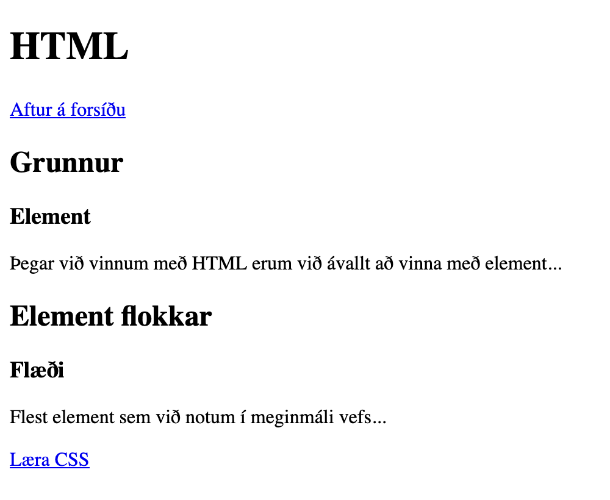
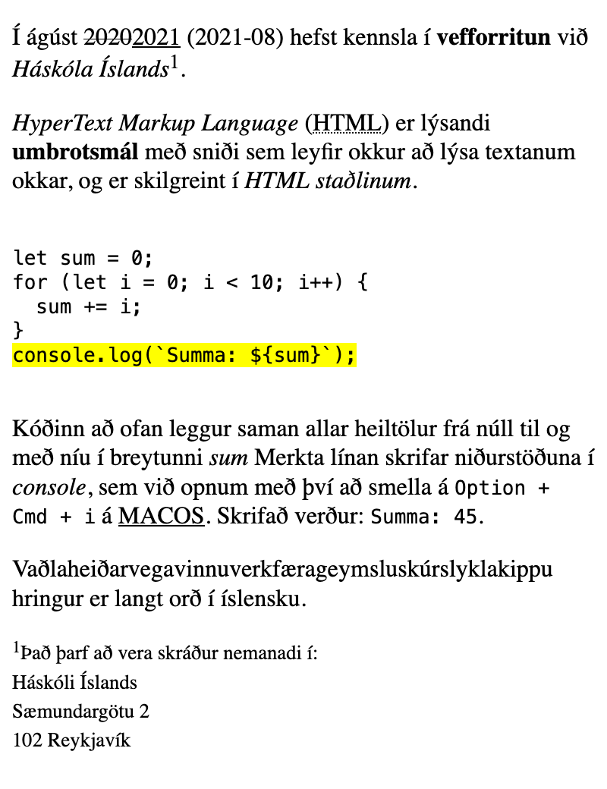
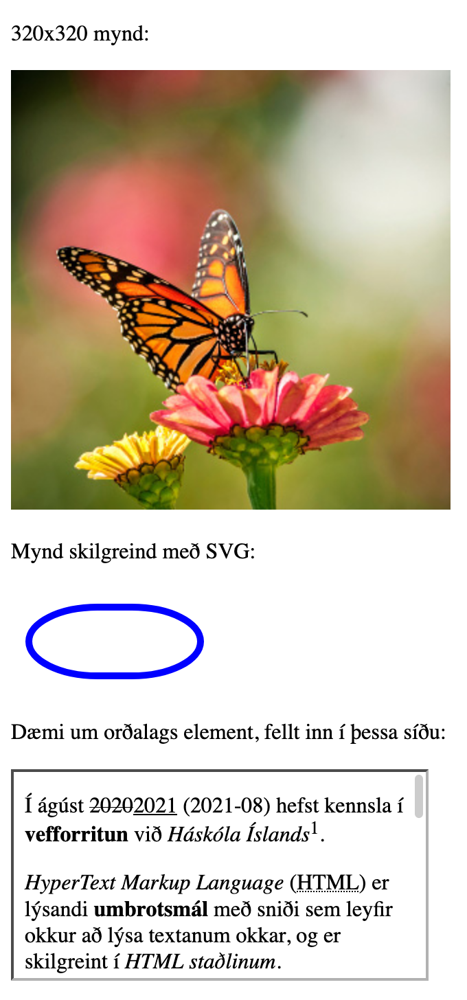
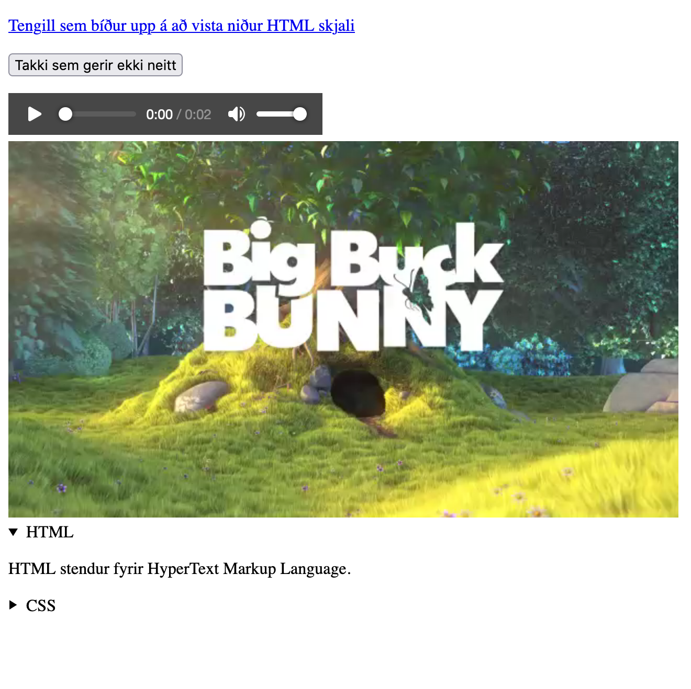

[HTML staðalinn](https://html.spec.whatwg.org/) skilgreinir lögleg element og gefur þeim merkingu (e. semantics). Vafrar og önnur forrit sem birta HTML nota þennan staðal og skilgreiningar til þess að birta HTML skjöl. Elementum er gróflega skipt í flokka eftir notkun, þar sem hvert element getur verið í einum eða fleiri flokkum:

* [Metadata](https://html.spec.whatwg.org/multipage/dom.html#metadata-content) – lýsigögn
* [Flow](https://html.spec.whatwg.org/multipage/dom.html#flow-content) – flæði
* [Sectioning](https://html.spec.whatwg.org/multipage/dom.html#sectioning-content) – kaflar og svæði
* [Heading](https://html.spec.whatwg.org/multipage/dom.html#heading-content) – fyrirsagnir
* [Phrasing](https://html.spec.whatwg.org/multipage/dom.html#phrasing-content) – orðalag
* [Embedded](https://html.spec.whatwg.org/multipage/dom.html#embedded-content-2) – innfelld
* [Interactive](https://html.spec.whatwg.org/multipage/dom.html#interactive-content) – gagnvirk

Fyrir hvert element skilgreinir staðallinn nokkuð nákvæmlega hvernig elementið hagar sér og hvernig eigi að útfæra. Við sem _höfundar_[^1] vefja þurfum að skoða skilgreiningu á því hvernig á að nota, þá helst:

* Hvar elementið má vera notað, „[contexts in which this element can be used](https://html.spec.whatwg.org/multipage/dom.html#concept-element-contexts)“
* Hvað elementið má innihalda, „[content model](https://html.spec.whatwg.org/multipage/dom.html#concept-element-content-model)“
* Hvaða attribute elementið hefur, „[content attributes](https://html.spec.whatwg.org/multipage/dom.html#concept-element-attributes)“
* Hvað þarf að huga varðandi _aðgengismál_, „[accessibility considerations](https://html.spec.whatwg.org/multipage/dom.html#concept-element-accessibility-considerations)“

Eftir almennum skilgreiningum fylgir textalýsing á notkun elements, ásamt dæmum um notkun.

Þegar við skrifum HTML eru þetta elmentin sem við skoðum m.t.t. merkingarfræði. Til að aðstoða við leit er gott að nota [skilgreiningar W3C](https://html.spec.whatwg.org/multipage/dom.html#kinds-of-content), [„HTML element reference“ frá MDN](https://developer.mozilla.org/en-US/docs/Web/HTML/Element), eða [„The Elements of HTML“ frá W3C](https://w3c.github.io/elements-of-html/).

Út frá merkingu þessara elementa setur vafri grunnútlit, t.d. eru fyrirsagnir stærri, málsgreinar hafa neðri spássíu (e. margin), og tenglar eru blálitaðir með undirstriki. Þessu útliti breytum við síðan með CSS, ekki með því að velja mismunandi (og hugsanlega) vitlaus element!)

Það sem fylgir er yfirferð á helstu elementum HTML.

## Metadata – lýsigögn {#lysigogn}

_Lýsigögn_ eru gögn sem skilgreina hvernig efni vefsíðu eigi að birtast, tengir önnur gögn við hana (t.d. CSS skjöl), eða skilgreina stöðu síðu í hópi síðna. Þessi lýsigögn eru ekki birt notanda beint í vafraglugganum og eru oftast skilgreind í `<head>`.

* [`<style>`](https://html.spec.whatwg.org/multipage/semantics.html#the-style-element) notum við til að fella CSS skilgreiningar _beint inn í_ skjalið án þess að hafa það aðskilið í sér CSS skrá.
* [`<title>`](https://html.spec.whatwg.org/multipage/semantics.html#the-title-element) er það element sem ætti alltaf að skilgreina til þess að setja titil skjals.

### `<link>` {#lysigogn-link}

Til að mynda tengingu við önnur gögn[^2] notum við [`<link>`](https://html.spec.whatwg.org/multipage/semantics.html#the-link-element). Ef `rel` attribute er sett þá einskorðast `<link>` við `<head>`, oftast með `href` sem vísar í skjal, t.d.

* `rel="stylesheet"` skilgreinir vísun í CSS skrá sem sækja skal og birta.
* `rel="next"` skilgreinir hvaða skjal sé næst í röðinni, vafrar geta notað þetta sem tillögu að því að sækja það skjal áður en notandi biður um það og þannig flýtt fyrir.
* `rel="prefetch"` stingur upp á við vafra að sækja gögn á meðan HTML þáttun fer fram.
* `rel="preload"` skilgreinir að merkt gagn _verði_ að vera sótt sem fyrst, gerð gagnsins er skilgreint með `as` attribute. Með því getum við t.d. skipað vafra að sækja letur[^3] sem notað er sem fyrst og þannig látið það birtast fyrr en seinna (annars væri letrið sótt eftir CSS þáttun.)

Hægt er að setja inn skrá í rót vefsvæðis sem heitir `favicon.ico` eða sem `<link rel="shortcut icon" href="/icon.png">` til þess að fá fram þetta litla táknmynd sem situr yfirleitt vinsta megin í stikunni í vöfrum. Ástæðuna fyrir þessu má rekja allt aftur til 1999 þegar þessari virkni var [hálfpartinn laumað inn í Internet Explorer 5](http://thehistoryoftheweb.com/how-we-got-the-favicon/).

### `<meta>` {#lysigogn-meta}

Fyrir almenn lýsigögn notum við [`<meta>`](https://html.spec.whatwg.org/multipage/semantics.html#the-meta-element). Við höfum séð hvernig það er notað til að skilgreina stafasett með sérstöku `charset` attribute. Það má líka nota til að skilgreina önnur lýsigögn en þá skilgreinum við bæði `name` og `content` attribute. T.d. fyrir `author` sem skilgreinir höfund síðu, `description` sem skilgreinir almenna lýsingu eða `generator` sem skilgreinir tól sem útbjó síðuna.

### `<script>` {#lysigogn-script}

Til að vísa í JavaScript notum við [`<script>`](https://html.spec.whatwg.org/multipage/scripting.html#the-script-element) sem annaðhvort inniheldur kóða og vísun í JavaScript skjal sem inniheldur kóðann okkar. Ef við höfum texta innan elements verður sá kóði keyrður þegar þáttari kemur að því. Ef `src` attribute er skilgreint þá verður skjal sem vísað er í sótt, þáttað og túlkað (kóðinn keyrður) áður en haldið er áfram, það er vegna þess að JavaScript kóði gæti skrifað út HTML. Það er óæskilegt, en möguleiki, svo vafrinn verður að bíða með HTML þáttun. Af þessari ástæðu er `<script>` oft sett á undan lokataggi fyrir `<body>`, þá getur vafri birt notanda gögn áður en JavaScript er túlkað. Af sögulegum ástæðum getum við ekki sjálflokað (e. self-closing) `<script>` elementi, við verðum alltaf að loka með endatagi.

Ef vafri hefur ekki stuðning við, eða slökkt hefur verið á JavaScript virkni er hægt að nota [`<noscript>`](https://html.spec.whatwg.org/multipage/scripting.html#the-noscript-element) elementið. Efni þess er birt _aðeins_ ef JavaScript virkni er óvirk.

### Dæmi

Dæmi sem nýtir öll lýsigögn sem minnst er á:

```html
<!doctype html>
<html lang="is">
  <head>
    <meta charset="utf-8">
    <meta name="author" content="NN">
    <meta name="description" content="Dæmi um lýsigögn">
    <link rel="stylesheet" href="styles.css">
    <link rel="preload" href="font.woff2" as="font">
    <link rel="shortcut icon" href="icon.png">
    <title>Halló heimur</title>
  </head>
  <body>
    <p>Hæ!</p>
    <noscript>JavaScript virkni óvirk</noscript>
    <script src="scripts.js"></script>
  </body>
</html>
```

## Flow – flæði {#flaedi}

Flest element sem við notum í meginmáli vefs, `<body>`, eru _flæði_ element, mörg þeirra geta einnig verið _greinilegt_ efni (e. palpable content): þau innihalda eitthvað (eru ekki tóm) sem er ekki falið. Nokkur element falla aðeins undir þessa flokka og enga aðra:

* [`<address>`](https://html.spec.whatwg.org/multipage/sections.html#the-address-element), skilgreinir upplýsingar um hvernig megi hafa samband við höfund efnis.
* [`<blockquote>`](https://html.spec.whatwg.org/multipage/grouping-content.html#the-blockquote-element), skilgreinir hluta í skjali sem vitnað er í frá öðrum stað.
* [`<footer>`](https://html.spec.whatwg.org/multipage/sections.html#the-footer-element) skilgreinir efni um það element sem það er innihaldið í, tilgreinir t.d. höfund, tengt efni, eða hvenær efnið var seinast uppfært.
* [`<header>`](https://html.spec.whatwg.org/multipage/sections.html#the-header-element) skilgreinir hóp af efni sem kynnir eða veitir leiðsögn um efni.
* [`<main>`](https://html.spec.whatwg.org/multipage/grouping-content.html#the-main-element) skilgreinir megin efni vefs, þetta element ætti aðeins að koma fyrir einu sinni per vefsíðu.
* [`<p>`](https://html.spec.whatwg.org/multipage/grouping-content.html#the-p-element), málsgrein, skilgreinir í flestum tilfellum texta og element sem falla undir [orðalag](#ordalag).
* [`<pre>`](https://html.spec.whatwg.org/multipage/sections.html#the-footer-element), _preformatted_, texti innan `<pre>` er óstílaður af vafra og viðheldur bilum og línubilum.
* [Töflur og listar](05.toflur-listar-form.html).

### `<figure>` {#flaedi-figure}

Þegar við höfum sjálfstætt svæði innan skjals sem við munum vilja vísa í úr öðrum stöðum (hugsanlega með útskýringartexta), getum við notað [`<figure>`](https://html.spec.whatwg.org/multipage/grouping-content.html#the-figure-element). Þetta gæti verið skýringarmynd, graf, eða forritskóði.

Ef útskýringartexti fylgir með, er hann skilgreindur innan fyrsta `<figcaption>` elements. Efnið sem vísað er í er sett innan elementsins.

### `<dialog>` {#dialog}

[`<dialog>`](https://html.spec.whatwg.org/multipage/interactive-elements.html#the-dialog-element) er notað til að merkja part af vef sem þarf eða krefst aðkomu notanda. Þetta gæti verið skráning á upplýsingum, val á aðgerðum, eða svar við fyrirvara. Oft eru þessar upplýsingar birtar í _hamsglugga_[^6] (e. modal window) þar sem notandi verður að taka afstöðu til þess sem er birt. Í staðli eru skilgreind _forritunarskil_ (e. API) þannig að hægt sé að nýta almenna birtingu (aðallega opna og loka „glugganum“) en eins og staðan er 2021, er þessi virkni ekki útfærð í öllum vöfrum og því ekki nothæf nema með fyrirvörum / fyrirvara.

### `<div>` {#flaedi-div}

Annað element sem fellur undir greinilegt efni er `<div>`. Þetta element hefur enga eiginlega merkingu, merking þess er skilgreint af því sem það inniheldur. Oft á tíðum grípum við til `<div>` þegar við hugsum ekki til enda hvaða og hverskonar efni við erum að merkja, oft eru önnur element sem henta betur.

> Authors are strongly encouraged to view the `div` element as an element of last resort, for when no other element is suitable. Use of more appropriate elements instead of the `div` element leads to better accessibility for readers and easier maintainability for authors.
> — [Grouping content: The div element](https://html.spec.whatwg.org/multipage/grouping-content.html#the-div-element)

Þetta þýðir samt ekki að við notum aldrei `<div>`! Þegar við förum að vinna í að setja útlit á vefina okkar, kemur það oft fyrir að við þurfum auka element og þá er það í mörgum tilfellum `<div>` element.

### Dæmi um flæði element

```html
<!doctype html>
<html lang="is">
  <head>
    <meta charset="utf-8">
    <title>Flæði dæmi</title>
  </head>
  <body>
    <header>
      <h1>DocType dæmi</h1>
    </header>
    <main>
      <p>Í dæmi 1 sjáum við hvernig minnsta HTML skjalið er skilgreint.</p>
      <figure>
        <pre>
          &lt;!doctype html>
          &lt;html lang="is">
            &lt;head>
              &lt;meta charset="utf-8">
              &lt;title>Halló heimur&lt;/title>
            &lt;/head>
            &lt;body>...&lt;/body>
          &lt;/html>
        </pre>
        <figcaption>Dæmi 1: Minnsta HTML skjalið</figcaption>
      </figure>
      <p>Hvernig væri að eiga memex?</p>
      <blockquote>Consider a future device … in which an individual stores all his books, records, and communications, and which is mechanized so that it may be consulted with exceeding speed and flexibility. It is an enlarged intimate supplement to his memory.</blockquote>
    </main>
    <footer>
      <address><a href="samband.html">Hafðu samband</a></address>
    </footer>
  </body>
</html>
```

Með því að nota `<pre>` elementið getum við birt HTML kóða, nema til þess að efni þess sé _ekki_ túlkað sem HTML þá setjum við `&lt;` í stað `<`.


## Sectioning – kaflar og svæði {#kaflar-og-svaedi}

Við uppbyggingu á vef er æskilegt að skipta honum upp í kafla og svæði eftir efnistökum. Kafla og svæða element hjálpa okkur við það:

* [`<article>`](https://html.spec.whatwg.org/multipage/sections.html#the-article-element), skilgreinir sjálfstætt efnisatriði innan síðu. Þetta getur átt við grein, athugasemd, eða sjálfstæða virkni innan síðu. Hvert og eitt `<article>` element getur innihaldið `<header>` og `<footer>` element til að skilgreina fyrirsagnir og aukagögn.
* [`<aside>`](https://html.spec.whatwg.org/multipage/sections.html#the-aside-element), skilgreinir efni sem er að einhverju leyti skylt meginmáli en á þó ekki við á þeim staðí. Þetta gæti verið annað efni á vefnum sem er óbeint tengt efni síðu, auglýsing sem fylgir efninu, eða leiðarvísi um efni greinar eða útdregin tilvitnun (e. pull quote).
* [`<nav>`](https://html.spec.whatwg.org/multipage/sections.html#the-nav-element), skilgreinir leiðarvísi á vef, eða innan síðu. Innan þess er yfirleitt notaður `<ul>` listi (af óröðuðum efnisatriðum) til þess að setja fram sjálft efnið.
* [`<section>`](https://html.spec.whatwg.org/multipage/sections.html#the-section-element), skilgreinir kafla innan skjals eða síðu, yfirleitt notað til að hópa saman efni undir fyrirsögn.

Áður fyrr voru `<div>` mikið notuð til að útbúa þessa skiptingu, t.d.

```html
<body>
  <div id="main">
    <div id="header">
      <div id="nav"></div>
    </div>
    <div class="article">
      <div class="section"></div>
    </div>
    <div id="footer"></div>
  </div>
</body>
```

en í dag getum við notað merkingarfræðilegri element:

```html
<body>
  <main>
    <header>
      <nav></nav>
    </header>
    <article>
      <section></section>
    </article>
    <footer></footer>
  </main>
</body>
```

### Dæmi um kafla og svæði

```html
<!doctype html>
<html lang="is">
  <head>
    <meta charset="utf-8">
    <title>Kafla og svæði dæmi</title>
  </head>
  <body>
    <header>
      <h1>HTML</h1>
      <nav><a href="index.html">Aftur á forsíðu</a></nav>
    </header>
    <article>
      <h2>Grunnur</h2>
      <section>
        <h3>Element</h3>
        <p>Þegar við vinnum með HTML erum við ávallt að vinna með element...</p>
      </section>
    </article>
    <article>
      <h2>Element flokkar</h2>
      <section>
        <h3>Flæði</h3>
        <p>Flest element sem við notum í meginmáli vefs...</p>
      </section>
    </article>
    <aside>
      <p><a href="css.html">Læra CSS</a></p>
    </aside>
  </body>
</html>
```



## Heading – fyrirsagnir {#fyrirsagnir}

Fyrir þau svæði og þá kafla sem við skilgreinum er æskilegt að setja fyrirsagnir eins og þarf. Í HTML eru fyrirsagnir skilgreindar frá `<h1>` til `<h6>`, í minnkandi mikilvægisröð. Út frá þessu er hægt að skilgreina _útlínu_ fyrir vefinn okkar sem hægt væri að horfa á eins og efnisyfirlit.

Merkingarfræðilega hefur `<h1>` mesta vægið og skilgreinir aðalumfjöllunarefni vefs og ætti aðeins að nota einu sinni á hverri vefsíðu. Þetta getur skipt máli fyrir lesvafra og vélar sem lesa vefina okkar. Þegar við byggjum efni á vef ættum við að skilgreina fyrirsagnir í röð og passa að _göt_ myndist ekki þar sem hoppað er yfir fyrirsögn, t.d. frá `<h1>` í `<h3>`.

```html
<main>
  <article>
    <h1>Aðalfyrirsögn, kemur fyrir einusinni</h1>
    <section>
      <h2>Kaflaheiti</h2>
      <h3>Millifyrirsögn</h3>
    </section>
    <section>
      <h3>Ónei, ég ætti að vera h2</h3>
    </section>
  </article>
</main>
```


### Útlínur {#utlinur}

Í mörg ár hefur verið óljóst hvernig útlínur virki nákvæmlega, og hvernig þær muni virka. HTML staðallinn [skilgreinir reiknirit (e. algorithm) til að útbúa útlínur](https://html.spec.whatwg.org/multipage/sections.html#outlines) sem tekur tillit til kafla og svæða. Einnig er [`<hgroup>`](https://html.spec.whatwg.org/multipage/sections.html#the-hgroup-element) element skilgreint sem leyfir að hópa saman fleiri en einni fyrirsögn, t.d. fyrir titil og undirtitil, og láta þá öll fyrirsagnar element vera túlkuð sem einn hóp.

Raunin er síðan sú að _engin_ vafri hefur útfært þessa virkni síðan hún var skilgreind í kringum 2007. Hún veldur ruglingi, og [allt lítur út fyrir að hún verði fjarlægð úr staðlinum](https://github.com/whatwg/html/pull/6462). Þess vegna ætti **ekki** að nota `<hgroup>` eða endurnýta fyrirsagnir (byrja aftur frá `<h1>`) innan kafla og svæða elementa, heldur skilgreina útlínu yfir allt skjalið. Einnig ætti ekki að nota fyrirsagnar element til að skilgrena undirtitla, aðra mögulega titla og þess háttar.

### Svæðarót

Nokkur element mynda _svæðarót_[^5] (e. sectioning root), hugtak sem tengt er útlínum. Þessi element eiga í orði að virka með útlínu reikniritinu og mynda nýja _rót_ þar sem útlína er reiknuð. Í reynd er þetta ekki útfært, en þessi element falla einnig undir aðra flokka og er lýst betur þar:

* `<blockquote>`, flæði og greinanlegt.
* `<body>`, grunnelement fyrir efni síðu.
* `<details>`, flæði, greinanlegt, og gagnvirkt.
* `<dialog>`, flæði.
* `<fieldset>`, flæði, greinanlegt, og form.
* `<figure>`, flæði og greinanlegt.
* `<td>`, sjá [töflur](05.toflur-listar-form.html).

## Phrasing – orðalag {#ordalag}

Texti vefsíðunnar samanstendur af orðalags elementum. Saman renna elementin í setningar sem hafa mismikið af innri elementum, allt frá málsgreinum sem aðeins inniheldur texta yfir í málsgreinar sem hafa orð og setningar með auknu væg og vísanir í annað efni. Mörg af orðalags elementum eru einnig flæði og greinanleg element.

Flest orðalags element eru:

* [`<a>`](https://html.spec.whatwg.org/multipage/text-level-semantics.html#the-a-element), skilgreinir tengil ef `href` attribute er skilgreint, annars stakt „akkeri“ í texta.
* [`<abbr>`](https://html.spec.whatwg.org/multipage/text-level-semantics.html#the-abbr-element), skilgreinir skammstöfun, ef `title` attribute er til staðar verður það að innihalda stöfun á skammstöfuninni[^4].
* [`<b>`](https://html.spec.whatwg.org/multipage/text-level-semantics.html#the-b-element), þýddi áður fyrr bold, en hefur verið endurskilgreint til að draga athygli að texta án þess að gefa honum aukið vægi.
* [`<br>`](https://html.spec.whatwg.org/multipage/text-level-semantics.html#the-br-element), línubil sem bera merkingu, t.d. í ljóðum. Ættum ekki að nota til að mynda sýnileg bil á milli texta, til þess notum við `<p>`, eða bil sem eru útlitslegs eðlis, til þess er CSS.
* [`<cite>`](https://html.spec.whatwg.org/multipage/text-level-semantics.html#the-cite-element), skilgreinir heiti á verki (t.d. bók, kvikmynd, lagi), _ekki_ höfund þess, þar gætum við notað `<b>`.
* [`<code>`](https://html.spec.whatwg.org/multipage/text-level-semantics.html#the-code-element), skilgreinir kóða, t.d. brot úr forriti, breytu heiti, eða skráarheiti.
* [`<data>`](https://html.spec.whatwg.org/multipage/text-level-semantics.html#the-data-element), skilgreinir gagnastak sem bæði er læsilegt af manneskjum (sem texti innan elements) og tölvum (sem gildi í `value` atrribute).
* [`<datalist>`](https://html.spec.whatwg.org/multipage/form-elements.html#the-datalist-element), sjá [umfjöllun um form](#form).
* [`<del>`](https://html.spec.whatwg.org/multipage/edits.html#the-del-element), skilgreinir efni sem hefur verið fjarlægt. `datetime` attribute getur verið notað til að skrá dags, eða dagstíma þegar efnið var fjarlægt.
* [`<dfn>`](https://html.spec.whatwg.org/multipage/text-level-semantics.html#the-dfn-element), skilgreinir _skilgreiningu_ á hugtaki, hugtakið er merkt með elementi og næsta málsgrein (`<p>`), [skilgreiningar listi](#listar-dl), eða svæðis element inniheldur nánari skilgreiningu.
* [`<em>`](https://html.spec.whatwg.org/multipage/text-level-semantics.html#the-em-element), leggur áherslu á texta.
* [`<i>`](https://html.spec.whatwg.org/multipage/text-level-semantics.html#the-i-element), þýddi áður fyrr italic en hefur verið endurskilgreint til að skilgreina texta „í annari rödd“ eða til að merkja texta í öðru máli.
* [`<ins>`](https://html.spec.whatwg.org/multipage/edits.html#the-ins-element), skilgreinir efni sem hefur verið bætt við. `datetime` attribute getur verið notað til að skrá dags, eða dagstíma þegar efninu var bætt við.
* [`<kbd>`](https://html.spec.whatwg.org/multipage/text-level-semantics.html#the-kbd-element), skilgreinir element sem merkir inntak frá notanda, oftast frá lyklaborði.
* [`<mark>`](https://html.spec.whatwg.org/multipage/text-level-semantics.html#the-mark-element), skilgreinir texta sem á að merkja eða auðkenna vegna tilvísunnar, t.d. til að benda á eitthvað sem vísað er í öðrum texta, eða merkja leitarniðurstöður í texta.
* [`<meter>`](https://html.spec.whatwg.org/multipage/form-elements.html#the-meter-element), skilgreinir mæli þar sem heild og gildi eru þekkt, t.d. hversu mikið pláss er notað á hörðum disk.
* [`<progress>`](https://html.spec.whatwg.org/multipage/form-elements.html#the-progress-element), skilgreinir element sem gefur til kynna framvindu, ef `value` attribute tilgreinir hversu miklu er lokið, hlutfallslega við `1.0` eða af gildi skilgreindu með `max` attribute. Ef `value` er ekki skilgreint er framvinda óljós eða í vinnslu, t.d. ef beðið er eftir svari.
* [`<q>`](https://html.spec.whatwg.org/multipage/text-level-semantics.html#the-q-element), skilgreinir tilvitnun innan texta, vísun í hvaðan tilvitnun kemur má skilgreina með slóð í `cite` attribute.
* [`<s>`](https://html.spec.whatwg.org/multipage/text-level-semantics.html#the-s-element), skilgreinir texta sem á ekki lengur við en við viljum samt ennþá birta upplýsingar um, t.d. ef vara er uppseld.
* [`<samp>`](https://html.spec.whatwg.org/multipage/text-level-semantics.html#the-samp-element), skilgreinir sýnishorn, eða úttak úr keyrslu á forriti.
* [`<small>`](https://html.spec.whatwg.org/multipage/text-level-semantics.html#the-small-element), skilgreinir texta sem er „smáa letrið“ eða álíka.
* [`<span>`](https://html.spec.whatwg.org/multipage/text-level-semantics.html#the-span-element), merkir ekkert í sjálfu sér og er skilgreint af börnum sínum, svipar til `<div>`.
* [`<strong>`](https://html.spec.whatwg.org/multipage/text-level-semantics.html#the-strong-element), gefur texta mikið auka vægi.
* [`<sub>` og `<sup>`](https://html.spec.whatwg.org/multipage/text-level-semantics.html#the-sub-and-sup-elements), skilgreinir texta sem er í yfirskrift (e. superscript) eða undirskrift (e. subscript).
* [`<time>`](https://html.spec.whatwg.org/multipage/text-level-semantics.html#the-time-element), skilgreinir tíma eða dagstíma í formi sem er lesanlegt af tölvum.
* [`<u>`](https://html.spec.whatwg.org/multipage/text-level-semantics.html#the-u-element), skilgreinir texta sem fær áherslu án þess að breyta textanum, t.d. til að benda á ritvillu. Stóð áður fyrir _underline_, ætti að forðast þar sem sjálfgefna birting er undirstrikun sem gæti valdið rugling á textanum og tengli.
* [`<var>`](https://html.spec.whatwg.org/multipage/text-level-semantics.html#the-var-element), skilgreinir breytu, t.d. í forritunarlegu samhengi.
* [`<wbr>`](https://html.spec.whatwg.org/multipage/text-level-semantics.html#the-wbr-element), skilgreinir mögulega línuskiptingu í orði.
* _Texti_, texti án merkingar innan elementa, t.d. `<body>halló</body>`.

### Dæmi um orðalag

Flest element að ofan eru til staðar í eftirfarandi dæmi:

```html
<!doctype html>
<html lang="is">
  <head>
    <meta charset="utf-8">
    <title>Orðalags dæmi</title>
  </head>
  <body>
    <p>
      Í ágúst <del>2020</del><ins>2021</ins>
      (<time>2021-08</time>) hefst kennsla í
      <strong>vefforritun</strong> við
      <em>Háskóla Íslands</em><sup>1</sup>.
    </p>
    <p>
      <dfn id="html">HyperText Markup Language</dfn>
      (<abbr title="HyperText Markup Language">HTML</abbr>)
      er lýsandi <b>umbrotsmál</b> með sniði sem
      leyfir okkur að lýsa textanum okkar,
      og er skilgreint í <cite>HTML staðlinum</cite>.
    </p>
    <pre><code>
let sum = 0;
for (let i = 0; i &lt; 10; i++) {
  sum += i;
}
<mark>console.log(`Summa: ${sum}`);</mark>
    </code></pre>
    <p>
      Kóðinn að ofan leggur saman allar heiltölur frá
      <data value="0">núll</data> til og með
      <data value="9">níu</data> í breytunni <var>sum</var>
      Merkta línan skrifar niðurstöðuna í <i>console</i>,
      sem við opnum með því að smella á
      <kbd>Option + Cmd + i</kbd> á <u>MACOS</u>.
      Skrifað verður: <samp>Summa: 45</samp>.
    </p>
    <p>
      Vaðlaheiðar<wbr>vegavinnu<wbr>verkfæra<wbr>geymsluskúrs<wbr>lyklakippu<wbr>hringur
      er langt orð í íslensku.
    </p>
    <small>
      <sup>1</sup>Það þarf að vera skráður nemanadi í:<br>
      Háskóli Íslands<br>
      Sæmundargötu 2<br>
      102 Reykjavík
    </small>
  </body>
</html>
```



## Embedded – innfellt

Þegar við bætum við efni sem kemur annarsstaðar frá, t.d. myndir eða vídeó, þá notum við innfelld (e. embedded) element:

* `<audio>` og `<video>`, [sjá gagnvirk element]{#gagnvirk}.
* [`<canvas>`](https://html.spec.whatwg.org/multipage/canvas.html#the-canvas-element), skilgreinir stað þar sem JavaScript forrit geta birt myndrænt efni, t.d. myndir, gröf, leiki eða þrívítt efni. Notað gegnum JavaScript forritunarskil.
* [`<embed>`](https://html.spec.whatwg.org/multipage/iframe-embed-object.html#the-embed-element), fellir inn efni sem yfirleitt er ekki „vef“ efni, t.d. úr öðrum forritum eins og Java. Lítið notað.
* [`<iframe>`](https://html.spec.whatwg.org/multipage/iframe-embed-object.html#the-iframe-element), fellir inn aðra vefsíðu eða vef, vísað í með `src` attribute, innan núverandi síðu.
* [``](https://html.spec.whatwg.org/multipage/embedded-content.html#the-img-element) bætir mynd við, vísað í með `src` attribute, sjá nánar að neðan.
* [`<math>`](https://www.w3.org/Math/draft-spec/chapter2.html#interf.toplevel), bætir við `MathML` formúlum. Mismunandi stuðningur er meðal vafra, t.d. styður Firefox flest alla virkni á meðan Chrome styður ekkert (í ágúst 2021).
* [`<object>`](https://html.spec.whatwg.org/multipage/iframe-embed-object.html#the-object-element) bætir við utanaðkomandi auðlind, sem gæti verið meðhöndluð af vafra ef þekkt eða sem plugin (t.d. Flash). Svipar til `<embed>` og er lítið notað.
* [`<picture>`](https://html.spec.whatwg.org/multipage/embedded-content.html#the-picture-element), leyfir ítarlegri stjórn yfir því hvernig mynd er felld inn í síðu, getur birt mismunandi myndir eftir því hve stór skjár er. Þarf alltaf að skilgreina nákvæmlega eitt `` element sem sér um birtingu á myndinni.
* [`<svg>`](https://svgwg.org/svg2-draft/struct.html#SVGElement), bætir við SVG (Scalable Vector Graphic) mynd. SVG er myndbirtingaform fyrir skalanlegar myndir (breidd og hæð skipta ekki máli) skilgreint með _XML_.

### Vísað í efni {#visad-i-efni}

Þegar við vísum í efni þurfum við að gefa upp slóð. Þessar slóðir geta verið _afstæðar_ (e. relative) eða _nákvæmar_ (e. absolute). Oftast erum við að nota innfelld element þegar við vísum í slóðir en það á þó líka við t.d. `<a href=".">` og `<link>` þegar við vísum í CSS skrár.

Afstæðar slóðir (e. relative paths) eru slóðir sem líta út frá því skjali sem vísað er frá. Ef við erum stödd í `index.html` skjali og vísað er á `img/mynd.jpg` er gert ráð fyrir að `img/` mappa sé til í sömu möppu og `index.html` er í.

Ef slóðin byrjar á `/` er byrjað á að fara „á rótina“ á viðkomandi vef og út frá því leitað að möppum og skjölum. T.d. ef við erum á `https://example.org/files/images` og vísum af þeirri síðu á `/logo.png` er leitað að myndinni á `https://example.org/logo.png` en ef `/` er sleppt er leitað á `https://example.org/files/images/logo.png`.

Nákvæmar slóðir (e. absolute paths) eru þær slóðir sem ekki eru afstæðar, þær vísa nákvæmlega í það sem átt er við. Í stað þess að vísa í `logo.png` vísum við í `https://example.org/files/images/logo.png`. Kostur við þetta er að vita nákvæmlega við hvað er átt. Á móti kemur sá stóri ókostur að ef slóð breytist þarf að breyta _öllum_ vísunum. Við það að breyta `files` í `assets` verða allar slóðir brotnar á meðan að hlutfallslegum slóðum er sama svo lengi sem möppur og skrár haldast þær sömu innbyrðis.

Tvö gildi er hægt að nota þegar verið er að fara á milli mappa en það eru `.` og `..`. Stakur punktur `.` vísar í þá möppu sem við erum í en `..` vísar í foreldri.

Ef við gefum okkur eftirfarandi möppur og skrár séu á léninu `example.org`:

```ascii
verkefni/
├── img/
│   └── mynd.jpg
└── index.html
```

þá á eftirfarandi við ef við erum stödd á `https://example.org/verkefni/index.html`:

* `.` vísar í möppuna `verkefni/`.
* `..` vísar í „rót“ `example.org`, möppuna sem inniheldur `verkefni/`.
* `./img/mynd.jpg`, `img/mynd.jpg`, `/verkefni/img/mynd.jpg` og `../verkefni/img/mynd.jpg` vísa öll á sömu myndina.

Margar af þessum reglum eiga bæði við um vefslóðir og skráakerfi stýrikerfa. Þó er munur þar á, t.d. nota vefslóðir, macOS og linux `/` til að skipta á milli mappa en í Windows er `\` notað.

### Myndir {#myndir}

Í sinni einföldustu mynd þá fellum við mynd með ``. Þetta er þó ekki nóg, við verðum að hafa _alt texta_ skilgreindan með `alt` attribute, þetta er text sem veitir textalýsingu á myndinni fyrir þau sem ekki geta séð hana. [Sjá nánar í kafla um aðgengi](07.adgengi.html).

Einnig viljum við skilgreina vídd myndarinnar: breidd og hæð hennar með `width` og `height` attribute. Þar sem sækja þarf myndina eftir að HTML er sótt, veit vafri ekki vídd myndar fyrr en hún er sótt, síðan er hún felld inn, og gæti þá komið fram „hopp“ í viðmótinu: texti og efni færist til á síðunni.

Þegar við vinnum skalanlega vefi þurfum við einnig að huga að því að birta ekki of stórar myndir ef það er óþarfi. `srcset` attribute leyfir okkur að skilgreina mismunandi myndir eftir því í hvernig skjá verið er að nota, t.d. skjá með mikla upplausn eða litlum skjá (en hugsanlega með mikilli upplausn!)[^7]

Það eru einnig til nokkur mismunandi myndaform sem hægt er að birta á vefnum, með `<picture>` getum við útbúið myndirnar okkar í mismunandi formum og gefið vafra val um hvaða mynd eigi að birta. Hvert myndaform er skilgreint með _mime týpu_ (e. mime type)[^8], t.d.:

* [`image/jpeg`](https://en.wikipedia.org/wiki/JPEG), oftast með skráarendingu `.jpg` eða `.jpeg`, format sem notar _tapandi þjöppun_ (e. lossy compression)[^9]. Hentar vel fyrir ljósmyndir. Stutt af öllum vöfrum.
* [`image/png`](https://en.wikipedia.org/wiki/Portable_Network_Graphics), með skráarendingu `.png`. Almennara format sem getur gefið skýrari myndir á kostnað stærri skráa. Styður gagnsæi (e. transparency). Stutt af öllum vöfrum.
* [`image/gif`](https://en.wikipedia.org/wiki/GIF), með skráarendingu `.gif`. Styður gagnsæi og hreyfimyndir, geta verið stórar skrár. Stutt af öllum vöfrum.
* [`image/webp`](https://en.wikipedia.org/wiki/WebP), með skráarendingu `.webp`, myndaformat hannað af Google sérstaklega fyrir vefinn. Styður tapandi og taplausa þjöppun, gagnsæi, og hreyfimyndir. Stutt af langflestum vöfrum, um eða yfir 95%.
* [`image/avif`](https://en.wikipedia.org/wiki/AV1#AV1_Image_File_Format_(AVIF)), nýlegt format sem er opið (ekki þarf að borga fyrir notkun) og mjög skilvirkt. Ekki jafnvel stutt og önnur og þarf að nota með öðrum.

Fyrir hvert format og/eða stærð/upplausn (getum notað `media` attribute) skilgreinum við [`<source>`](https://html.spec.whatwg.org/multipage/embedded-content.html#the-source-element) element innan `<picture>`, þar sem vafri velur **fyrsta** sem á við. Að lokum skilgreinum við eitt `` element sem er með _almennustu_ útgáfunni af myndinni okkar—sú útgáfa sem verður notuð ef allt annað klikkar. Þetta `` element er líka það element sem notað er til að birta valda mynd.

```html
<picture>
  <source type="image/avif" src="image.avif">
  <source type="image/webp" src="image.webp">
  
</picture>
```

Almennt notum `<picture>` þegar við:

* erum með að huga sérstaklega að skilvirkni (e. performance) með því að bjóða upp á margar mismunandi útgáfur, á kostnað þess að þurfa að útbúa margar útgáfur af myndum og halda uppfærðum
* viljum hafa stjórn yfir birtingu mynda (e. art direction) í mismunandi skjám, t.d. hvernig mynd er skorin í minni skjám

### Dæmi um innfelld element

```html
<!doctype html>
<html lang="is">
  <head>
    <meta charset="utf-8" />
    <title>Innfelld dæmi</title>
  </head>
  <body>
    <p>320x320 mynd:</p>
    
    <p>Mynd skilgreind með SVG:</p>
    <svg xmlns="http://www.w3.org/2000/svg" width="150" height="75">
      <rect
        x="13"
        y="14"
        width="125"
        height="50"
        rx="50"
        ry="100"
        fill="none"
        stroke="blue"
        stroke-width="5"
      />
    </svg>
    <p>Dæmi um orðalags element, fellt inn í þessa síðu:</p>
    <iframe src="./04.element-phrasing.html"></iframe>
  </body>
</html>
```



## Interactive – gagnvirk {#gagnvirk}

Sum element eru, eða geta verið, gagnvirk fyrir notanda. Þá getur notandi smellt, slegið inn gögn, eða virkjað element á einhvern hátt.

* `<button>`, skilgreinir _takka_, þegar takki er virktur framkvæmist einhver aðgerð, t.d. form með gögnum er sent, form er hreinsað, eða JavaScript virkni keyrir, [sjá nánar í næsta kafla](05.toflur-listar-form.html).
* `<input>` ef ekki með `type="hidden"`, `<label>`, `<select>`, og `<textarea>`: taka við gögnum frá notenda og skilgreina form, [sjá nánar í næsta kafla](05.toflur-listar-form.html).
* `<embed>` og `<iframe>` eru gagnvirk að því leiti að það sem innfellt er getur verið gagnvirkt.

### `<audio>` og `<video>`

[`<audio>`](https://html.spec.whatwg.org/multipage/media.html#the-audio-element) bætir við hljóði (í formi skráar) eða hjóðstraum (í formi _straums_, lifandi hljóðskrá). [`<video>`](https://html.spec.whatwg.org/multipage/media.html#the-video-element) bætir við myndbandi eða hljóði með texta. Bæði element eru innfelld, en eru gagnvirk ef við skilgreinum leiðir til að stjórna þeim.

Þau attribute sem við getum sett á `<audio>` og `<video>` eru t.d.

* `autoplay` ef við viljum byrja að spila efni strax og búið er að hlaða því inn.
* `controls` ef við viljum sýna sjálfgefnu stýringar sem vafri býður upp. Þessar stýringar eru mismunandi eftir vöfrum. Ef við höfum þetta attribute eru elmentin gagnvirk.
* `loop` ef byrja á samstundis aftur að spila efni eftir að það klárast.
* `muted` ef notandi þarf að kveikja á hljóði, á vel við ef við ætlum að nýta `autoplay`.
* `src` ef við höfum aðeins eina skrá fyrir hljóð eða myndband.

Fyrir bæði `<audio>` og `<video>` getum við skilgreint mismunandi [`<source>`](https://html.spec.whatwg.org/multipage/embedded-content.html#the-source-element), eins og í `<picture>` elementinu.

[`<track>`](https://html.spec.whatwg.org/multipage/media.html#the-track-element) elementið skilgreinir texta sem fylgir hljóði eða myndbandi, annað hvort texti eða skýringartexti[^10]. Fyrir elementið skilgreinum við `attribute`:

* `kind`, gerð texta, t.d. `subtitles` eða `captions`.
* `src`, slóð á texta.
* `srclang`, tungumál texta.
* `label`, lýsing á texta.

Öll element sem ekki eru `<track>` eða `<source>` innan `<audio>` eða `<video>` eru aðeins birt ef stuðningur í vafra er ekki til staðar.

```html
<video>
  <track kind="subtitles" src="brave.en.vtt" srclang="en" label="English">
  <track kind="captions" src="brave.en.hoh.vtt" srclang="en" label="English for the Hard of Hearing">
  <track kind="subtitles" src="brave.fr.vtt" srclang="fr" lang="fr" label="Français">
  <track kind="subtitles" src="brave.de.vtt" srclang="de" lang="de" label="Deutsch">
  <source src="brave.webm" type="video/webm">
  <source src="brave.ogg" type="video/ogg">
  <source src="brave.mov" type="video/quicktime">
  <p>Ekki stuðningur við myndbönd.</p>
</video>
```

### `<a>`

[`<a>`](https://html.spec.whatwg.org/multipage/text-level-semantics.html#the-a-element), anchor elementið, með `href` attribute býr til tengil sem hægt er að nota. Aukalega er hægt að skilgreina attribute:

* `target`, opnar tengil í öðru samhengi, oftast `target="_blank"` til að opna tengil í nýjum glugga.
* `download`, býður upp á að hlaða efni niður í stað að vafri fari að því.
* `rel`, tenging núverandi skjals við það skjal sem tengt er í, [sjá mögulegar gerðir í staðli](https://html.spec.whatwg.org/multipage/links.html#linkTypes).
* `hreflang`, tungumál skjals sem tengt er í.
* `type`, líklegt MIME gildi skjals sem tengt er í.
* `referrerpolicy`, skilgreinir hve miklar upplýsingar eigi að láta tengt skjal vita um hvaðan tengt var, getur opnað á öryggisholur og gagnaleka. [Sjá möguleg gildi](https://w3c.github.io/webappsec-referrer-policy/#referrer-policy).

Í flestum tilfellum er `href` attrbute URL sem tengt er á, en einnig er hægt að skilgreina tengla sem opna tölvupóst með `mailto:` forskeytinu, eða opna síma, með `tel:` forskeytinu.

### `<details>`

[`<details>`](https://html.spec.whatwg.org/multipage/interactive-elements.html#the-details-element) elementið leyfir að skilgreina efni sem hægt er að opna til að fá frekari upplýsingar. Fyrsta [`<summary>`](https://html.spec.whatwg.org/multipage/interactive-elements.html#the-summary-element) element innan þess skilgreinir samantekt eða yfirskrift, önnur element innan `<details>` eru aðeins birt ef það hefur verið opnað, eða ef `open` attribute er til staðar.

### Dæmi um gagnvirk element

```html
<!doctype html>
<html lang="is">
  <head>
    <meta charset="utf-8" />
    <title>Gagnvirk dæmi</title>
  </head>
  <body>
    <p>
      <a href="index.html" download>Tengill sem bíður upp á að vista niður HTML skjali</a>
    </p>
    <p>
      <button>Takki sem gerir ekki neitt</button>
    </p>

    <audio controls src="media/t-rex-roar.mp3"></audio>

    <video src="media/big-buck-bunny.mp4" controls autoplay>
    </video>

    <details open>
      <summary>HTML</summary>
      <p>HTML stendur fyrir HyperText Markup Language.</p>
    </details>
    <details>
      <summary>CSS</summary>
      <p>CSS stendur fyrir Cascading Style Sheets.</p>
    </details>
  </body>
</html>
```




[^1]: staðallinn er hugsaður fyrir bæði höfunda vefja—þau sem skrifa HTML—og höfunda vafra—sem túlka HTML og birta.

[^2]: þessi tenging er ekki _hyperlink_, heldur tenging t.d. við CSS sem skilgreinir útlit, eða JavaScript skrá sem skilgreinir virkni.

[^3]: við sjáum hvernig letrið er notað í yfirferð á CSS.

[^4]: staðall skilgreinir þetta element fyrir _bæði_ „[abbreviation](https://en.wikipedia.org/wiki/Abbreviation)“ og „[acronym](https://en.wikipedia.org/wiki/Acronym)“ sem eru mismunandi hlutir í ensku, á íslensku er orðið skammstöfun notað fyrir bæði (þó orðið „skammyrði“ sé til).

[^5]: hér vantar betri íslenskun.

[^6]: hér vantar betri íslenskun.

[^7]: farið betur yfir í umfjöllun um skalanlega vefi.

[^8]: _Multipurpose Internet Mail Extensions_, staðlað í [RFC 6838](https://datatracker.ietf.org/doc/html/rfc6838), skilgreinir hvernig skrá verið er að eiga við. Þar sem mime type er skilgreint er það notað, _ekki_ skráarending til að ákveða hvernig skrá er birt.

[^9]: notar ónákvæmar nálganir til að þjappa mynd og tapar þar af leiðandi upplýsingum sem getur leitt til óskýrra mynda. Andstæðan við tapandi þjöppun er taplaus þjöppun (e. lossless).

[^10]: [texti (e. subtitles)](https://en.wikipedia.org/wiki/Subtitles) er þegar talað mál hefur textaútgáfu í ákveðnu tungumáli, t.d. enskt tal en íslenskur texti. [Skýringartexti (e. captions eða closed captions)](https://en.wikipedia.org/wiki/Closed_captioning) er textaútgáfa af öllu viðeigandi hljóði sem kemur fram, t.d. lýsing á tónlist, eða hljóðáhrifum (e. sound effect).
