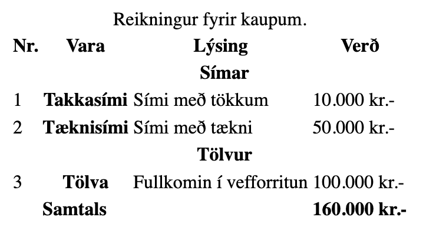
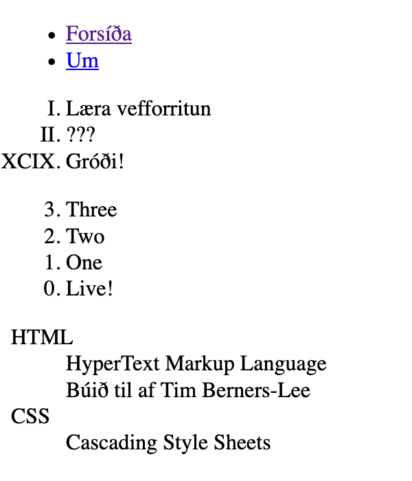

Töflur, listar, og form koma oft fyrir þegar við erum að smíða vefi. Töflur til að vinna með töfluleg gögn, listar til að hópa saman efni, og form til að taka við upplýsingum frá fólki.

## Töflur

Að vinna með töfluleg gögn krefst aðeins flóknari uppsetningar en á öðrum gögnum í HTML. Töflur eru skilgreindar með [töflumódeli í staðli](https://html.spec.whatwg.org/multipage/tables.html#table-model): skilgreina þarf töflu, dálka, raði, gagnareiti (e. cell), og hugsanlega fót eða samantekt. Mælst er til að hafa lýsingu á töflum til að auðvelda lestur gagnanna.

* [`<table>`](https://html.spec.whatwg.org/multipage/tables.html#the-table-element), skilgreinir töflu af gögnum í fleiri en einni vídd.
* [`<caption>`](https://html.spec.whatwg.org/multipage/tables.html#the-caption-element), lýsir gögnum í töflu og samhengi þeirra, getur auðveldað töluvert að lesa úr gögnum. Ef skilgreint, er fyrsta element innan `<table>`.
* [`<thead>`](https://html.spec.whatwg.org/multipage/tables.html#the-thead-element), hópar saman röðum sem skilgreina fyrirsagnir dálka í töflu. Kemur eftir `<caption>` ef skilgreint, annars fyrsta element innan `<table>`.
* [`<tbody>`](https://html.spec.whatwg.org/multipage/tables.html#the-tbody-element), hópar saman röðum sem skilgreina meginmál töflu. Kemur eftir `<thead>`, ef skilgreint.
* [`<tfoot>`](https://html.spec.whatwg.org/multipage/tables.html#the-tfoot-element), hópar saman röðum sem skilgreina „fót“ töflu, samantekt, t.d. samtölur. Kemur eftir `<tbody>`, ef skilgreint.
* [`<tr>`](https://html.spec.whatwg.org/multipage/tables.html#the-tr-element), skilgreinir röð í töflu, alltaf innan `<table>`, `<thead>`, `<tbody>`, eða `<tfooter>`.

* `<td>` skilgreinir gagnareit í röð og dálk.

### `<th>` og `<td>`

[`<th>`](https://html.spec.whatwg.org/multipage/tables.html#the-th-element) skilgreinir gagnareit sem er fyrirsögn, annaðhvort í röð (þá í byjun `<tr>`) eða dálks (þá í röð af fyrirsögnum innan `<thead>`).

Við getum skilgreint eftirfarandi attribute:

* `colspan` sem tölu, sem skilgreinir hversu marga dálka reitur nær.
* `rowspan` sem tölu, sem skilgreinir hversu marga raðir reitur nær.
* `headers`, strengur sem vísar í `id` á þeim elementum sem skilgreina fyrirsögn reitsins. Ef fleiri en eitt element er bil notað til að skipta á milli.
* `abbr`, möguleg skammstöfun á fyrirsögn.

Til að tilgreina hvað fyrirsögn á við, notum við `scope` attribute:

* `row` ef fyrirsögn á við þá reiti sem koma á eftir í röðinni.
* `col` ef fyrirsögn á við reiti sem eru í sama dálk.
* `rowgroup` ef fyrirsögn á við rest af reitum í röð, og raðir fram að næsta `rowgroup`. Skilgreinir hópun eins og `<tbody>` en innan raða.
* `colgroup` ef fyrirsögn á við rest af reitum í dálk, og dálka fram að næsta `colgroup`.

[`<td>`](https://html.spec.whatwg.org/multipage/tables.html#the-td-element) skilgreinir gagnasellu (e. data cell) í töflu. Getum skilgreint `colspan`, `rowspan`, og `headers`; eins og fyrir `<th>`.

### Dæmi um töflu

```html
<table>
  <caption>Reikningur fyrir kaupum.</caption>
  <thead>
    <tr>
      <th scope="col">Nr.</th>
      <th scope="col">Vara</th>
      <th scope="col">Lýsing</th>
      <th scope="col">Verð</th>
    </tr>
  </thead>
  <tbody>
    <tr>
      <th></th>
      <th scope="rowgroup" colspan="3">Símar</th>
    </tr>
    <tr>
      <td>1</td>
      <th scope="row">Takkasími</th>
      <td>Sími með tökkum</td>
      <td>10.000 kr.-</td>
    </tr>
    <tr>
      <td>2</td>
      <th scope="row">Tæknisími</th>
      <td>Sími með tækni</td>
      <td>50.000 kr.-</td>
    </tr>
    <tr>
      <th></th>
      <th scope="rowgroup" colspan="3">Tölvur</th>
    </tr>
    <tr>
      <td>3</td>
      <th scope="row">Tölva</th>
      <td>Fullkomin í vefforritun</td>
      <td>100.000 kr.-</td>
    </tr>
  </tbody>
  <tfoot>
    <tr>
      <td></td>
      <td colspan="2"><strong>Samtals</strong></td>
      <td><strong>160.000 kr.-</strong></td>
    </tr>
  </tfoot>
</table>
```



## Listar

Nokkur flæði og greinileg element skilgreina lista af efni.

### Raðaðir og óraðaðir listar

[`<ol>`](https://html.spec.whatwg.org/multipage/grouping-content.html#the-ol-element) skilgreinir raðaðan lista (e. ordered list) af efni. Ef `reversed` attribute er skilgreint á listanum eru atriði í lækkandi röð, annars í hækkandi röð. Til að tilgreina annað byrjunargildi en `1` getum við skilgreint heiltölugildi í `value` attributeinu.

Til að breyta birtingu á merki getum við notað CSS, eða sett `type` attribute:

* `decimal` eða `1` (1-9) (sjálfgefið).
* `lower-alpha` eða `a` (a-z).
* `upper-alpha` eða `A` (A-Z).
* `lower-roman` eða `i` (i-x).
* `upper-roman` eða `I` (I-X).

[`<ul>`](https://html.spec.whatwg.org/multipage/grouping-content.html#the-ul-element) skilgreinir óraðaðan (e. unordered list) lista af efni. Litið er svo á að breyting á röð barna skipti engu máli fyrir merkingu listans.

Til að merkja atriði í `<ol>` eða `<ul>` listum notum við `<li>` elementið. Ef það er innan `<ol>` lista og þarf að skilgreina númer sitt notum við `value` attribute með heiltölugildi.

Oft er `<ul>` ásamt `<nav>` notað til þess að skilgreina valmynd, það oft að `<menu>` elementið var skilgreint til að gera nákvæmlega það.

### `<dl>` {#listar-dl}

Fyrir nafngildis (e. name value) lista notum við [`<dl>`](https://html.spec.whatwg.org/multipage/grouping-content.html#the-dl-element) (description list). Við skilgreinum eitt eða fleiri nöfn með [`<dt>`](https://html.spec.whatwg.org/multipage/grouping-content.html#the-dt-element) (term) og fylgjum því á eftir með einu eða fleiri gildum [`<dd>`](https://html.spec.whatwg.org/multipage/grouping-content.html#the-dd-element) (definition). Þetta getum við notað til að merkja t.d. skilgreiningar, spurningar & svör, eða atriðaskrá.

### Dæmi um lista

```html
<!doctype html>
<html lang="is">
  <head>
    <meta charset="utf-8" />
    <title>Lista dæmi</title>
  </head>
  <body>
    <nav>
      <menu>
        <li><a href="/">Forsíða</a></li>
        <li><a href="/about">Um</a></li>
      </menu>
    </nav>
    <ol type="I">
      <li>Læra vefforritun</li>
      <li>???</li>
      <li value="99">Gróði!</li>
    </ol>
    <ol start="3" reversed>
      <li>Three</li>
      <li>Two</li>
      <li>One</li>
      <li>Live!</li>
    </ol>
    <dl>
      <dt>HTML</dt>
      <dd>HyperText Markup Language</dd>
      <dd>Búið til af Tim Berners-Lee</dd>
      <dt>CSS</dt>
      <dd>Cascading Style Sheets</dd>
    </dl>
  </body>
</html>
```



## Form {#form}

Þegar við viljum fá upplýsingar frá notanda notum við yfirleitt form. Þau leyfa okkur að skilgreina mismunandi tegundir af leiðum til að skrá gögn ásamt aðferðum til að sannreyna þau að einhverju leyti áður en þau eru send.

[`<form>`](https://html.spec.whatwg.org/multipage/forms.html#the-form-element) skilgreinir safn af elementum sem safna gögnum sem hægt er að vinna með, og senda á bakenda til úrvinnslu. Á það er hægt að setja attribute:

* `action`, skilgreinir URL sem formið er _sent á_, þetta er slóð á vefþjón sem kann að taka við og vista gögnin sem voru skráð.
* `autocomplete`, skilgreinir hvort vafri eigi að bjóða upp á sjálfvirka útfyllingu.  Ef sjálfgefið er að svo sé, (`on` gildið), slökkvum á með `off`.
* `enctype`, skilgreinir hvernig gögnin í forminu eru kóðuð áður en þau eru send, sjá að neðan.
* `method`, skilgreinir hvernig senda eigi gögnin með tilliti til HTTP: `post` ef gögnin ættu ekki að vera aðgengileg eftir að þau eru send, t.d. skráningar form eða innskráningarform. `get` ef niðurstaða þess að senda formið ætti að vera aðgengileg sérstaklega, t.d. ef við framkvæmum leit með `get`, þá verður leitarstrengur aðgengilegur (t.d. `/search?query=efni`).
* `novalidate`, skilgreinir ef keyra eigi _staðfestingu_ (e. validation) á gögnin eða ekki. Sjálfgefið er keyrt, en ef við bætum við `novalidate` á `<form>` verður hún ekki keyrð.

### `enctype`

Hvernig nafn-gildis pör eru kóðuð þegar um `method="post"` er notað, skilgreinum við með `enctype`:

* `application/x-www-form-urlencoded` er sjálfgefið en þá eru gögn _URL enkóðuð_.
* `text/plain`, ekki er átt við gögnin, þau eru sett sem `key=value` með `\n` á milli reita
* `multipart/form-data`, gögnum er _streymt_ yfir með _boundaries_, notum þegar við höfum `<input type="file">` element og ætlum að taka við skrám frá notanda.

### Að taka við gögnum frá notanda

Til að taka við gögnum notum við [`<input>`](https://html.spec.whatwg.org/multipage/input.html) elementið sem er gagna element eða reitur sem leyfir notanda að slá inn eða eiga við gögn, hefur þó nokkur `attribute`, t.d.:

* `autocomplete`, skilgreinir hvort element eigi að bjóða upp á sjálfvirka útfyllingu. Sjálfgefið er að svo sé, (`on` gildið), slökkvum á með `off`.
* `disabled` hvort hægt sé að skrá gögn eða ekki.
* `list` ef hægt eigi að vera að velja úr fyrirfram skilgreindum lista, skilgreindum með `<datalist>`.
* `name` sem segir til um hvað þessi reitur heitir, mætti hugsa sem breytunafn, notum á bakenda til að ná í gögn frá notanda.
* `pattern` er regluleg segð (e. regular expression) sem skilgreinir hvernig gildi skuli formað.
* `placeholder` fyrir texta sem er til staðar þar til eitthvað er slegið inn.
* `readonly` ef ekki á að vera hægt að breyta gildi í reitnum, aðeins lesa úr honum.
* `required` ef innsláttar krafist.
* `type` sem skilgreinir hvernig reitur þetta er.
* `value` ef reiturinn á að innihalda gildi í byrjun.

[`type`](https://html.spec.whatwg.org/multipage/input.html#attr-input-type) attribute skilgreinir hvernig reiturinn er birtur, í flestum tilfellum bætir eða breytir vafri hvaða innsláttur er í boði út frá þessu attribute.

* [`hidden`](https://html.spec.whatwg.org/multipage/input.html#hidden-state-(type=hidden)), reitur sem _ekki_ á að birta, geymir upplýsingar sem senda á án aðkomu notanda.
* [`text`](https://html.spec.whatwg.org/multipage/input.html#text-(type=text)-state-and-search-state-(type=search)) fyrir einfaldan texta.
* [`search`](https://html.spec.whatwg.org/multipage/input.html#text-(type=text)-state-and-search-state-(type=search)) leitarreitur sem hagar sér eins og texta reitur en bíður yfirleitt upp á að hreinsa gildi með einni aðgerð.
* [`tel`](https://html.spec.whatwg.org/multipage/input.html#telephone-state-(type=tel)), reitur sem býst við símanúmeri og birtir því yfirleitt talnalyklaborð.
* [`url`](https://html.spec.whatwg.org/multipage/input.html#url-state-(type=url)), reitur sem býst við URL og birtir því yfirleitt textalyklaborð þar sem helstu tákn tengd URL eru til staðar, t.d. `/`, `:`, og jafnvel `.com`.
* [`email`](https://html.spec.whatwg.org/multipage/input.html#email-state-(type=email)), reitur sem býst við netfangi og birtir því  yfirleitt textalyklaborð þar sem helstu tákn tengd netföngum, helst `@`.
* [`password`](https://html.spec.whatwg.org/multipage/input.html#password-state-(type=password)) fyrir reit sem sýnir ekki textann sem hefur verið sleginn inn.
* [`date`](https://html.spec.whatwg.org/multipage/input.html#date-state-(type=date)), [`month`](https://html.spec.whatwg.org/multipage/input.html#month-state-(type=month)), [`week`](https://html.spec.whatwg.org/multipage/input.html#week-state-(type=week)), [`time`](https://html.spec.whatwg.org/multipage/input.html#time-state-(type=time)), og [`datetime-local`](https://html.spec.whatwg.org/multipage/input.html#local-date-and-time-state-(type=datetime-local)) taka við dagsetningu og birta viðeigandi innsláttarform eftir tegund.
* [`number`](https://html.spec.whatwg.org/multipage/input.html#number-state-(type=number)), reitur sem tekur við tölum og birtir yfirleitt viðmót til að hækka eða lækka töluna. `min` og `max` attribute skilgreina lágmark og hámark tölunnar, `step` skilgreinir hversu mikið er hækkað/lækkað í einu.
* [`range`](https://html.spec.whatwg.org/multipage/input.html#range-state-(type=range)) skilgreinir bil sem hægt er að velja tölu af. `min` og `max` attribute skilgreina lágmark og hámark, `step` hversu langt er á milli hvers staks.
* [`color`](https://html.spec.whatwg.org/multipage/input.html#color-state-(type=color)) birtir viðmót til að velja lit, gildi verður kóðað sem hex strengur eins og það sem CSS notar, t.d. `#000000`.
* [`checkbox`](https://html.spec.whatwg.org/multipage/input.html#checkbox-state-(type=checkbox)) fyrir reit sem er annaðhvort af eða á, fyrir `boolean` gildi, stýrum hvort sé sjálfgefið virkt með `checked` attribute.
* [`radio`](https://html.spec.whatwg.org/multipage/input.html#radio-button-state-(type=radio)) reitur, aðeins hægt að velja eitt gildi úr tæmandi lista, þar sem hvert gildi hefur sama `name`, sjá dæmi að neðan.
* [`file`](https://html.spec.whatwg.org/multipage/input.html#file-upload-state-(type=file)) fyrir reit sem býður upp á að velja skrá sem skal senda á vefþjón.
* [`submit`](https://html.spec.whatwg.org/multipage/input.html#submit-button-state-(type=submit)) til að senda formið á skilgreint `action` með `method`, einnig hægt að nota `<button>` innan `<form>`.
* [`image`](https://html.spec.whatwg.org/multipage/input.html#image-button-state-(type=image)) skilgreinir takka sem hefur ákveðna mynd, frá því áður en CSS var til, ætti ekki að nota.
* [`reset`](https://html.spec.whatwg.org/multipage/input.html#reset-button-state-(type=reset)), takki sem færir öll stök í formi aftur í byrjunarstöðu.
* [`button`](https://html.spec.whatwg.org/multipage/input.html#button-state-(type=button)), almennur takki, ætti frekar að nota `<button>`.

Ef við viljum taka við mörgum línum af texta notum við [`<textarea>`](https://html.spec.whatwg.org/multipage/form-elements.html#the-textarea-element). `cols` skilgreinir fjölda stafa per línu, `rows` fjölda lína sem skal sýna. Öll börn innan `<textarea>` birtast sem breytanlegur texti, þar með talið allt HTML.

### Fellilistar

Til þess að útbúa fellilista (e. drop-down list) notum við [`<select>`](https://html.spec.whatwg.org/multipage/form-elements.html#the-select-element). Hvert gildi sem hægt er að velja er skilgreint í [`<option>`](https://html.spec.whatwg.org/multipage/form-elements.html#the-option-element) elementi sem er barn `<select>`, texti þess er birt notanda en ef `value` attribute er skilgreint er það gildi sent fyrir það gildi. Ef hægt á að vera að velja fleiri en eitt atriði úr listanum er `multiple` attribute notað. Til að hópa saman gildum getum við sett `<option>` element innan [`<optgroup>`](https://html.spec.whatwg.org/multipage/form-elements.html#the-optgroup-element), það getur haft `label` attribute fyrir sýnilegt heiti.

Ef við viljum endurnýta lista af gildum eða útbúa lista af tillögum af innslátti fyrir fólk, getum við notað  [`<datalist>`](https://html.spec.whatwg.org/multipage/form-elements.html#the-datalist-element) elementið. Við skilgreinum `id` attribute fyrir það og inni í því skilgreinum við möguleika með `<option>` eins og fyrir `<select>`. Síðan vísum við í listann með `list` attribute sem inniheldur `id` gildið.

### Merking reita

Til að merkja reiti notum við [`<label>`](https://html.spec.whatwg.org/multipage/forms.html#the-label-element) sem merkir texta eða heiti við `<input>`, `<select>`, `<textarea>` eða aðra reiti. Ef `<label>` element inniheldur viðeigandi element er nóg að velja/smella á heitið til að færa _fókus_ í innsetningu. Ef element eru aðskilin notum við `for` attribute á `<label>` þar sem gildið er `id` á `<input>`, `<textarea>` eða `<select>` elementi. Við ættum **alltaf** að skilgreina `<label>` þegar við vinnum með form til að auka aðgengi þeirra.

### `<fieldset>`

Fyrir flóknari form getum við notað [`<fieldset>`](https://html.spec.whatwg.org/multipage/form-elements.html#the-fieldset-element) til að hópa hluta forms saman, t.d. fyrir persónuupplýsingar. Fyrir hvert `<fieldset>` getum við skilgreint fyrirsögn með [`<legend>`](https://html.spec.whatwg.org/multipage/form-elements.html#the-legend-element), vafrar hafa sjálfgefna birtingu á því hvernig þetta er birt en við getum breytt því með CSS.

Oftast höfum við a.m.k. einn takka í formunum okkar, takka sem sendir gögnin áfram, til þess notum við `<button>`. Einnig er hægt að skilgreina `type="reset"` til að útbúa takka sem endurstillir form, færir alla reiti í upphafsstöðu.

### Unnið með gögn

Þegar við tökum við gögnum í gegnum form er yfirleitt unnið með þá áfram, annað hvort í JavaScript eða á bakenda á vefþjóni. Almennt þegar við vinnum með gögn sem notendur geta sent inn viljum við **treysta engu**. Margar af þeim öryggisholum og málum sem koma upp í vefforritun má rekja til gagna sem koma inn í gegnum form. Þó svo að hægt sé að nota `required`, `type="number"`, eða `pattern` attribute; þá er auðvelt að komast framhjá þessu, t.d. með því að nota „devtools“ í vafra til að breyta HTML áður en gögn eru send.

Þetta ber að hafa alltaf í huga þegar unnið er með gögn. Gögn sem koma frá framenda eru í eðli sínu ótraust og gætu innihaldið óæskileg gildi sem gætu valdið óskunda. Því verður alltaf að sannreyna þau þar.

### Dæmi um form

```html
<!doctype html>
<html lang="is">
  <head>
    <meta charset="utf-8" />
    <title>Form dæmi</title>
  </head>
  <body>
    <form action="https://www.google.com/search" method="get">
      <label>
        Leitarorð:
        <input type="search" name="q">
      </label>
      <button>Leita með Google</button>
     </form>
     <form action="/skraning" method="post">
      <fieldset>
        <legend>Persónuupplýsingar</legend>
        <label>
          Nafn:
          <input type="text" id="name" required>
        </label>
        <label>
          Sími:
          <input type="text" id="phone"  placeholder="000-0000">
        </label>
        <div>
          <label for="comment">Athugasemdir:</label>
          <textarea name="comment" id="comment"></textarea>
        </div>
      </fieldset>
      <fieldset>
        <legend>Upplýsingar</legend>
        <label>
          <input name="delivery" type="radio" value="mail">
          Senda í bréfpósti
        </label>
        <label>
          <input name="delivery" type="radio" value="email" checked>
          Senda í tölvupósti
        </label>
        <div>
          <label>
            <input name="register" type="checkbox">
            Skrá á póstlista
          </label>
        </div>
      </fieldset>
      <fieldset>
        <legend>Spurningar</legend>
        <div>
          <label for="color">Uppáhaldslitur</label>
          <select id="color" name="color">
            <option value="green">Grænn</option>
            <option value="red">Rauður</option>
          </select>
        </div>
        <div>
          <label for="language">Uppáhaldsmál</label>
          <input id="language" type="text" list="languages">
        </div>
      </fieldset>
      <button type="reset">Byrja upp á nýtt</button>
      <button>Senda</button>
      <datalist id="languages">
        <option value="css">CSS</option>
        <option value="english">Enska</option>
        <option value="html">HTML</option>
        <option value="icelandic">Íslenska</option>
        <option value="english">Japanska</option>
        <option value="javascript">JavaScript</option>
      </datalist>
    </form>
  </body>
</html>
```


