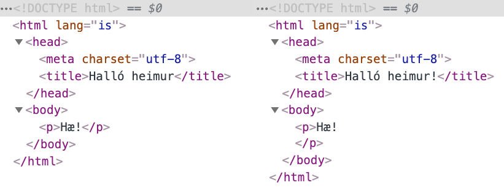

Í gegnum árin hafa ýmsar tilraunir verið gerðar til þess að skrifa HTML, bæði þar sem vinnan er sett á _höfund_ og á _vafra_.

## XML

XML, eða _Extensible Markup Language_ er opið sniðmál sem staðlað er af W3C og hefur það að markmiði að kóða almennar upplýsingar á formi sem bæði er lesanlegt af tölvum og fólki. XML er skilgreint með SGML og notast við element og attribute. Eru því XML og HTML skjöl að mörgu leyti lík, nema að XML nota yfirleitt tög sem draga nöfn sín af verkefninu sem verið er að leysa.

```xml
<?xml version="1.0" encoding="UTF-8" ?>
<page>
  <section>
    <heading>Fyrirsögn</heading>
    <content>Efni</content>
  </section>
</page>
```

XML skjöl _verða_ að uppfylla vissar kröfur um réttmæti til að tölvur geti lesið þau, þau verða að vera _gild_ (e. valid). Ef þau eru það ekki mun XML þáttari sem reynir að búa til DOM tré kasta villu og **engu** er skilað. XML skjöl verða einnig að byrja á _XML skilgreiningu_, t.d. `<?xml version="1.0" encoding="UTF-8" ?>` sem segir til um útgáfa af XML og stafasett sem notað er.

## XHTML

Við lok seinustu aldar var XML mjög vinsæl tækni sem var mikið notuð á internetinu. Þessar vinsældir ásamt því hversu erfitt það gat verið á stundum að þátta HTML (vafrar höfðu byggt inn virkni sem lagaði villur hjá notendum þar sem erfitt getur verið að skrifa HTML alveg kórrétt[^1]) urðu til þess að fólk fór að vinna að því að gera útgáfu af HTML sem fór eftir sömu reglum og XML. _XHTML_, Extensible HyperText Markup Language, var staðlað af W3C og kom útgáfa 1.0 út sem W3C recommendation árið 2000 og útgáfa 1.1 árið 2001.

### HTML & XHTML

XHTML er vel formað XML þannig að hægt sé að þátta (e. parse) það með XML þátturum. Þegar búið er að þátta XML skjal höfum við tré sem tölvur geta unnið með.

Þetta þýðir að XHTML gerir kröfur á málfræði sem ekki eru til staðar í HTML:

* XHTML verður að vera vel formað: `<p>Halló <strong>heimur</strong></p>` ekki `<p>Halló <strong>heimur</p></strong>`
* Tög og attribute í lágstöfum: `<p class="a">texti</p>` ekki `<P CLASS="a">texti</P>`
* Endum alltaf og lokum alltaf elementum `<p class="a">texti</p><br/>` ekki `<p class="a">texti<br>`
* Attribute á elementum alltaf innan gæsalappa og ekki stök: `<input class="a" selected="selected">texti</p>` ekki `<input class=a selected>texti`

Þessar kröfur eru _ekki_ til staðar í HTML5. Við fyrstu sýn mætti halda að þessar kröfur séu af hinu góða. Hinsvegar þegar kemur að því að skrifa XHTML og **alltaf** fylgja þessum reglum, þá fara gallar að koma í ljós.

### Gallar við XHTML

Þar sem XHTML á að vera vel formað XML er auðvelt að gera mistök sem valda því að vefur birtist ekki, t.d. ef það gleymist að loka elementi með endatagi, þá hreinlega _birtist vefurinn ekki_. Í IE6 (vinsælasti vafrinn á þeim tíma sem XHTML var sem mest í umræðunni) var ekki hægt að setja XML skilgreiningu inn í skjalið, þar sem skilgreiningin lét vafrann túlka vefinn í _quirks mode_.

HTTP hefur leið til að skilgreina hvernig skjal (með MIME type) kemur frá vefþjóni með _Content Type_ skilgreiningu. Fyrir HTML er `text\html` notað en fyrir XML og XHTML er það `application\xml`. Margir af þeim vefjum sem voru strangt tiltekið skrifaðar í XHTML/XML voru sendar með _vitlausu_ Content Type til vafra og þ.a.l. túlkaðar á _sama hátt_ og HTML, að hafa vefina skrifaða í XHTML hafði í raun og veru engin áhrif á hvernig þeir voru túlkaðir af vöfrum.

Þó svo að þessi hugsun um að láta alla vefi vera skrifaða _rétt_ og láta vafra framfylgja því, hafi verið rökrétt, þá virkar það ekki í reynd. Mun betra er að stefna að _traustleika_ (e. robustness):

> Be conservative in what you do, be liberal in what you accept from others.
> —Robustness principle / Postel’s law: [RFC761: TCP](https://tools.ietf.org/html/rfc761#section-2.10)

XHTML skjal sem er í lagi:

```html
<?xml version="1.0" encoding="UTF-8" ?>
<!DOCTYPE html PUBLIC "-//W3C//DTD XHTML 1.0 Strict//EN" "http://www.w3.org/TR/xhtml1/DTD/xhtml1-strict.dtd">
<!-- ef við tilgreinum ekki xhtml xml namespace er vefur birtur sem xml -->
<html xmlns="http://www.w3.org/1999/xhtml">
  <head>
    <title>Í lagi?</title>
  </head>
  <body>
    <p>Halló?</p>
  </body>
</html>
```

XHTML skjal sem er ekki í lagi og mun ekki birtast:

```html
<?xml version="1.0" encoding="UTF-8" ?>
<!DOCTYPE html PUBLIC "-//W3C//DTD XHTML 1.0 Strict//EN" "http://www.w3.org/TR/xhtml1/DTD/xhtml1-strict.dtd">
<html xmlns="http://www.w3.org/1999/xhtml">
  <head>
    <title>Í lagi?</title>
  </head>
  <body>
    <p>Halló?</p>
    <p>Bless!
  </body>
</html>
```

Sérð þú villuna? Í línu 9 er `<p>` elementi ekki lokað. Fyrir ekki stærri villu er refsað harkalega. Jafnvel í svona litlu dæmi er það ekki strax augljóst hvað vantar. Fyrir risa vefsíður með mikið af efni–sem jafnvel ótæknimenntað fólk vinnur við—er svona lagað afar óæskilegt.


Þó svo að HTML5 skjöl þurfi ekki að vera XML skjöl þá þýðir það ekki að þau séu ekki þáttuð. Það þýðir einfaldlega að flækjustigið við þáttunina er færð frá notanda (verða að skrifa kórrétt skjal) yfir til vafrans.

## Að skrifa HTML (og kóða almennt)

Þegar við förum að skrifa HTML (og annan kóða) lendum við tiltölulega hratt í því að vera að vinna með texta sem passar ekki á einn skjá, eða í eina skrá. Þá fer að skipta máli að vera skipulögð til að reyna eins og við getum að minnka það að fara fram og til baka, halda samræmi, og fleira. Þetta á sérstaklega við ef við erum að vinna í teymi.

### Túlkun á HTML & DOM

Þó svo að HTML5 leyfi okkur að skrifa allskonar HTML þá viljum við halda vissu stigi af snyrtimennsku, því eins og sagt er, _kóði lýsir innri manneskju_. Þær leiðir sem við notum til að skrifa snyrtilegt HTML eru aðallega að:

* Fylgja (yfirleitt) þeim kröfum sem XHTML setur á málfræði.
* Passa upp á inndrátt, þar sem bil og nýjar línur eru ekki mikilvæg í HTML þá getum við leyft okkur að nýta þau til að mynda snyrtilegt HTML.

Ef við skoðum _minnsta HTML5 skjalið_ sem hefur allt það sem við þurfum til að skilgreina grunnvef:

```html
<!doctype html>
<html lang="is">
  <head>
    <meta charset="utf-8">
    <title>Halló heimur</title>
  </head>
  <body>
    <p>Hæ!</p>
  </body>
</html>
```

þá getum við skilgreint það sem _snyrtilegt_ HTML sem auðvelt er að lesa fyrir manneskjur. Sömu merkingu fáum við út úr eftirfarandi:

```html
<!doctype html><HTML lang=is>
<head><meta charset="utf-8">
<title>Halló heimur!</TITLE>
<BODY><p>Hæ!
```

sem við gætum sagt að sé _subbulegt_. Vafranum er þó sama, bæði dæmin eru merkingarfræðilega nákvæmlega eins.

Til þess að sjá hvernig vafri túlkar HTML, getum við nýtt okkur „developer tools“ (eða „dev tools“) í vöfrum. Þá opnum við tólið, veljum „Elements“ í Chrome eða „Inspector“ í Firefox. Vafrinn þáttar bæði dæmi í sama DOM (Document Object Model) tréð, fyrir utan bil og nýja línu sem sett er fyrir lokun á `<p>`.



Þannig að HTML sem við skrifum er ein útgáfa (sú sem við sjáum með „view source“) en sú sem vafrinn birtir er önnur og er sú útgáfa kölluð DOM. Sú útgáfa getur breyst, t.d. ef við fjarlægjum eða bætum við elementum með JavaScript.

### Snyrtilegt HTML & villur

Það er gott að rifja upp Postel’s law og vera traust og öguð. Að skrifa snyrtilegt HTML getur hjálpað okkur við að losna undan hvimleiðum villum. T.d. skiptir máli hvar element lokast miðað við önnur element.

```html
<title>Halló heimur!
<body><p>Hæ!
```

Hér er `<title>` ekki lokað og því mun það efni sem kemur á eftir verða túlkað innan þess, og vefurinn okkar ekki líta út eins og við myndum vilja. Vafrinn mun ekki taka fram fyrir hendurnar á okkur hér og loka `<title>` fyrir okkur. Af hverju? Það er ekki augljóst _hvar_ eigi að loka því, hugsanlega viljum við hafa HTML í titlinum, vafrinn hefur enga leið til að túlka það.

```html
<ul class="first">
  <li>Fyrsta stak í fyrsta lista
  <ul class="second">
  <li>Fyrsta stak í öðrum lista
  <ul class="third">
  <li>Fyrsta stak í þriðja lista</li>
  <!-- hér vantar að loka </ul>! -->
  </li>
  </ul>
  </li>
  <li>Annað stak í fyrsta lista</li>
</ul>
```

Ef við lokum _of mörgum_ `<div>`, gleymum að loka `<ul>`, eða gerum aðrar villur mun vafrinn ekki birta HTML eins og við viljum og merking vefsins okkar breytist.

Að auki eru ákveðnar reglur um það hvaða element má vera innan annars elements, hver er t.d. merking þess að hafa málsgrein innan málsgreinar, `<p><p>Halló heimur!</p></p>`? Í staðlinum er þetta skilgreint innan „[content model](https://html.spec.whatwg.org/multipage/dom.html#concept-element-content-model)“ hluta hvers elements.

## Linting

Hugtakið _linting_ á við þegar við höfum forrit sem athugar kóðann okkar og láta vita af mögulegum villum. Þessar villur geta verið tvenns konar:

* Mögulegar villur sem kæmu upp við keyrslu, t.d. `<ul>` lokað of oft eða of snemma í HTML eða óskilgreindri breytu í JavaScript. Fyrir _túlkuð_ forritunarmál eins og JavaScript getur þetta gripið villur sem _þýðandi_ í þýddum forritunarmálum grípur fyrir okkur (t.d. eins og í Java)
* Brotum á kóðastíl verkefnis, þeim stíl sem við höfum sammælst um að nota eða tólið mælir með

Þessi forrit nýta [_static analysis_](https://en.wikipedia.org/wiki/Static_program_analysis) á forritskóðanum okkur (hvort sem það er HTML, CSS, eða eitthvað annað forritunarmál). Forritin eru ekki keyrð, heldur eru þau þáttuð og borin saman við reglur forritunarmálsins og hugsanlega sérsniðnar reglur sem teymi hefur sett sér.

Þegar við vinnum í verkefnum með öðrum geta litlir hlutir í uppsetningu kóða hægt og rólega farið að skipta máli. Því getur verið mjög gott að skilgreina _hvernig_ við skrifum forritin okkar og nýta lintera og álíka tól til að framfylgja þeim ákvörðunum. Dæmi um hvað við stöðlum gæti verið:

* Hvernig við meðhöndlum inndrátt, notkun á _tabs_ eða _spaces_.
* Hámarkslengd lína, ef línur verða mikið lengri en 100 stafir geta komið upp vandamál (t.d. að bera saman kóðabreytingar, lesa kóða á minni skjám/minni gluggum).
* Í hvaða röð CSS eigindi eru röðuð.

Til að aðstoða okkur við að skrifa snyrtilegt og rétt HTML eur til linting (eða _validation_) forrit (eða þjónustur) sem túlka HTML sem við gefum því og láta vita af villum sem eru til staðar. W3C rekur þá mest notuðu á [`https://validator.w3.org/`](https://validator.w3.org/) en þar getum við sent inn slóð á vef eða kóða til athugunar. Ef við sendum inn:

```html
<!doctype html><html lang="is">
<title>Halló heimur!
<body><p>Hæ!
```

fáum við til baka lista af villum, eitthvað í líkingu við:

```text
1. Error: End of file seen when expecting text or an end tag.
At line 3, column 12
BODY><p>Hæ!

2. Error: Unclosed element title.
From line 1, column 22; to line 2, column 7
tml><HTML>↩<title>Halló
```

Einnig bjóða flestir textaritlar upp á aukapakka (plugin) sem birta linting villur meðan við skrifum og flýta þannig fyrir því að við skrifum snyrtilegan og góðan kóða.

### Tabs VS spaces

Eitt af hinum _helgu stríðum_ forritunarheimsins er hvort nota eigi _tab_ eða _space_ til að draga inn kóða. Þá er ekki verið að meina _tab_ og _space_ lyklana á lyklaborðinu sjálfu heldur hvort eigi að nota bil, ` ` (kóði 32 í ASCII) staf eða _tab_ staf (kóði 9 í ASCII, eða `\t`). Þetta _stríð_ hefur verið ýkt í poppmenningu og oft notað til að gantast með forritara.

Rök fyrir notkun (og ekki notkun!) á tab er að hægt er að skilgreina nákvæmlega hversu langt bil eitt tab (sjálfgefið er það yfirleitt birt sem fjögur bil) býr til á meðan að bil er alltaf nákvæmlega jafn langt. Sumir vilja að lína sé inndregin um ca. 2 bil, aðrir um 4. Forritunarumhverfi sem unnið er í hefur yfirleitt einhverja ákveðna stefnu sem flestir fylgja, t.d. í JavaScript heiminum eru tvö space yfirleitt notuð en í C# eitt tab.

Hvort heldur sem notað er skiptir ekki mestu máli, en það sem skiptir máli er að hafa samræmi í inndrætti á öllum kóða. Að blanda saman tab og space í kóða getur orðið mjög ruglandi og ætti að forðast í allra lengstu lög.

```html
<div>
	<p>Halló tab</p>
  <p>Halló spaces</p>
  <ul class="first">
  	<li>Fyrsta stak í fyrsta lista
		  <ul>
    		<li>Fyrsta stak í öðrum lista</li>
  	  </ul>
    </li>
  	<li>Annað stak í fyrsta lista</li>
	</ul>
</div>
```

Ýkt dæmi með blönduðum bilum og tabs. Athugið að birting hér þýðir tab yfir í fjögur bil.

## HTML & vafrinn

Eins og nefnt hefur verið, þá les vafrinn (eða annað forrit sem túlkar HTML) vefsíðuna okkar og þáttar (e. parse) í DOM (Document Object Model) sem síðan er birt. Í þessari þáttun er þó fleira sem gerist:

* Hvert `<script>` element er sótt (vísar í JavaScript), þáttað og keyrt. Á meðan þetta fer fram er vafri _ekki_ að halda áfram með þáttun á HTML, þessi aðgerð _blokkar_[^2].
* Hvert `<link>` element sem vísar í skjal er sótt og þáttað, t.d. CSS skrár.
* Öll innfeld (e. embedded) element eru fundin og sótt, stærð þeirra skiptir máli fyrir _layout_.
* Úr þáttuðu HTML og þáttuðu CSS er búið til _render tree_.
* Vafri reiknar út _layout_, hvar öll element eigi að birtast á skjánum, reiknuð er hæð og breidd á **öllu** í pixlum.
* Að lokum eru pixlar teiknaðir á skjáinn og viðmótið okkar birtist.

Þetta þýðir að röðun og stærð skráa sem við notum skipta máli. Ekki verður farið nánar í það, en það er eitthvað sem þarf sérstaklega að hafa í huga þegar farið er að vinna í stærri verkefnum sem nýta mikið af innfelldu efni, CSS, og JavaScript virkni.


[^1]: kórrétt er að skrifa nákvæmlega rétt samkvæmt staðlinum, þar sem engar villur er að finna.

[^2]: blokkar að því leiti að annað bíður þar til þessum lið er lokið með öllu.
