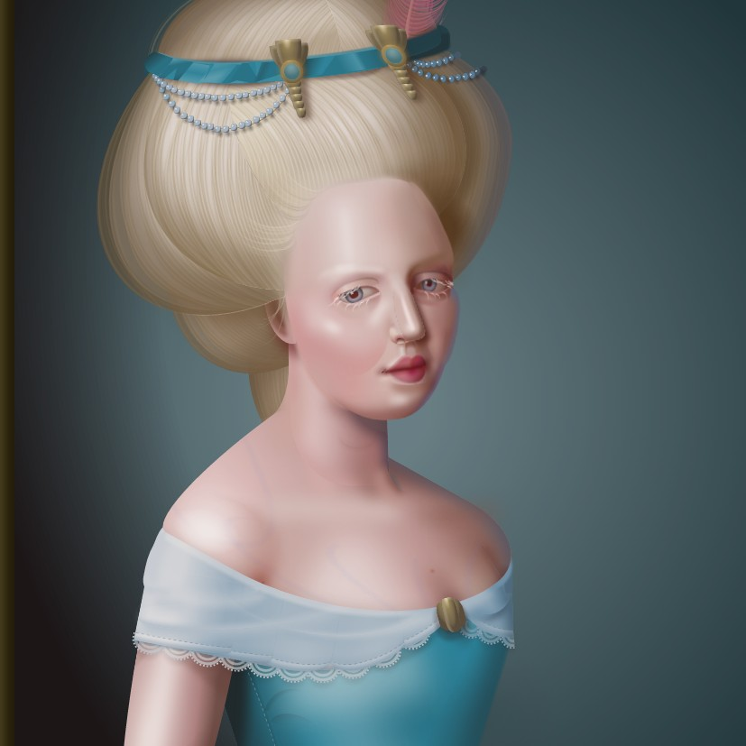

## Hvað er CSS?

Þegar við höfum skrifað efnið okkar í afskaplega fínu HTML skjali, merkingarbæru og aðgengilegu, langar okkur að ljá það lífi með útliti. Þar sem HTML er _descriptive_ markup mál er því ekki ætlað að tjá útlit. Þar kemur CSS inn í myndina.

CSS stendur fyrir [_Cascading Style Sheets_](http://en.wikipedia.org/wiki/Cascading_Style_Sheets) og er _style sheet language_. Það er notað til að lýsa framsetningu á skjali skrifuðu í markup máli, t.d. HTML, XHTML, XML og SVG. CSS kom fyrst fram á sjónarsviðið árið 1994 þegar [Håkon Wium Lie lagði til _Cascading HTML style sheets_](https://www.w3.org/People/howcome/p/cascade.html). Í tillögunni er farið yfir hvernig vafrinn stjórni að mestu allri birtingu og „höfundurinn á HTML skjölum hafi engin áhrif á birtinguna“, sem var vissulega rétt, fyrir tíma CSS var engin leið til að breyta litum á stökum tenglum, aðeins öllum í einu!

Þó svo að það væri ekki hægt að breyta litum á tenglum lét fólk það ekki stoppa sig í að nýta það sem í boði var til að lífga upp á vefsíður. Töflur og gegnsæjar gif myndir tröllriðu öllu eftir að [_Creating Killer Websites_](https://www.killersites.com/killerSites/core.html) kom út og fólk gat loksins tjáð sig á vefnum með _hönnun_.


Árið 1996 var [CSS 1 staðlað hjá W3C](https://www.w3.org/TR/1999/REC-CSS1-19990111) en átti erfitt uppdráttar fyrstu árin eftir það. Stuðningur í vöfrum var ekki mikill og þegar virkni var útfærð var hún oftar en ekki ósamhæfð milli vafra. CSS 2 staðallinn kom út 1998 og kynnti til leiks `position` eigindið sem leyfði enn frekari stjórn yfir útliti. Stuðningur við CSS hélt þó áfram að vera lítill og ósamhæfður í vöfrum. Vefforritarar létu sér nægja að nota töflur og sáu sumir hverjir ekki ástæðu til að tileinka sér nýja tækni sem ekki var vel studd. [Web Standards Project (WaSP)](http://en.wikipedia.org/wiki/Web_Standards_Project) fór gagngert að þrýsta á vafraframleiðendur til að útfæra CSS rétt samkvæmt staðli og var stofnuð til þess [„CSS Action Committee“](https://archive.webstandards.org/css/) sem einnig gekk undir nafninu „The CSS Samurai“. Partur af því sem þessi hópur gerði var að útbúa viðmiðs útfærslu af CSS sem vafrar gátu hlaðið upp og borið saman við mynd. Þetta próf var kallað _acid test_ og varð til þess að stuðningur fór hægt og rólega að aukast.


Þegar þessir staðlar voru orðnir ágætlega studdir í nýlegri vöfrum um aldamótin, var þónokkuð af fólki ennþá að nota eldri, úrelta vafra eins og t.d. Netscape Navigator. Þar sem engin pressa var á notendur til að uppfæra og hlutirnir _virkuðu_ var ennþá stöðnun, flestir vefforritarar sáu ekki ástæðu til að tileinka sér nýja tækni. Þetta breyttist síðan með _töflulausum_ eða _merkingarfræðilegum_ endurhönnum á Wired árið 2001, og ESPN árið 2003, og CSS Zen Garden sem opnaði árið 2003 sem sýndi fólki líka hvers CSS var megnugt.


CSS 2.1 kom fyrst út árið 2004 og innihélt sá staðall aðallega lagfæringar á villum í CSS 2. Brösuglega gekk þó að ná yfir allar villurnar. W3C setti því staðalinn fram en setti aftur í _draft_ og hélt það áfram alla leið til ársins 2011. Af þessu lærði W3C og var CSS 3 sett upp á annan máta. Í staðinn fyrir að gefa út einn stóran staðal með allri virkni sem staðla ætti, er virknin þróuð í einingum. [Í dag eru tugir af einingum í vinnslu](https://www.w3.org/Style/CSS/current-work) og eru þær á hverjum tíma í mismunandi stöðu, hvort sem þær eru draft, candidate recommendation eða proposed recommendation.


## Einfalt, ekki auðvelt

> “You don't need to be a programmer or a CS major to understand the CSS specifications. You don't need to be over 18 or have a Bachelor's degree. You just need to be very pedantic, very persistent, and very thorough.”
>— [Understanding the CSS Specifications](http://www.w3.org/Style/CSS/read)

CSS er einfalt að læra en ekki auðvelt að nota. Í grunninn eru þetta nokkrar reglur með einfaldri málfræði sem leyfa okkur að lýsa því hvernig element eigi að birtast. Þar sem það er einfalt að læra á CSS en ekki auðvelt að skrifa CSS til að lýsa því útliti sem óskað er eftir, lenda margir upp á kant við CSS. Vegna þessa eru margir sem sem líta CSS hornauga og kenna því um að ekki gangi vel. Þetta er vert að hafa í huga áður en byrjað er að læra CSS.


Það er líka gott að hafa í huga að þó að CSS sé einfalt er það mjög kröftugt. Flest öll þau útlit sem við sjáum á vefnum eru smíðuð með CSS (stundum eru myndir eða þrívíddarvirkni notuð til að smíða útlit óháð CSS). Með mikilli þolinmæði má smíða ótrúlega hluti með CSS.

> Think for a moment of all the sites out there on the web. There’s a huge variation in visual style: colour schemes, typographic treatments, textures and layouts. All of that variety is made possible by one simple pattern that describes all the CSS ever written:
>
> `selector { property: value; }`
>
> That’s it.
> —[Resilient Web Design – Chapter 2](https://resilientwebdesign.com/chapter2/)

Þó svo að CSS sé ekki hannað eða nýtt sem forritunarmál, þá er það [_óvart_ „turing complete“](https://beza1e1.tuxen.de/articles/accidentally_turing_complete.html). 


Með þolinmæði og tíma er hægt nota CSS sem verkfæri til að skapa list:



## CSS & HTML

Þar sem CSS er sú tækni sem við notum til að ljá HTML líf þurfum við að tengja saman HTML og CSS. Það eru nokkrar leiðir til þessa:

* Geyma CSS í eigin skrá (með skráarendingunni `.css`) og vísa í þá skrá úr HTML með `<link rel="stylesheet" href="path/to/file.css">` í `<head>`. Þessi leið viðheldur algjörum aðskilnaði á milli HTML og CSS og er æskilegasta leiðin.
* `<style>` element í HTML skjali, helst í `<head>`. Elementið inniheldur CSS reglurnar sem texta. Þetta er ekki alveg jafn _hrein_ leið en aðskilur þó CSS frá HTML.
* Öll element hafa `style` global attribute sem leyfir skilgreiningu á CSS beint á elementi. Þetta getur haft sína kosti en ætti **alls ekki** að vera almenna leiðin til að tengja CSS við HTML þar sem þetta bindur útlit við sniðmálið og er litlu betra en að nota `<FONT>`.

Skjalið `styles.css`:

```css
body {
  background-color: pink;
}
```

Skjalið `index.html`:

```html
<!doctype html>
<html lang="is">
  <head>
    <meta charset="utf-8">
    <title>CSS</title>
    <link rel="stylesheet" href="styles.css">
    <style>
    p {
      font-size: 2em;
    }
    </style>
  </head>
  <body>
    <p>Halló, <em style="text-decoration: italic;">heimur</em></p>
  </body>
</html>
```

Í dæminu að ofan eru allar þrjár leiðirnar notaðar. Hreinlegri og betri lausn er að geyma allar þessar upplýsingar um útlit í CSS skjalinu:

```css
body {
  background-color: pink;
}

p {
  font-size: 2em;
}

em {
  text-decoration: italic;
}
```

```html
<!doctype html>
<html lang="is">
  <head>
    <meta charset="utf-8">
    <title>CSS</title>
    <link rel="stylesheet" href="styles.css">
  </head>
  <body>
    <p>Halló, <em>heimur</em></p>
  </body>
</html>
```

Þarna höfum við endurbætt (e. refactor) fyrra dæmið: breytt uppbyggingu á kóða til hins betra án þess að breyta lokaniðurstöðunni.
