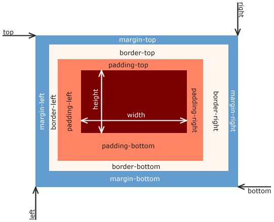

Box módelið lýsir því hvernig rétthyrnd box fyrir element eru mynduð.



## Margin

Margin er ysta lag boxsins og getum við skilgreint lengd í hverja átt með `margin-top`, `margin-right`, `margin-bottom` og `margin-left`. Lengd getur verið skilgreind sem neikvæð tala en þá er box _dregið_ í viðkomandi átt um töluna. Litur á boxi er ekki settur á margin svæði box, það „hleypir“ lit þess sem er bakvið það í gegn.

Ef `auto` er skilgreint fyrir vinstri og hægri hliðar er box miðjað innan foreldri síns, vafri reiknar sjálfkrafa hve mikið margin á að vera vinstra og hægra megin. _Shorthand_ skilgreining á margin er:

```css
margin: 1em;           /* margin: allar hliðar; */
margin: 1em 0;         /* margin: top&bottom right&left; */
margin: 0 1em 2em;     /* margin: top right&left bottom; */
margin: 0 1em 2em 3em; /* margin: top right bot left; */
```

Þar sem margin er ysta lag boxisns geta lóðrétt margin tveggja eða fleiri boxa í röð geta fallið saman og er það kallað _collapsing margin_. Einnig getur það gerst fyrir box innan í boxi. Getur oft komið á óvart en getur líka verið gagnlegt. Nokkuð [flóknar reglur](http://www.w3.org/TR/CSS2/box.html#collapsing-margins) segja til um hvenær og hvernig það gerist.

```html
<p>Fyrsta málsgrein.</p>
<p class="more">Önnur málsgrein.</p>
<p>Þriðja málsgrein.</p>
```

```css
p { margin: 50px; }
/*
á milli tveggja p er aðeins 50px margin
ekki 50px+50px þar sem þau falla saman
*/

p.more { margin-bottom: 100px; }
/*
milli p.more og næsta p er 100px margin ekki 100px + 50px
einnig vegna þess að margin falla saman
*/
```


## Border

Border er næst ystalag boxins og teiknar jaðar utan um það. Hægt er að skilgreina:

* þykkt (e. width) sem jákvætt tölulegt gildi með `border-width`.
* stíl (e. style) með lykilorðum, t.d. `solid` (lína), `dotted` (teiknaður jaðar er röð af punktum), `double` (tvær línur með bili á milli, summa alls er jafn þykk gildi þykktar) með `border-style`.
* lit (e. color) sem litagildi með `border-color`.

Fyrir hverja átt er hægt að skilgreina hvert gildi, t.d. `border-top-width`. Eða nota `border` shorthand sem skilgreinir allt fyrir allar hliðar eða per hlið með t.d. `border-top`.

```css
border: 1px solid #000;    /* svört 1px lína allt um kring */
border-top: 0;             /* nema engin lína efst */
border-bottom-width: 3px;  /* og 3px þykk í botninum */
border-left-style: dotted; /* og punktar til vinstri */
```

## Padding

Næst innst í boxinu er `padding`. Það er skilgreint eins og `margin`, einnig fyrir shorthand. Munur er:

* Padding getur ekki verið skilgreint með neikvæðu gildi.
* Padding fær bakgrunnslit sem skilgreindur er á elementi.

## Efni

Við getum skilgreint breidd efnis með `width` og hæð með `height`. Heildarstærð sem boxið tekur er þá:

```text
width = left margin + right margin + left border + right border +
        left padding + right padding + content width

height = top margin + bottom margin + top border + bottom border +
         top padding + bottom padding + content height
```

Það getur leitt til vandræða þar sem útlit notar hlutfallslegar stærðir og nákvæmar stærðir, t.d. ef við skilgreinum border með `px` en viljum að boxið í heild sinni fylli alveg upp í foreldri sitt með `100%`.

Að takmarka hæð á elementum er hættulegur leikur. Breidd á elementum miðast alltaf við breidd á vafra (eða því tæki sem við erum að skoða með) og því auðveldara að takmarka það og þá sérstaklega með hlutfallslegum lengdum. `width: 100%;` á element þýðir að það fyllir upp í lárétt pláss foreldris. Ef við skilgreinum `height: 100%;`, hvað þýðir það? Hæð á allri síðu? Hæð á foreldri? Hvað ef sú hæð er skilgreind útfrá hæð barnsins? Við lendum í enn frekari vandræðum ef við grípum til þess að nota nákvæm gildi, t.d. `height: 100px;`, því hvað gerist ef efnið þarf meira pláss? Í flestum tilfellum viljum við því takmarka breidd en láta hæðina flæða eftir því sem efnið þarf.

```css
p {
  border: 1px solid #000;
  width: 10%;
  height: 100px;
}
```

Því minna pláss sem foreldri býður upp á, því meiri líkur á að textinn „flæði út úr“ `p` elementi.


## Box sizing

CSS3 skilgreinir [`box-sizing`](https://developer.mozilla.org/en-US/docs/Web/CSS/box-sizing) sem breytir því hvernig box modelið er reiknað:

* `content-box` - sjálfgefið gildi, allt tekið með í reikninginn.
* `border-box` - aðeins margin er tekið með í reikninginn.

Að breyta því hvernig við reiknum heildarstærð á boxi getur oft á tíðum verið til góðs. Við höfum þá frelsi til að eiga við „innri“ gildi boxsins (`border` og `padding`) án þess að það hafi áhrif á heildarstærðina. T.d. ef við höfum box sem eiga að raðast saman í lárétta röð og hvert box á að taka 25% af breidd foreldris en við viljum líka að það hafi `border` og `padding` svo efni fái að anda. Án þess að nota `box-sizing: border-box;` þyrftum við því að fara í að reikna `width` án þessara gilda, sem eru hugsanlega nákvæm gildi, eða bæta við fleiri elementum innan boxsins til að útbúa pláss.

```css
.box {
  width: 25%; /* á að taka 25% af breidd foreldris */
  
  padding: 10px; /* en hafa 10px padding */
  border: 1px solid #000; /* og border */

  /*
  en núna mun allt boxið verða á breiddina:
  25% + 2*10px + 2*1px
  og það verður ekki pláss fyrir fjögur box í röð
  */
  
  box-sizing: border-box;
  /* allt í góðu núna! box verður 25% að breidd */
}
```

## Takmarkanir á hæð og breidd

Stundum viljum við að boxin okkar séu aldrei minni eða stærri en ákveðið (oftast nákvæmar stærðir) á hæð eða breidd:

* `min/max-height: x;` takmarkar box þ.a. það sé aldrei minna/stærra en `x`.
* `min/max-width: x;` takmarkar box þ.a. það sé aldrei mjórra/breiðara en `x`.

Þetta getur verið gott þegar við vinnum með box sem _skalast_ en við vitum að undir/yfir ákveðinni breidd líta þau ekki vel út eða verða ónothæf. Þá getum við skilgreint breidd þeirra í hlutfallslegri stærð, t.d. `width: 100%;` en takmarkað þá með `min-width` og `max-width` með nákvæmum stærðum.

```css
.box {
  width: 100%;     /* fyllir upp í foreldri */
  max-width: 40em; /* aldrei breiðari en um 40em */
  min-width: 20em; /* og aldrei minni en um 20em */
  /*
  Stærð á elementi með .box verður því á bilinu
  [20em, 40em] sama þó foreldri sé minni eða stærri.
  */
}
```

Þegar við byrjum að vinna með útlit í CSS er mjög gott að muna það að **lang flest í CSS er rétthyrnt box!**
