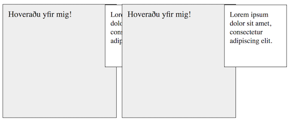

CSS 2.1 skilgreinir [_visual formatting model_](http://www.w3.org/TR/CSS2/visuren.html) sem skilgreinir hvernig við stýrum uppsetningu og flæði efnis á síðu. 

## Normal flow – eðlilegt flæði

Ef við höfum ekki skilgreint hvernig element á að haga sér er það í _eðlilegu flæði_ og er sjálfgefið annað hvort _block_ eða _inline_. Við getum stýrt hvernig element hegðar sér með `display` eigindu, sem tekur eftirfarandi gildi:

* `block`, element forma „blokkir“ og fylla upp í breidd foreldris.
* `inline`, element forma ekki „blokkir“ heldur dreifir sér í línur, inline element fá ekki lárétt `margin`, `width` eða `height`.
* `inline-block`, element myndar blokk (og getur því fengið lárétt margin) en dreifir sér í línu.
* `none`, element er fjarlægt með öllu úr flæði og tekur ekkert pláss.

Ef við viljum ekki ganga svo langt að fjarlægja box með `display: none;` getum við falið allt efni innan þess með `visibility: hidden;`. Það felur boxið og allt efni í því en reiknar með því í útliti.

## Efni í boxi

Þegar við stýrum stærð á elementum með `height` eða `width` hættum við á að elementið verði of lítið fyrir efni sitt. Þá getur `overflow` hjálpað en það leyfir okkur að skilgreina hvað gerist við efnið sem flæðir út fyrir:

* `visible` (sjálfgefið) sýnir efni sem flæðir út fyrir
* `hidden` felur efni sem flæðir út fyrir
* `scroll` efnið flæðir og skrunstikur birtast
* `auto` birtir efni ef pláss, annars skrunstikur

Í þeim tilfellum sem við takmörkum hæð á elementum sem innihalda texta þá viljum við hugsa sérstaklega um `overflow`. Það er auðvelt að gera ráð fyrir því að texti muni alltaf vera jafn langur og sá sem við höfum í forritun, en hvað gerist ef einhver bætir við tvisvar sinnum lengri texta? Eða ef fyrirsögn er það löng að hún fari í tvær línur? `overflow: hidden` er lausn sem viðheldur útliti en felur efni og er því ekki æskilegt. `overflow: auto` setur sjálfkrafa þær skrunstikur sem verða að vera og er yfirleitt besta lausnin. `overflow` er _short-hand_ gildi fyrir `overflow-x` og `overflow-y` sem við getum notað til að stýra birtingu á x eða y ás sérstaklega.

## Staðsetning

Við getum stýrt staðsetningu á elementum með `position` eigindinu. Það tekur nokkur lykilorð sem stýra hvernig við viljum breyta staðsetningu. Ásamt því notum við `top`, `right`, `bottom` og `left` eigindin (stundum kölluð _offset eigindi_) til þess að staðsetja elementið. Þau taka öll bæði jákvæð og neikvæð gildi sem lengd. `static` er sjálfgefna gildi `position` og staðsetur það í eðlilegu flæði. Að gefa element `position` gildi annað en `static` gerir það að _containing block_ sem notast er við í suma útreikninga. Fyrsta containing block er rótar elementið, yfirleitt `<html>`.

### Hlutfallsleg staðsetning

Við staðsejum element _hlutfallslega_ í eðlilegu flæði með `position: relative;`. Staðsetning á elementi er reiknuð út frá eðlilegu flæði en síðan er það flutt hlutfallslega miðað við þá staðsetningu eftir gildum offset eiginda. Eftir flutning er „plássið“ í eðlilegu flæði eftir.

```html
<div class="box">1</div>
<div class="box">2</div>
<div class="box">3</div>
<div class="box">4</div>
```

```css
.box {
  margin-bottom: 10px;
  padding: 20px;
  height: 50px;
}

.box:nth-child(2) {
  position: relative;
  top: 150px;
  left: 50px;
}

.box:nth-child(4) {
  position: relative;
  top: -200px;
  left: -50px;
}
```


### Nákvæm staðsetning

Við staðsetjum element _nákvæmlega_ með `position: absolute;`, út frá containing block. Element sem eru staðsett nákvæmlega eru ekki reiknuð í eðlilegu flæði og skilja því ekki eftir sig pláss. Að auki þar sem þau eru ekki með í útreikning í eðlilegu flæði, þá **fá þau ekki breidd** út frá því. `width: 100%;` mun ekki gefa breidd sem er jöfn fullri breidd foreldris, heldur mun það taka stærð sem efni krefst.

```html
<div class="absolute">
  <div class="box">1</div>
  <div class="box">2</div>
  <div class="box">3</div>
  <div class="box">4</div>
</div>
```

```css
.absolute {
  /* gerum foreldri að containing block */
  position: relative;
  border: 1px solid #000;
}

.box {
  margin-bottom: 10px;
  padding: 20px;
  height: 50px;
}

.box:nth-child(1) {
  position: absolute;
  top: 0;
  right: 0;
}

.box:nth-child(3) {
  position: absolute;
  bottom: 0;
  left: 50px;
  width: 100px;
}
```


Með því að nota `position: absolute;` getum við látið element _fylla út í_ foreldri sitt að öllu leiti með því að tilgreina öll staðsetningar eigindi í `0`. Foreldri **verður** að vera containing block, annars er barnið staðsett ofar í trénu.

```html
<div class="box">
  <div class="child">
    Box 1 – barn
  </div>
</div>
<div class="box parent">
  <div class="child fill">
    Box 2 – barn
  </div>
</div>
```

```css
.fill {
  position: absolute;
  top: 0;
  right: 0;
  bottom: 0;
  left: 0;
}

.parent {
  position: relative;
}
```


### Föst staðsetning

Við staðsetjum element _fast_ út frá viewporti með `position: fixed;`. Element sem eru fast staðsett eru ekki reiknuð í eðlilegu flæði og skilja því ekki eftir sig pláss. Element er fast að því leiti að þegar síða er _scrolluð_ helst element í stað.

```css
/* element er alltaf staðsett uppi í vinstra horni vafra */
.fixed {
  position: fixed;
  top: 0;
  left: 0;
}
```

### Klístruð staðsetning

_Klístruð_ staðsetning með `position: sticky;` notar samblöndu af hlutfallslegri og fastri staðsetningu. Staðsetning er reiknuð út frá eðlilegu flæði en þegar komið er að ákveðnum þröskuldi á _containing block_ sem getur skrunað, þá er það reiknað sem það væri hlutfallslega fast.

```css
.sticky {
  /* staðsett hlutfallslega þangað til... */
  position: sticky;

  /* 200px frá top á containing block sem skrunar, þá fast */
  top: 200px;
}
```

### Þriðja víddin

Element sem hafa annað gildi en `position: static;` eru ekki aðeins staðsett í tvívíðu rúmi, þau liggja líka á z-ás. Þetta kemur fram t.d. í því að ef tvö eða fleiri element eigi að birtast í efra vinstra horni, hvert þeirra sést? Þessi staðsetning ræðst af _stacking order_ og hvernig það er reiknað út sjálfgefið fylgir [ákveðnum reglum](https://www.w3.org/TR/CSS2/visuren.html#z-index). Við getum ákvarðað hvar í röðinni element liggur með því að gefa því sitt eigið gildi með `z-index: <tala>;`. Hærra `z-index` gildi raðar element _nær_ notanda þ.e.a.s. ofar á z-ás.

```html
<div class="zindex">
  <div class="box">1</div>
  <div class="box">2</div>
  <div class="box">3</div>
  <div class="box">4</div>
</div>
```

```css
.zindex {
  position: relative;
  border: 1px solid #000;
}

.zindex .box:nth-child(1) {
  position: absolute;
  top: 60px;
  right: 0;
  z-index: 4;
}

.zindex .box:nth-child(2) {
  position: relative;
  z-index: 1;
}

.zindex .box:nth-child(3) {
  position: absolute;
  bottom: 50px;
  left: 50px;
  z-index: 1;
  width: 100px;
}

.zindex .box:nth-child(4) {
  position: relative;
  z-index: 3;
}
```


Eitt sem getur valdið vandræðum með `z-index` er þegar við viljum birta element _innan_ elements sem hefur skilgreint `z-index` og hefur systkini sem hafa sama `z-index`, fyrir utan það. T.d. ef við viljum birta upplýsingar þegar _hoverað_ er yfir eitthvað eða smellt á takka í lista af boxum. Boxin hafa sama `z-index` og reglur segja til um að seinna í DOM trénu (þ.e.a.s. seinna í HTML röð) hefur forgang í birtingu ef sama `z-index` gildi er skilgreint.



## Fela efni ætlað skjálesurum

Það geta komið upp þau tilvik þar sem við viljum fela efni frá vöfrum en gera það aðgengilegt skjálesurum. T.d. „beint í efni“ tenglar eða textar sem auðveldara er að lesa úr samhengi hönnunarsíðu en ef hún er lesin. Til þess að gera þetta „skjálesara aðgengilega efni“ falið, er CSS notað. Það eru nokkrar leiðir til þess að ná þessu fram, t.d. að skilgreina `.sr-only` skipun:

```css
.sr-only {
  position: absolute;
  left: -10000px;
  top: auto;
  width: 1px;
  height: 1px;
  overflow: hidden;
}
```

## Floats

Önnur leið sem CSS 2.1 skilgreinir til að hafa áhrif á eðlilegt flæði er með _floats_ en það getum við skilgreint fyrir element með `float` eigindinu sem getur tekið gildin `left`, `right` eða sjálfgefna gildið `none`. Með því að skilgreina `float: left;` eða `float: right;` fjarlægjum við element úr eðlilegu flæði og „fleytum“ því til vinstri eða hægri m.v. þá línu sem það er í. Þessi lína er efri brún staðsetningar elements í eðlilegu flæði áður en því er fleytt. Fleiri en eitt element sem fleytt er í sömu átt munu sitja hlið við hlið lárétt svo lengi sem þau hafa pláss. Um leið og plássið er ekki til staðar mun elementi vera ýtt niður og „ný“ lína mynduð.

```html
<div class="img">mynd</div>
<p>Lorem ipsum dolor sit amet…</p>
```

```css
.img {
  float: left;
  margin: 0 10px 10px 0;
}
```


Við getum stýrt flæðinu í kringum element sem er fleytt með `clear` eigindinu sem tekur við gildunum `left`, `right`, `both` eða sjálfgefna gildinu `none`. Ef við „hreinsum“ ekki innan foreldris, sem aðeins inniheldur element sem er fleytt, getum við lent í vandræðum þar sem það fær þá ekki hæð og fellur saman (collapses). Nokkrar leiðir eru til að koma í veg fyrir þetta en sú sem var vinsælust meðan `float` var meira notað var _clearfix_ sem er sett á foreldrið og útbýr gervi-element á eftir því sem sér um að hreinsa.

```css
.clearfix::after {
  content: '';
  display: table;
  clear: both;
}
```

Á einum tímapunkti var `float` töluvert notað til þess að stýra heildar útliti á síðum, t.d. til að fleyta dálkum til hliðar, við hliðina á meginmáli. Í dag ættum við **ekki** að nota `float` til að stýra útliti heldur aðeins til að fleyta elementum innan annars efnis, t.d. myndum sem eiga við texta. Til þess að stýra útliti notum við Flexbox eða CSS grid.
