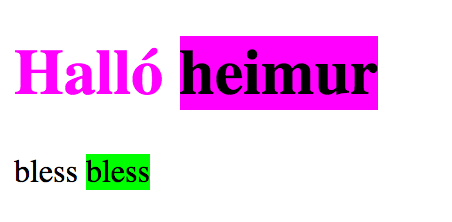
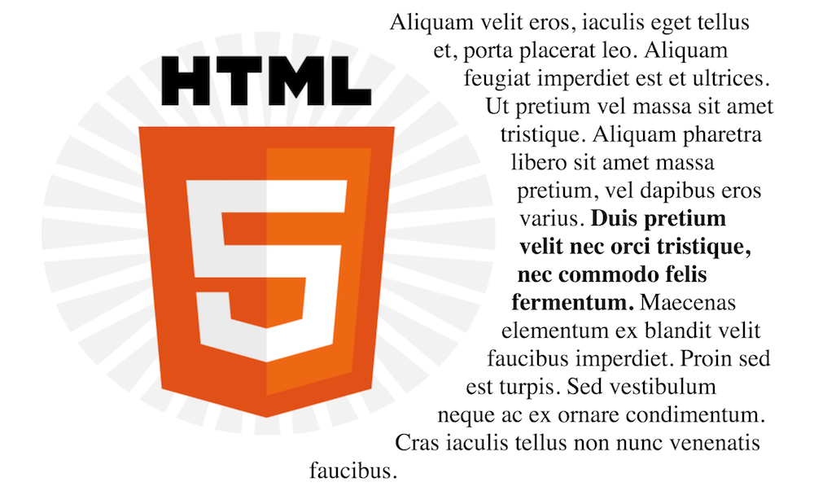
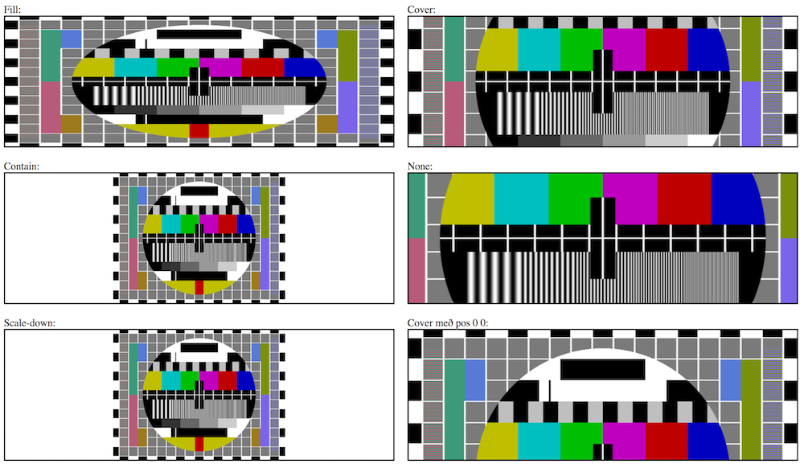

## Progressive enhancement

Hugtakið um _progressive enhancement_ segir að við eigum að einbeita okkur að upplifun sem krefst minnstu mögulegrar tækni og bæta hana í lögum, _progressively_. Á hverju af þessum _lögum_ nær notandi að upplifa efnið okkar. Þetta má hugsa í tilfelli vefforritunar svona:

1. Skrifum áhugavert, skýrt efni.
2. Setjum það upp með aðgengilegu, merkingarfræðilegu HTML.
3. Bætum við grunn útliti sem er vel stutt.
4. Bætum við flóknara útliti sem er e.t.v. minna stutt.
5. Bætum við aukinni virkni með JavaScript.

Með hverju skrefi verður vefurinn _fallegri_, _skemmtilegri_ og meira _töff_ fyrir einhverjar skilgreiningar af þessum orðum. En, á hverju stigi er efnið okkar, aðal ástæða fyrir vefnum okkar, aðgengilegt.

### Shim og polyfill

Almennt er talað um _shim_ sem virkni sem „stungið“ er inn í umhverfi til þess að veita nýja virkni í gömlu umhverfi (eða öfugt, gamalli virkni í nýrra umhverfi). Þegar umhverfið er síðan uppfært ætti _shim_ virknin að detta út og allur kóði ætti að virka í nýja umhverfinu. Þessi virkni er e.t.v. ekki alveg kórrétt eða hröð, en hún veitir fyrr aðgang að nýrri virkni.

Fyrir vefinn er talað um _polyfill_ sem kóða sem veitir aðgang að nýrri virkni áður en allir vafrar bjóða upp á hana, þ.e.a.s. polyfill er shim fyrir vafra virkni. Polyfill eru ekki eingöngu fyrir CSS virkni heldur eru til polyfill fyrir mikið af virkni sem komið hefur til á seinustu árum og koma einhversskonar stuðningi í jafnvel elstu vafra, sjá t.d. [HTML5 Cross Browser Polyfills](https://github.com/Modernizr/Modernizr/wiki/HTML5-Cross-Browser-Polyfills).

### CSS og progressive enhancement

Við getum notað _í dag_ virkni sem verður ekki að fullu studd í öllum vöfrum fyrr en _í framtíðinni_ og við höfum plan um hvernig. Í því plani tökum við tillit til þess að:

* Ákveða hvaða vafra og stýrikerfi við ætlum (eða ætlum ekki að styðja).
* Prófa í viðeigandi tækjum.
* Nýta okkur _progressive enhancement_.

## „Nýleg“ virkni í CSS

Ný veftækni er ekki alltaf að fullu studd í öllum vöfrum sem notaðir eru dagsdaglega. Við viljum því ekki nota þá virkni blint ef það getur á einhvern hátt dregið úr upplifun notenda. Það eru nokkrar leiðir til að skrifa CSS með þetta allt saman í huga. Eftir því sem árin líða og vafrar eru fljótari að bæta við virkni (eða vöfrum fækkar…) á þetta minna við, samt sem áður þarf að hugsa um þetta til að skilja ekki einhverja sem heimsækja vefina okkar eftir úti í kuldanum.

Auðveld leið er að skilgreina _fallback_ gildi, en það er gildi sem við eru viss um að allir vafrar styðji áður en við skilgreinum gildi sem nýtir nýrri tækni sem ekki er að fullu studd.

```css
width: 99%;
width: calc(100% - 30px);
```

Fallið `calc()` leyfir okkur að reikna saman lengdir sem hafa mismunandi lengdir. T.d. getum við reiknað `calc(50% - 2px);` og miðað við hvað `50%` verður reiknað sem, verða `2px` dregnir frá þeirri stærð þegar notað gildi er fundið.

Önnur leið sem vafraframleiður bjóða upp á (eða, buðu upp á) er að nota _vafraforskeyti_ (vendor prefixes) á ákveðnum eigindum og gildum. Þá er boðið upp á virknina áður en vafrinn er með fullkominn stuðning eða á meðan staðallinn er ekki að fullu skilgreindur. Þetta hefur farið minnkandi seinustu ár þar sem vefforritarar uppfærðu ekki endilega vefi eftir að forskeyti urðu óþarfi og vafrar urðu að halda áfram að styðja þau.

```css
display: -webkit-box;
display: -ms-flexbox;
display: flex;

-webkit-user-select: none;
-moz-user-select: none;
-ms-user-select: none;
user-select: none;
```

Ekki er æskilegt að handskrifa vafraforskeyti heldur nota sjálfvirk tól til að sjá um, t.d. [_autoprefixer_](https://autoprefixer.github.io/).

Báðar þessar leiðir nýta sér villumeðhöndlun CSS: eigindi og gildi sem ekki eru þekkt af vafra er einfaldlega sleppt og næsta er skoðað.

[caniuse.com](http://caniuse.com/) hefur yfirgripsmikinn gagnagrunn yfir stuðning vafra á ákveðinni virkni. Við getum nýtt okkur þennan gagnagrun til að taka ákvörðun um það hvort það sé þess virði að leggja í að nota nýja virkni yfir höfuð fyrir verkefnið okkar.

### Feature queries

Nýlegri leið til að skrifa CSS sem ekki er tryggt að allir vafrir styðja er að nota _feature queries_ með `@supports` at-reglunni. `@supports` leyfir okkur að athuga hvort að eigindi **og** gildi séu studd, þá getum við innan reglunnar skilgreint CSS sem er notað. Það ber þó að fara sparlega með notkun á þessu og ætti aðeins að nota ef við þurfum að skrifa fleiri en eina línu af CSS, hugsanlega með nýrri virkni og eldri í bland. Ef við ætlum einfaldlega að bæta við virkni í einni línu þá notum við fallback.

```css
/* ef við getum breytt því í hvaða átt texti er skrifaður með writing mode
   gerum það *og* fleytum texta til vinstri */
@supports (writing-mode: vertical-lr) {
  h1 {
    float: left;
    writing-mode: vertical-lr;
  }
}

/* ekki gera svona, bara bæta við border-radius sem progressive enhancement */
@supports (border-radius: 50%) {
  .box {
    border-radius: 50%;
  }
}
```

### CSS custom properties

CSS custom properties (eða CSS variables) leyfa okkur að skilgreina breytur, t.d. fyrir lit, ákveðna lengd eða eitthvað annað sem er mikið notað. Þetta leyfir okkur að gera breytingar á auðveldari máta og getur bætt lesanleika. Breyturnar eru skilgreindar með `--<heiti>` en það er vegna þess að þær nýta sömu hugsun og í vafraforskeytum og eru í raun að nota _tóma_ forskeytið. Til þess að nýta breytu notum við `var(--<heiti>)` fallið í CSS. Ef breyta er ekki skilgreind getum við sent aðra færibreytu sem er þá _fallback_ gildi, `var(<breyta>, #000)`. Breytur sem skilgreindar eru munu erfast frá foreldri til barns og eru háðar _cascade_.

```html
<h1>Halló <span>heimur</span></h1>
<p><span>bless</span></p>
```

```css
h1 {
  --main-color: #f0f;
  color: var(--main-color);
}

span {
  color: #000;
  /* ef við höfum aðgang að breytu er hún notuð, annars #000 */
  background-color: var(--main-color, #0f0);
}
```



Til þess að skilgreina breytur alveg efst í trénu svo hún sé aðgengileg öllu getum við notað `:root` gerviklasann (pseudo-class). Þessi gerviklasi er alltaf jafngildur rótinni á skjalinu sem er verið að stíla. Fyrir HTML væri það eins og að skilgreina fyrir `html` nema `:root` hefur hærri sértækni.

```css
:root {
  --main-color: #f0f;
}
h1 {
  color: var(--main-color);
}
```

Aðrir hlutir sem við getum gert með CSS breytum:

* Breytt dýnamískt gildi með því að setja breytu með `style` attribute.
* Margfaldað tölulegt gildi breytu með `calc()`, t.d. `calc(--multiplier * 1em)`.
* Skilgreint mörg gildi í einu, t.d. `--margins: 10px 20px;`, `margin: var(--margins);`.

### Border radius

Hægt er að rúnna horn á boxi með `border-radius`, það virkar hvort sem `border` hafi verið skilgreindur eða ekki. Líkt og með `border` er `border-radius` shorthand fyrir `border-top-left-radius` o.s.fr.

Ef við skilgreinum eina tölu er miðað við hringlaga horn en tvær tölur miða við sporöskjulaga horn. Hægt er að nota t.d. [border-radius generator frá Mozilla](https://developer.mozilla.org/en-US/docs/Web/CSS/CSS_Background_and_Borders/Border-radius_generator) til að skilgreina hin fullkomnu rúnuðu horn.

### Box shadow

Líkt og með skugga á texta getum við skilgreint einn eða fleiri skugga á boxum.  Þessir skuggar geta bæði legið utan (`outset`, sjálfgefið gildi) eða innan boxsins (`inset`). Við skilgreinum hvernig skugginn liggur frá boxinu á x og y ás, hversu mikið hann er _bluraður_, hvernig hann dreifist og hvernig hann er á litinn. Fyrir flóknari skugga má nota [box-shadow generator frá Mozilla](https://developer.mozilla.org/en-US/docs/Web/CSS/CSS_Box_Model/Box-shadow_generator).

### CSS shapes

Þar sem lang flest í CSS er skilgreint sem rétthyrnt box getur verið skemmtilegt að brjóta upp þessi box og gera eitthvað öðruvísi. CSS shapes leyfa okkur skilgreina hvernig inline element leggjast upp að boxunum okkar, í staðinn fyrir að nota ytra byrði þeirra. Við getum skilgreint form (t.d. hring, polygon) eða _alpha channel_ á mynd, þau svæði myndar sem eru gegnsæ. Í dag er hægt að nota í einhverjum vöfrum `shape-outside` sem leyfir að gera þetta fyrir efni utan boxa, en unnið er að skilgreiningu á `shape-inside`.

```css
img {
  float: left;

  /* efni leggst eftir sporöskjulaga ferli utan um myndina */
  shape-outside: ellipse(50% 50%); 
  margin: 1em;
}
```



### `object-fit`

Þegar við fellum inn annað efni á síðuna okkar, eins og mynd með `` þá gætum við þurft að skilgreina hvernig það meðhöndlað til að passa í foreldri sitt. Með `object-fit` getum við skilgreint nokkrar leiðir til að meðhöndla:

* `object-fit: fill;`, sjálfgefið, fyllir algjörlega út í foreldi. Ef stærðarhlutföll (aspect ratio) passar ekki, er hlutur teygður
* `object-fit: cover;`, hlutur fyllir út í box en stærðarhlutföllum er haldið, ef hlutur passar ekki er klippt af honum
* `object-fit: contain;`, hlutur fyllir út í box en stærðarhlutföllum er haldið, ef hlutur passar ekki er hann skalaður, getur myndast „letterbox“
* `object-fit: none;`, ekkert er átt við hlut

Einnig er hægt að stýra staðsetningu hlutar í tvívíðu rúmi með `object-position: <x-ás> <y-ás>;`. Sjálfgefið gildi er `object-position: 50% 50%;`, hlutur er miðjaður.


