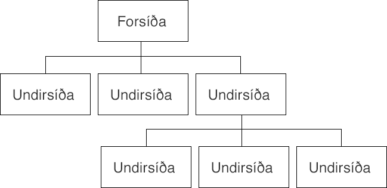
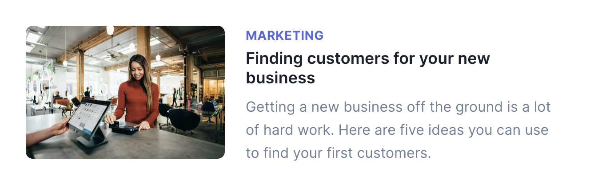

Það er vert að tæpa aðeins á því sem ber að hafa í huga þegar _við förum að hanna okkar eigið útlit_. Forritarar eiga það margir til að hunsa skipulag og framsetningu á efni og einfaldlega koma allri virkni á skjáinn (stundum kölluð „forritaraútlit“).

## Röðun og jöfnun

Röðun og jöfnun (e. alignment) á efni skiptir máli. Við ættum að leggja okkur fram við að setja hluti skipulega upp með reglu. Notkun á grind getur hjálpað til hér þar sem hún skilgreinir grunn til að vinna á. Eins ættu bil á milli efnis ekki að vera handahófskennd heldur fylgja reglu.

Í byrjun ættum við að setja okkur reglu um hvernig hlutum er raðað og þeir jafnaðir. Texti ætti að vera eins jafnaður (til vinstri, hægri eða jafnaður). Bil stöðluð og notuð á milli (margin) og innan (padding) hluta. T.d. ef við gefum okkur grunnbil upp á `20px` getum við notað þá tölu og margfeldi af henni til að mynda bil, t.d. `3 * 20px` sem gott bil á milli tveggja svæði.


Þegar við erum að skipuleggja efni er mikilvægt að huga að hópun. Hlutir sem eiga að vera saman ættu að vera saman og ættu að vera líkir. Þetta getur átt við allt frá listum, til upplýsinga í fæti til mynda og texta tengdum þeim.


##  Andstæður

Andstæður (e. contrast) myndast þegar hlutir eru ólíkir og ekki aðeins ólíkir heldur mjög ólíkir. Með þvi getum við dregið athygli að ákveðnum hlutum og brotið upp hönnun. Andstæður er hægt að mynda með því að nota mismunandi letur, mismunandi þyngd og mismunandi stærð. Við getum líka notað liti til að mynda andstæður, með því að snúa við litum á bakgrunni og letri.


## Letur

Letrið sem við notum skiptir máli. Ekki allar leturgerðir eru ekki gerðar til þess að vera á meginmáli og ekki allar eru gerðar til þess að vera í fyrirsögnum. Við ættum að velja leturgerðir sem bjóða upp á andstæður (hvort sem það er innan leturgerðar með mismunandi þyngd), henta efninu okkar og ekki of margar. Tvær leturgerðir ættu að vera nóg fyrir flest verkefni.

Stærð á letrinu okkar ætti ekki heldur að vera handahófskennt, fyrir fyrisagnir, meginmál og annan texta ættum við að skilgreina stærðir. Hægt er að útbúa _týpografískan skala_ sem skilgreinir stærðir á letri, svipar til tónlistarskala. T.d. er `12 14 16 18 21 24 36 48` skali sem oft er notaður fyrir letur.

Þegar við vinnum með fyrirsagnir og texta sem á einhvern hátt er dreginn út getur verið gott að huga að _kerning_ en það er þegar við eigum við pláss á milli hvers og eins stafs. Ef við höfum átt við `letter-spacing` eða erum að nota leturgerð sem ekki hefur gott pláss á milli stafa gætum við þurft að gera ráðstafanir svo að textinn okkar skiljist og orð ruglist ekki, t.d. getur `rn` runnið saman í `m` eða `LI` í `U`.

Það er síðan hægt að fara enn lengra með skala, letur og grind með því að skilgreina lóðrétta grind fyrir letur, svokallaðan _lóðréttan takt_ (e. vertical rhythm). Við gefum okkur þá pláss í grunninn sem _hver lína af texta_ þarf að passa innan margfeldis af, og ekki bara það heldur þurfa öll bil á milli texta (`margin`) að vera í margfeldi líka. T.d. ef við gefum okkur grunngildið `16px` þurfa allar línur að vera heilt, jákvætt margfeldi af því. Fyrirsögn passar t.d. innan `46px`, millifyrirsögn innan `32px` og meginmál innan `16px`. Hver lína innan þessarar láréttu grindar er kölluð _baseline_.


Allar þessar tilfærslur með letur eru ekki óþarfar; þær skapa sátt og jafnvægi.

## Litir

Sama gildir um liti og letur, við ættum að ákveða litapallettu og nota hana. Ekki velja handahófskennda liti sem passa hugsanlega vel saman en hugsanlega ekki vel saman. Margar leiðir eru til þess að velja saman viðeigandi liti en margar þeirra snúast um að velja liti sem passa saman á litahjólinu. Til þess að velja þessa liti má nota tól eins og:

* [Adobe Color](https://color.adobe.com/)
* [Sessions collage: Color Calculator](https://www.sessions.edu/color-calculator/)

## Veftré og wireframe

Áður en við förum beint _að hanna_ vef er mikilvægt að gera sér grein fyrir umfangi hans. Til þess að komast að því er gott að byrja á að því að setja upp _veftré_ en það er yfirlitsmynd yfir allar síður vefsins og hvernig þær tengjast innbyrðist.



Með því að teikna upp veftré verður vefurinn og verkefnið sem við erum að fara að vinna skýrara og við sjáum jafnvel fram á hluti sem okkur hefði ekki dottið í hug. Ef við erum að vinna verkefnið með öðrum er þetta líka góð leið til þess að komast á sömu blaðsíðu um síður sem þarf að smíða og útbúa efni fyrir.

Wireframe er síðan það að taka hverja síðu (eða eina síðu fyrir hverja „síðutýpu“) og skissa upp hvernig hún mun líta út áður en farið er í beina hönnun. Þetta er hægt að gera með blað og blýanti, á tússtöflu eða í tóli (t.d. [balsamiq](https://balsamiq.com/)). Þetta gefur okkur tilfinningu fyrir því hvaða efni þurfi að vera á hverri síðu, í hvaða forgangi það eigi að vera og hvernig það tengist öðru efni.


Þessi (ásamt mörgum öðrum mikilvægum verkefnum) eru unnin af fólki sem sérhæfir sig í _notendaupplifunarhönnun_ (_UX design_ eða _user experience design_).

## CSS tól

Ef í harðbakkan slær og við treystum okkur ekki í að hanna okkar eigið útlit eru til tól sem geta hjálpað, oftast flokkuð saman sem framework, hönnunarsafn (e. design library) eða hlutasöfn (e. component library).

[Bootstrap](https://getbootstrap.com/) er _framenda hlutasafn_ (frontend component library). Með Boostrap sníðum við HTML með ákveðnum klösum og fáum smekklegt útlit án mikils tilkostnaðar. Kostnaðurinn er þó helst sá að við fáum vef sem er mjög líkur mjög mörgum öðrum. Einnig getur verið erfitt að bæta við og blanda okkar eigin CSS við það sem kemur frá Bootstrap þar sem við þurfum að vita sértækni á boostrap selectorum og yfirskrifa það.


```html
<div class="jumbotron">
  <h1 class="display-3">Hello, world!</h1>
  <p class="lead">
    This is a template for a simple marketing or informational website. It includes a
    large callout called a jumbotron and three supporting pieces of content. Use it as
    a starting point to create something more unique.
  </p>
  <p class="lead">
    <a class="btn btn-primary btn-lg" href="#" role="button">Learn more</a>
  </p>
</div>
```

[Tailwind](https://tailwindcss.com/) er annað framework sem byggir á því að nota hjálparklasa (e. utility classes) til þess að byggja upp útlit. Það skaffar ekki tilbúnum hlutum til að búa til útlit (eins og t.d. takkar eða valmynd) heldur allskonar klasa sem við notum til að búa til þessi útlit.

Kostir við það að nota framework sem byggir á hjálparklösum er að það getur litið út fyrir „að vera manns eigið“ og eftir að hafa lært hvernig eigi að skrifa, þá er hægt að gera það hratt og örugglega.

Ókostir eru að þarna er beinlínis verið að blanda saman útliti og merkingarfræði. Það er ekki hægt að endurnýta útlit nema með því að nota einhversskonar sniðmát (e. template) sem væri búið til á vefþjóni. Einnig er erfitt að yfirskrifa þar sem langflestir selectorar nota `!important`.

```html
<div class="md:flex">
  <div class="md:flex-shrink-0">
    
  </div>
  <div class="mt-4 md:mt-0 md:ml-6">
    <div class="uppercase tracking-wide text-sm text-indigo-600 font-bold">Marketing</div>
    <a href="#" class="block mt-1 text-lg leading-tight font-semibold text-gray-900 hover:underline">
      Finding customers for your new business
    </a>
    <p class="mt-2 text-gray-600">
      Getting a new business off the ground is a lot of hard work.
      Here are five ideas you can use to find your first customers.
    </p>
  </div>
</div>
```


