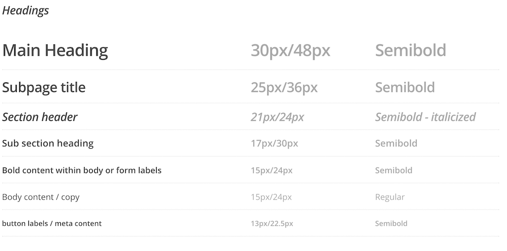
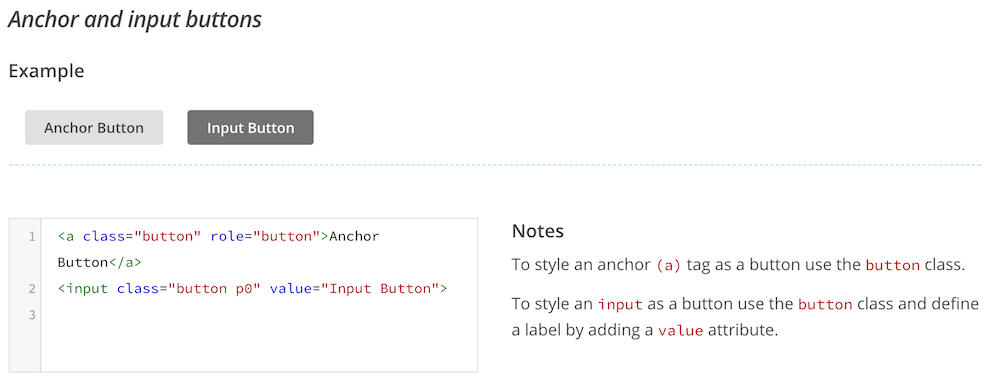
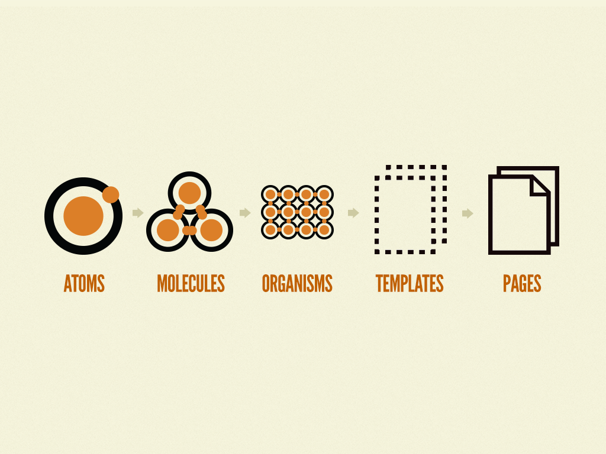

Þegar við byrjum að skrifa CSS er það einfalt og við höfum yfirsýn yfir hvað gerir hvað. Línurnar þurfa ekki að vera orðnar ýkja margar áður en yfirsýnin fer að dala og við förum að verða hrædd um að skemma eitthvað með breytingunum okkar. Sérstaklega útaf því að CSS er hannað þ.a. allir hlutir „flæði“ yfir alla — allt er almennt og getur haft áhrif á allt. Nokkrar leiðir hafa komið fram í gegnum árin til að halda í stjórnina og yfirsýnina.

## „Append only stylesheets“

Ef við pössum okkur ekki mun CSS í verkefnum okkar hægt og rólega falla í óreiðu. Viðbætur sem verða til eftir upprunaleg skrif verða erfiðar þar sem ekki er augljóst hvernig hlutirnir virka, mismunandi forritarar skrifa á mismunandi vegu, blanda af selectorum gerir hluti óljósa o.fl. Hræðsla við að brjóta útlit á einhverri síðu á vefnum gerir það að verkum að tiltekt verður erfið og við endum með „append only stylesheets“, ný virkni er skrifuð sérstaklega og bætt við aftast.

```css
/* einhverjar reglur eru skilgreindar beint á type */
button { }

/* önnur tegund notar class selector */
.button { }

/* enn önnur type og class */
button.button { }

/* eða önnur, óljós nöfn */
.button2 { }
```

## CSS viðmiðunarreglur

Í stórum verkefnum þar sem við erum að vinna ein eða í teymi er mikilvægt að eyða tíma í það að búa til viðmiðunarreglur (guidelines) um það hvernig við skrifum CSS. Þær geta varðað marga hluti

* Hvernig nefnum við og skiptum upp hlutum?
* Hvernig skrifum við selectora?
* Hvernig högum við layout? Notum við grind?
* o.s.fr.

Nokkrar aðferðir hafa verið búnar til og getum við tileinkað þær, t.d.:

* [SMACSS](https://smacss.com/) – _Scalable and Modular Architecture for CSS_.
* [OOCSS](https://www.smashingmagazine.com/2011/12/an-introduction-to-object-oriented-css-oocss/) – _Object oriented CSS_.
* [SUIT CSS](https://suitcss.github.io/) – _Style tools for UI components_.
* [BEM](http://getbem.com/) – _Block Element Modifier_.

Allar af þessum aðferðum koma með viðmiðunarreglum en sumar koma einnig með tæki og tól sem hjálpa enn frekar til.

## BEM

BEM, _Block Element Modifier_, er tiltölulega einföld aðferð þar sem hún einblínir á það _hvernig_ við skrifum selectora. Við notum aðeins class selector, enga type eða id selectors. Einnig leyfum við okkur að aðskilja merkingarfræðina enn frekar frá útliti, þar sem við getum sett `class` á hvaða element sem er til þess að fá viðeigandi útlit á það.

* _Block_ - hæsta stig á _component_, foreldrið, t.d. `.button`
* _Element_ - börn undir _block_, t.d. `.button__price`
* _Modifier_ - breytir block án þess að hafa áhrif almennt, t.d. `.button--wide`

```css
.block { }
.block--modifier { }
.block__child { }
.block__child--modifier { }
```

Með BEM skrifum við flata selectora, við erum ekki að hreiðra undir öðrum. Í HTML verðum við að tryggja að við hreiðrum rétt.

```css
/* Ekki svona */
.block .block__child { }

/* heldur svona */
.block__child { }

/* en modifer getur haft áhrif á child */
.block--modifier .block__child { }
```

## Style Guides & Pattern Libraries

Önnur góð leið til að viðhalda skipulagi er að útbúa _style guide_ eða _pattern library_. Þau safna saman hlutum sem mynda vefinn okkar, ekki í hönnunarskjölum heldur sem dæmi í kóða. Með þessu höfum við einn stað til að fá og sjá yfirlit yfir það úr hverju vefurinn okkar er byggður. Hönnun verður samræmdari, við vitum hvernig hlutir munu líta út og ef við smíðum eitthvað nýtt bætum við því við svo aðrir sjái. [styleguides.io](http://styleguides.io/) er vefur sem heldur utan um mörg mismunandi styleguide.





## Atomic Design

_Atomic design_ er leið, þróuð af Brad Frost, sem skilgreinir hvernig við getum búið til kerfi utan um vefina okkar. Í grunninn skiptist hún í að skilgreina:

* Atóm – grunn element, t.d. input, litir.
* Sameind – sameinuð atóm, t.d. form.
* Lífveru – hópur af sameindum, t.d. leitar form, navigation.
* Sniðmát – hópa saman lífverum og mynda síður.
* Síðu – ákveðin tilvik af sniðmátum með _alvöru efni_ sem notendur sjá.



Hægt er að lesa nánar um atomic design í [Atomic Design](http://atomicdesign.bradfrost.com/) bók Brad Frost sem hægt er að nálgást ókeypis á vefnum.

## Prófanir í öllum vöfrum

Yfirleitt vinnur vefforritari í sínum uppáhalds textaritli og þróar vefi með hjálp síns uppáhalds vafra. Þessi vafra er eflaust með góð _developer tools_ sem hjálpa til við forritunina, og góðan stuðning við nýlega virkni. Þetta á hinsvegar ekki við um alla sem nota vefinn. Í gegnum árin hafa mjög margir mismunandi vafrar verið gefnir út með mjög mismunandi stuðning við HTML, CSS og JavaScript. Á seinni árum með sjálfvirkum uppfærslum hefur þó dregið töluvert úr þessu.

Þegar kemur að því að ákveða hvaða vafra eigi að styðja (og það er gott að ákveða sem fyrst í ferlinu) er mikilvægt að gera sér grein fyrir því að með hverjum vafra sem þarf að prófa í eykst tíminn sem verkefnið tekur. Þessi auka tími getur verið lítill fyrir einfaldari verkefni eða mikill fyrir flóknari. Þegar inn í þetta spila einnig mismunandi tæki er mikilvægt að hafa plan. Ein leið til að útbúa svona plan er að skoða heimsóknartölur fyrir núverandi vef til að fá tilfinningu fyrir því hvaða vafra notendur séu að nota. Ef það er ekki möguleiki má skoða hvaða vafra fólk er að nota í því svæði sem verkefnið verður mest notað.

Á vefurinn okkar að virka í Internet Explorer sem hefur 1,8% markaðshlutdeild á Íslandi og 3% hnattrænt (skv. [mælingum statcounter í ágúst 2018](http://gs.statcounter.com/browser-market-share/all/worldwide/2018))? Hvað með [Opera Mini](https://en.wikipedia.org/wiki/Opera_Mini), vafri sem mikið er notaður í löndum þar sem gagnamagn á farsímaneti er dýrt og takmarkað?

Það sem er mikilvægast eftir að búið er að útbúa plan um hvaða stuðning við ætlum að hafa er að komast í raun útgáfur af tækinu til að prófa í. Hvort sem það er að hafa sér tölvu með  windows stýrikerfinu til að prófa verkefnið í Internet Explorer og Edge í, eða tölvu með macos stýrikerfinu til að prófa í Safari. Einnig eru til þjónustur eins og [Browserstack](https://www.browserstack.com/) sem leyfir okkur að tengjast úr vafranum okkar við sýndarumhverfi sem keyrir mjög margar útgáfur af stýrikerfum og vöfrum.
