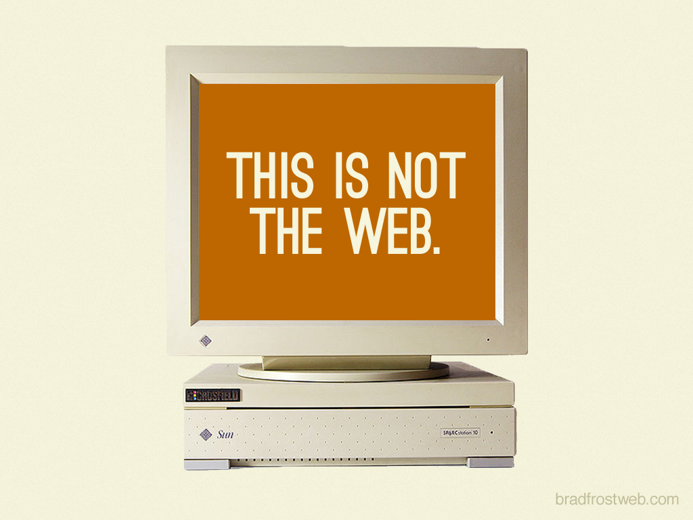
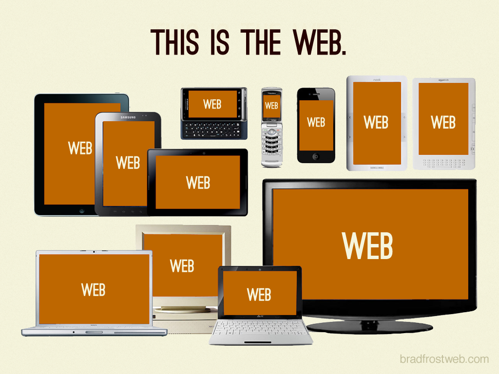
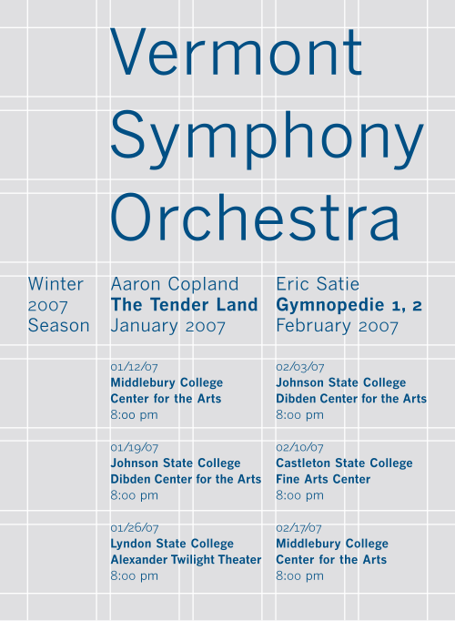

> The web’s greatest strength, I believe, is often seen as a limitation, as a defect. It is the nature of the web to be flexible, and it should be our role as designers and developers to embrace this flexibility, and produce pages which, by being flexible, are accessible to all.
> —John Allsopp: [A Dao of Web Design](https://alistapart.com/article/dao) í A List Apart árið 2000

Skalanleg vefhönnun (e. responsive web design) er þegar við sættum okkur við það að vefurinn hvorki er né verður birtur í einni fastri „fullkominni“ stærð sem við hönnum fyrir. Hann er eins margbreytilegur og tækin sem hann birtist í. Að sætta sig við fjölbreytileika vefsins krefst þess að við bæði hönnum og forritum vefina okkar með það í huga.






Fyrir tíma snjallsíma (fyrir árið 2007, þegar fyrsti iPhone kom út) voru vefir langflestir forritaðir fyrir fastar skjástærðir. Þær stærðir sem voru vinsælastar á hverjum tíma voru þær sem flestir notendur höfðu á sínum skjám. Í fyrstu `640×480` skjáir (640 pixel breiða og 480 pixel háa), síðan `800×600` og að lokum aðallega fyrir `1024×768` skjái. Þegar komið var að `1024×768` upplausn myndaðist samstaða um að hann fyrir `960px` væri algildur grunnur, þar sem sú tala deilist þægilega. Þegar snjallsímar komu fyrst á markað og fólk fór að skoða vefi hannaða fyrir `960px` í töluvert minni skjám var lausnin yfirleitt sú að hanna sérstaka „mobile“ vefi sem aðeins voru ætlaðir fyrir minni skjái, þá yfirleitt á `m` lénum, t.d. `m.example.org`.

Árið 2010 skrifaði [Ethan Marcotte](https://ethanmarcotte.com/) greinina [„Responsive Web Design“](https://alistapart.com/article/responsive-web-design) í [A List Apart](https://alistapart.com/) þar sem hann kynnti aðferð til að hanna og byggja vefi sem ekki voru fastir í þessum viðjum, heldur _sköluðu_ upp og niður með tækjum sem þeir birtust í. Þessari grein fylgdi hann svo eftir með [bók](http://abookapart.com/products/responsive-web-design) með sama nafni árið 2011. Skalanleg vefhönnun byggir á þremur atriðum, _í mikilvægis röð_:

1. Sveigjanlegu umbroti, byggðu á grind.
2. Sveigjanlegum myndum og miðlum.
3. CSS media queries.

Þegar verið er að hanna eru _grindur_ oft notaðar til þess að hafa undirliggjandi skipulag á því hvernig efnið er sett upp. Í stað þess að raða efni úti um hvippinn og hvappinn er röð og regla til staðar. Grindur eru yfirleitt notaðar fyrir lárétta staðsetningu á vefnum. Með því að nota bæði grind og lóðréttum hrynjanda (e. vertical rhythm) getum við skipulagt efnið okkar bæði lóðrétt og lárétt.



Með því að útfæra skalanlega vefi getum við birt _sama efnið_, með _sama HTML_, á _sömu slóð_ en _aðlögum okkur_ að allskonar tækjum. Útlitið er ekki alltaf eins, en efnið okkar er nothæft í öllum stærðum.

Þó svo að á fyrstu árum eftir að skalanleg vefhönnun kom fram á sjónarsviðið hafi verið talað um hana sérstaklega, þá er hún í dag (að mestu leiti) farin veg _töflulausar hönnunar_. Við gerum einfaldlega ráð fyrir því að vefir í dag skali með tækjunum sem við notum. Að gera það ekki frá grunni skilar sér í slakari vefjum sem erfitt er að laga eftir á.

Annað hugtak sem kom upp á svipuðum tíma og skalanleg vefhönnun er _mobile first_. [Luke Wroblewski](https://www.lukew.com/) skilgreindi hugtakið í [bók sem einnig kom út hjá A Book Apart](https://abookapart.com/products/mobile-first). Mobile first beitir progressive enhancement á það að byggja skalanlegan vef, við byrjum á því að einblína á upplifun á minni skjám. Með því að byrja með minna pláss neyðumst við til þess að taka ákvarðanir um það hvað sé virkilega mikilvægt. Það einfaldar ákvörðunartöku um hvað sé raunverulega mikilvægast og setur efnið í fyrsta sætið.

### Sveigjanleg grind

Þegar við vinnum með sveigjanlega grind megum við ekki skilgreina neinar breiddir í nákvæmum stærðum, við verðum að nota hlutfallslegar stærðir. Með því að notafæra okkur formúluna `target ÷ context = result` getum við breytt úr nákvæmu gildi í hlutfallsegt fyrir breiddir, margin, padding og letur. T.d. ef við höfum `1600px` umgjörð og innan hennar erum við með efnissvæði sem á að vera `1200px`. Þá getum við sett umgjörðina með `max-width: 1600px;` og efnissvæðið með `1200px ÷ 1600px = 0.75` eða `width: 75%;`.

Með sveigjanlegri grind festum við ekki stærð hennar í ákveðnum pixlum. Við skilgreinum fjölda dálka (oft eru 12 dálkar notaðir), bil á milli þeirra (kallað _gutter_) og hámarksstærð svæðis. Síðan reiknum við stærð hvers dálks sem `100% / <fjöldi dálka>`. Innan grindarinn búum við síðan til raðar og dálka sem passa í grindina og staðsetjum efnið okkar í þeim. Fyrir hverja röð viljum við almennt ekki hafa samtölu dálka hærri en fjölda dálka. Það er þó hægt að „brjóta grindina“ til að láta efni standa út úr.

Það er ekki krafa að byrja hvern dálk nákvæmlega í fyrsta. Með því að nota `margin` getum við fært dálka innan grindar svo lengi sem gildin eru hlutfallsleg, t.d. miðjað `50%` dálk með `margin-left: 25%;`.

```html
<div class="grid">
  <div class="row">
    <div class="col-6">50% dálkur</div>
    <div class="col-6">50% dálkur</div>
  </div>
</div>
```

```css
.grid {
  max-width: 1600px;
}

.row {
  display: flex;

  margin-left: -10px;
  margin-right: -10px;
}

.col-6 {
  /* gutter verður 20px */
  padding-left: 10px;
  padding-right: 10px;

  width: 50%;
}
```

Þegar við skilgreinum grind með bili í CSS setjum við _helming_ bilsins sem `padding` sitthvoru megin á hvern dálk þ.a. þegar þeir liggja hlið við hlið þá verður til heilt bil. Til þess að halda samræmi stækkum við röðina í samræmi um eitt bil með því að draga röðina út sitthvoru megin um hálft bil.

Grindina notum við fyrir _layout_, skipulag á aðalatriðum á vefnum. Innan grindar falla síðan efnissvæði, hlutir, myndir og miðlar. Fyrir hvern ef þessum hlutum látum við þá fylla upp í 100% af mögulegri breidd foreldris, nota `border-box: box-sizing;` og almennt ekkert `margin` þ.a. þeim sé alveg stjórnað af dálkum grindarinnar. Ef við skilgreinum `margin` er það yfirleitt `margin-bottom` en það gerir það að verkum að hver hlutur ýtir hlutum aðeins frá sér að neðan og við þurfum ekki að hugsa um collapsing margin. Lárétt margin myndu rugla í grindinni.

### Sveigjanlegar myndir og miðlar

Þegar við erum að útfæra vefi sem eiga að birtast í mörgum mismunandi skjástærðum getum við ekki sett inn myndir og miðla sem eru af fastri stærð. Mynd sem er `1200px` breið og á að birtast í dálk sem búið er að skala niður í `600px` mun ekki birtast snyrtilega nema við gerum ráðstafanir. Við getum fest breidd mynda og miðla við breidd foreldris og látið skalast og þurfum þá aðeins að skilgreina `max-width: 100%;` en þá mun efnið alltaf fylla upp í breiddina. Við getum átt við hvernig efnið birtist með því að skera (crop) myndina til, `object-fit` getur hjálpað okkur við að skilgreina hvernig myndin er skorin eða sköluð og þá stundum í samhengi við `height` og `overflow: hidden;`.

```css
img {
  /*
  mynd skalast þ.a. hún fyllir alltaf upp í
  lárétt pláss í foreldri og ekki meira
  */
  max-width: 100%;
}
```

Ef við viljum viðhalda stærðarhlutföllum nákvæmlega getum við notað eftirfarandi „trikk“ sem nýtir sér gervi-element, barn sem fyllir upp í foreldri sitt, og það að `padding-top` með hlutfallslegri tölu reiknast út frá `width`:

```html
<div class="box">
  <div class="content">16:10 efni</div>
</div>
```

```css
.box {
  position: relative;
  width: 100%; /* fyllir upp í foreldri sitt, t.d. dálk */
}

.box::before {
  content: '';
  display: block;
  padding-top: 62.5% /* fyrir 16:10 setjum við 10/16*100=62.5% */
}

.content {
  /* fyllir upp í foreldri sitt */
  position: absolute;
  top: 0; right: 0; bottom: 0; left: 0;

  background-color: red;
}
```

### Media queries

Með _media queries_ getum við skilgreint „brotpunkta“ í hönnun þar sem við breytum á einhvern hátt hvernig layout á vef hagar sér. Við miðum við heildar breidd á viewport og getum skilgreint CSS sem er notað upp að ákveðinni breidd, frá ákveðinni breidd,  eða blandað þessu saman til að skilgreina á bili, skilgreint eins fyrir hæð og, fleira.

Við getum (og ættum) að beita progressive enhancement/mobile first þegar við notum media queries. Það þýðir að grunnstílar ættu að skilgreina hvernig hlutur lítur út þegar hann fyllir alveg út í pláss sitt – er í minnstri upplausn, t.d. í snjallsíma. Eftir því sem hlutur fær meira pláss skilgreinum við media queries sem breyta hegðun með auknu plássi.

```css
/* almennt er section 100% breitt */
section {
  width: 100%;
}

/* frá 800px breiðum viewport er section 50% breitt */
@media (min-width: 800px) {
  section {
    width: 50%;
  }
}
```

Fyrir grindina verður það þó skrítið ef við byrjum að breyta dálka skilgreiningum með media queries. T.d. ef við höfum `.col-6` sem á að taka 6 dálka af 12 en allt í einu frá og með einhverri breidd verða það 4 af 12 eða 12 af 12. Ein lausn á þessu er að útbúa skilgreiningar sem taka fram fyrir almennu skilgreininguna og nýta „flæðið“ og media queries til að fá mismunandi gildi eftir upplausn, t.d. `.col-6 .col-sm-12`, almennt taka 6 af 12 dálkum en í `sm` (small) upplausn, taka 12 af 12.

```html
<div class="grid">
  <div class="row">
    <div class="col col-6 col-sm-12">
      <div class="box">50% dálkur almennt, 100% í minni upplausn</div>
    </div>
  </div>
</div>
```

```css
.col-6 {
  width: 50%;
}

/* skilgreint seinna í skjali og fær því forgang */
@media (max-width: 599px) {
  .col-sm-12 {
    width: 100%;
  }
}
```

Önnur leið er að skilgreina ekki `.col` utan um efnið sjálft heldur láta hvern „hlut“ innan grindar stýra sinni stærð. T.d. ef við viljum að efni innan `<section>` falli að grind:

```html
<div class="grid">
  <div class="row">
    <section class="my-box"></section>
    <section class="my-box"></section>
    <section class="my-box"></section>
  </div>
</div>
```

```css
.my-box {
  width: 100%;
}

@media (min-width: 800px) {
  .my-box {
    padding-left: 10px;
    padding-right: 10px;
    width: 33.33333333%;
  }
}
```

Stór kostur við þessa lausn er að við þurfum ekki mikið af sértækum `.col-x-n` hjálpar klösum, heldur skilgreinir efnið sig innan grindar. Ókostur er að ef það er ósamræmi í media-queries (hvenær skipt er á milli) getur útlitið okkar orðið ósamræmt, t.d. í einhverri breidd eru box að taka `100%` en önnur fyrir neðan taka `50%` þó þau séu ca. jafn stór.

### Skalanlegir vefir og upplausn

Mismunandi tæki sem birta vefina okkar hafa mismunandi upplausn, þau koma mismörgum pixelum fyrir á skjánum. _Physical resolution_ segir til um raun upplausn á skjá, t.d. `960×640` en _logical resolution_ segir til um raun **stærð** skjás, t.d. `480×320`. Hlutfallið þarna á milli er _device pixel ratio_, t.d. `2x`. [_Pixel density_](https://en.wikipedia.org/wiki/Pixel_density) segir til um fjölda pixela á tommu eða cm. _Retina display_ er markaðshugtak frá Apple þar sem pixel density er um 300 ppi og við horfum á skjáinn í um 25 cm fjarlægð — augað greinir ekki pixela.

Við getum leiðbeint vöfrum um hvernig við viljum að síða birtist með `<meta name="viewport">` en í `content` attribute getum við sett einhver af eftirfarandi gildum:

* `width` setur breidd viewports: tala eða _device-width_ sem lætur viewport vera jafnt _logical resolution_ ekki _physical resolution_.
* `initial-scale`, upphafs þysjun (zoom) á síðu, yfirleitt `1`.
* `minimum-scale`, hversu lítil síða má verða — hve langt má þysja út.
* `maximum-scale`, hversu stór síða má verða — hve langt má þysja inn.
* `user-scalable`, má notandi þysja? Þetta viljum við alltaf leyfa.

```html
<meta name="viewport" content="width=device-width, initial-scale=1">
```

Ef við skilgreinum ekki `width=device-width` í `<meta name="viewport">` og notum media queries mun vefurinn okkar ekki birtast eins og við höldum í tækjum með hærri raunupplausn.

### Frekari stjórn yfir myndum

Ef við viljum fá enn frekari stjórn yfir hvernig mynd birtist getum við notað `<picture>` elementið. Það leyfir okkur að skilgreina mismunandi myndir sem birtast við mismunandi stærðir, byggðar á media query skipunum.

```html
<picture>
  <source srcset="/stor.jpg" media="(min-width: 800px)">
  
</picture>
```

Hér mun `litil.jpg` birtast svo lengi sem skjástærð tækis er undir `800px` breidd. Fyrir ofan það er `stor.jpg` birt. Þetta getur gefið möguleika á meiri listrænni stjórn; í minni vöfrum er hægt að nota mynd þar sem búið er að klippa myndina svo aðalatriði sjáist betur. Í öllum tilfellum þar sem við notum `<picture>` skilgreinum við `` innan þess, sú mynd virkar sem fallback ef einhver af `<source>` elementum virka ekki eða ef stuðningur er ekki til staðar við `<picture>`. `alt` texti mun alltaf vera sá sem skilgreindur er á ``.

Hægt er að nota `<picture>` og `srcset` attribute til að stjórna enn betur hvernig myndir birtast, í hvaða formati, í hvaða upplausn, og hversu hárri upplausn.

```html
<picture>
  <!-- ef vafri styður webp formatið, nota það -->
  <source type="image/webp" srcset="img.webp, img-2x.webp 2x, img-3x.webp 3x">

  <!--
  fyrir skjái með 2x eða 3x device pixel ratio
  birtum við stærri myndir sem þá birtast „greinilegri“
  -->
  
</picture>
```

### Allir saman nú!

Með því að nýta þessi þrjú hugtök:

1. Sveigjanlegt umbrot, byggt á grind
2. Sveigjanlegar myndir og miðlar
3. CSS media queries

saman fáum við síðu sem bregst við umhverfi sínu og skalast alveg frá lítilli upplausn síma upp í háa upplausn á risa-sjónvarpi. Eins og marg annað er þetta einföld hugmynd sem fljótt verður flókin í útfærslu. Við getum nýtt okkur tól í vöfrum til að prófa lausnirnar okkar, en til að vita nákvæmlega hvernig þetta hagar sér þarf að prófa á tækjunum sjálfum. Það getur síðan í sjálfu sér orðið erfitt þar sem þau eru mörg og engin tvö nákvæmleg eins.
